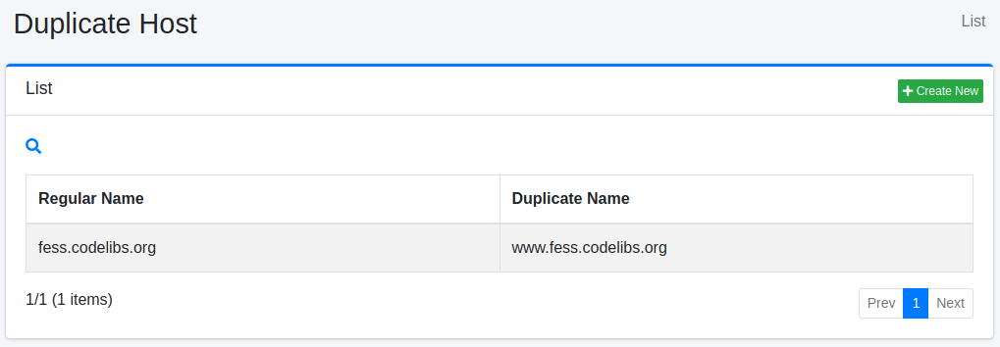
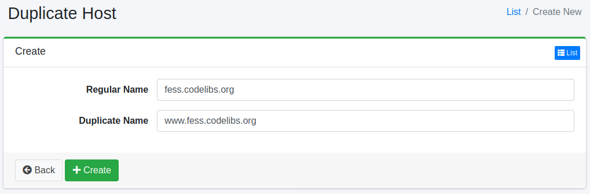

==============
Duplicate Host
==============

Overview
========

Here, we will explain the configuration for handling duplicate hosts. Duplicate hosts are used when you want to treat different hostnames as the same during crawling. For example, if you want to treat "www.example.com" and "example.com" as the same site, you can use this configuration.

Management Methods
==================

Display Method
--------------

To access the list page for configuring duplicate hosts shown below, click on "[Crawler > Duplicate Hosts]" in the left menu.

|image0|

To edit, click on the configuration name.

Creating Settings
-----------------

To open the Duplicate Hosts settings page, click on the "Create New" button.

|image1|

Setting Items
-------------

Regular Name
::::::::::::

Specify the canonical hostname. The duplicate hostnames will be replaced with the canonical hostname.

Duplicate Name
::::::::::::::

Specify the duplicate hostname that you want to replace.

Deleting Settings
-----------------

Click on the configuration name on the list page, and when the delete button is clicked, a confirmation screen will appear. Clicking the delete button will remove the configuration.

