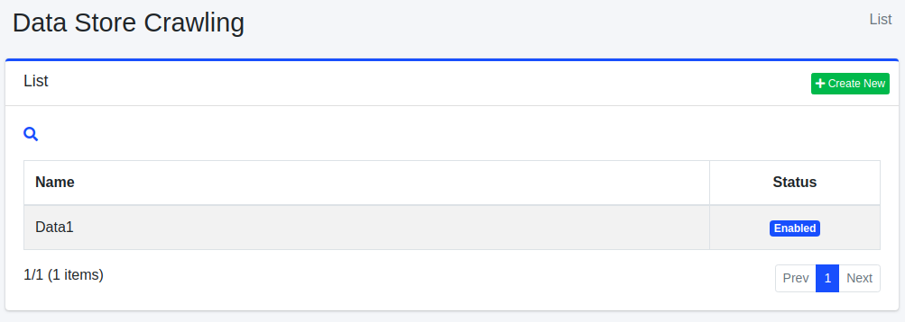

===================
Data Store Crawling
===================

Overview
========

In |Fess|, you can crawl data sources such as databases and CSV files. This section provides an explanation of the necessary configuration for data store crawling.

Management Operations
=====================

Display Configurations
----------------------

To access the list page for configuring data stores, click on [Crawler > Data Store] in the left menu.

|image0|

To edit a configuration, click on the configuration name.

Create Configuration
--------------------

To open the configuration page for data stores, click on the "Create New" button.

|image1|

Configurations
--------------

Name
::::

Specify the name of the crawl configuration.

Handler Name
::::::::::::

Specifies the handler name for processing the data store.

* DatabaseDataStore: Crawl a database
* CsvDataStore: Crawl CSV/TSV files
* CsvListDataStore: Crawl a CSV file that contains indexed file paths

Parameter
:::::::::

Specify parameters related to the data store.

Script
::::::

Specify how values retrieved from the data store should be assigned to fields. Expressions can be written in Groovy.

Boost
:::::

Specify the boost value for documents crawled with this configuration.

Permissions
:::::::::::

Specify the permissions for this configuration. To display search results to users belonging to the "developer" group, specify {group}developer. User-specific specifications use {user}username, role-specific specifications use {role}rolename, and group-specific specifications use {group}groupname.

Virtual Hosts
:::::::::::::

Specify the hostname of the virtual host. Refer to the :doc:`Virtual Host section of the Configuration Guide <../config/virtual-host>` for more details.

Status
::::::

Specify whether to enable or disable this crawl configuration.

Description
:::::::::::

Enter a description.

Delete Configuration
--------------------

To delete a configuration, click on the configuration name on the list page, and then click the delete button. A confirmation dialog will appear, and the configuration will be deleted when you press the delete button.

Example
=======

DatabaseDataStore
-----------------

This section describes the database crawl.

As an example, let's assume we have the following table in a MySQL database called "testdb," and we can connect to it using the username "hoge" and the password "fuga". We will provide an explanation based on this scenario.

::

    CREATE TABLE doc (
        id BIGINT NOT NULL AUTO_INCREMENT,
        title VARCHAR(100) NOT NULL,
        content VARCHAR(255) NOT NULL,
        latitude VARCHAR(20),
        longitude VARCHAR(20),
        versionNo INTEGER NOT NULL,
        PRIMARY KEY (id)
    );

In this case, we will populate the table with the following data:

::
    
    INSERT INTO doc (title, content, latitude, longitude, versionNo) VALUES ('Title 1', 'This is content 1.', '37.77493', '-122.419416', 1);
    INSERT INTO doc (title, content, latitude, longitude, versionNo) VALUES ('Title 2', 'This is content 2.', '34.701909', '135.494977', 1);
    INSERT INTO doc (title, content, latitude, longitude, versionNo) VALUES ('Title 3', 'This is content 3.', '-33.868901', '151.207091', 1);
    INSERT INTO doc (title, content, latitude, longitude, versionNo) VALUES ('Title 4', 'This is content 4.', '51.500152', '-0.113736', 1);
    INSERT INTO doc (title, content, latitude, longitude, versionNo) VALUES ('Title 5', 'This is content 5.', '35.681137', '139.766084', 1);

Parameter
:::::::::

Here is an example of parameter configuration:

::

    driver=com.mysql.jdbc.Driver
    url=jdbc:mysql://localhost:3306/testdb?useUnicode=true&characterEncoding=UTF-8
    username=hoge
    password=fuga
    sql=select * from doc

Parameters are in the format of "key=value". The descriptions of the keys are as follows:

.. tabularcolumns:: |p{4cm}|p{8cm}|
.. list-table::

   * - driver
     - JDBC driver class
   * - url
     - URL
   * - username
     - Username to access to DB
   * - password
     - Password to access to DB
   * - sql
     - SQL statement to crawl data

Table: Parameter for DB

Script
::::::

Here is an example of script configuration:
::

    url="http://SERVERNAME/" + id
    host="SERVERNAME"
    site="SERVERNAME"
    title=title
    content=content
    cache=content
    digest=content
    anchor=
    content_length=content.length()
    last_modified=new java.util.Date()
    location=latitude + "," + longitude
    latitude=latitude
    longitude=longitude

The parameters are in the format of "key=value". The descriptions of the keys are as follows:

The values are written in Groovy. Please enclose strings in double quotation marks. You can retrieve the corresponding values by accessing database column names.

.. tabularcolumns:: |p{4cm}|p{8cm}|
.. list-table::

   * - url
     - URL(Set the URL that can access the data according to your environment)
   * - host
     - Host name
   * - site
     - Site path
   * - title
     - Title
   * - content
     - Content
   * - cache
     - Content Cache(Not search target)
   * - digest
     - Displayed description in search result page
   * - anchor
     - Links contained in this document(optional)
   * - content_length
     - Content length
   * - last_modified
     - Last modified for this document

Table: Configuration for Script

JDBC Driver
:::::::::::

To connect to the database, a driver is required. Please place the JAR file in the app/WEB-INF/lib directory.

CsvDataStore
------------

This section provides an explanation for crawling CSV files.

For example, generate a test.csv file with the following content in the /home/taro/csv directory. Set the file encoding to Shift_JIS.

::

    1,Title 1,This is test 1.
    2,Title 2,This is test 2.
    3,Title 3,This is test 3.
    4,Title 4,This is test 4.
    5,Title 5,This is test 5.
    6,Title 6,This is test 6.
    7,Title 7,This is test 7.
    8,Title 8,This is test 8.
    9,Title 9,This is test 9.

Parameter
:::::::::

Here's an example of parameter configuration:

::

    directories=/home/taro/csv
    fileEncoding=Shift_JIS

The parameters follow the "key=value" format. The key descriptions are as follows:

.. tabularcolumns:: |p{4cm}|p{8cm}|
.. list-table::

   * - directories
     - Directories which contains CSV file(.csv or .tsv)
   * - files
     - CSV files (if you want to specify them)
   * - fileEncoding
     - Encoding of CSV files
   * - separatorCharacter
     - Separator character in CSV content

Table: Parameters for CSV file

Script
::::::

Here's an example of script configuration:

::

    url="http://SERVERNAME/" + cell1
    host="SERVERNAME"
    site="SERVERNAME"
    title=cell2
    content=cell3
    cache=cell3
    digest=cell3
    anchor=
    content_length=cell3.length()
    last_modified=new java.util.Date()

The parameters follow the "key=value" format. The keys are the same as those used for database crawling. The data in the CSV file is stored using `cell[n]`, where n starts from 1. If a cell in the CSV file is empty, it may be null.

CsvListDataStore
----------------

This is used when crawling a large number of files. By providing a CSV file that contains paths to updated files, you can crawl only the specified paths, reducing the crawl execution time.

The format for specifying paths is as follows:

::

    [Action]<Separator character>[Path]

You can use one of the following

 Actions:

- create: When a file is created.
- modify: When a file is updated.
- delete: When a file is deleted.

For example, in the /home/taro/csv directory, create a test.csv file with the following content. Set the file encoding to Shift_JIS.

The path is specified in the same format as when specifying paths for file crawling. Use the notation "file:/[path]" or "smb://[path]".

::

    modify,smb://servername/data/testfile1.txt
    modify,smb://servername/data/testfile2.txt
    modify,smb://servername/data/testfile3.txt
    modify,smb://servername/data/testfile4.txt
    modify,smb://servername/data/testfile5.txt
    modify,smb://servername/data/testfile6.txt
    modify,smb://servername/data/testfile7.txt
    modify,smb://servername/data/testfile8.txt
    modify,smb://servername/data/testfile9.txt
    modify,smb://servername/data/testfile10.txt

Parameters
::::::::::

Here's an example of parameter configuration:

::

    directories=/home/taro/csv
    fileEncoding=Shift_JIS

The parameters follow the "key=value" format. The key descriptions are as follows:

.. tabularcolumns:: |p{4cm}|p{8cm}|
.. list-table::

   * - directories
     - Directories which contains CSV file(.csv or .tsv)
   * - fileEncoding
     - Encoding of CSV files
   * - separatorCharacter
     - Separator character in CSV content

Table: Parameter for CsvListDataStore

Script
::::::

Here's an example of script configuration:

::

    event_type=cell1
    url=cell2

The parameters follow the "key=value" format. The keys are the same as those used for database crawling.

If authentication is required for crawling, the following settings are also necessary:

::

    crawler.file.auth=example
    crawler.file.auth.example.scheme=SAMBA
    crawler.file.auth.example.username=username
    crawler.file.auth.example.password=password

.. |image1| image:: ../../../resources/images/en/14.13/admin/dataconfig-2.png
