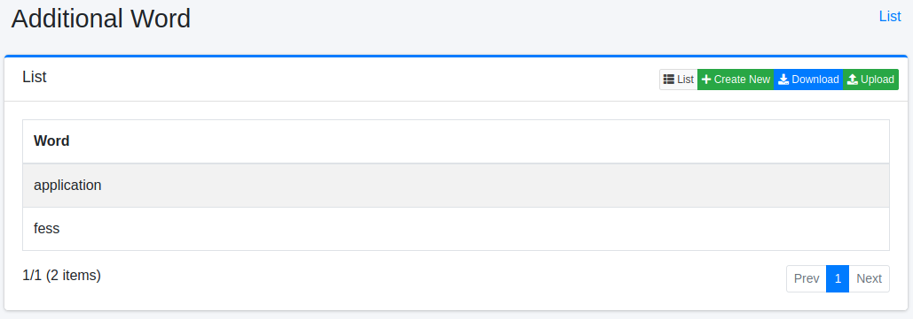

===============
Additional Word
===============

Overview
========

Additional Word page manages preferred words to display on a keyword suggest.
The keyword suggest words are generated from search queries and indexed contents automatically, and you can add words to them.

Management Operations
=====================

Display Configurations
----------------------

Select Suggest > Additional Word in the left menu to display a list page of Additional Word Configuration, as below.

|image0|

Click a configuration name if you want to edit it.

Create Configuration
--------------------

Click Create New button to display a form page for Additional Word configuration.

|image1|

Configurations
--------------

Word
::::

Displayed suggest word.

Reading
:::::::

Reading for suggest word.

Permissions
::::

Roles to restrict suggesting.
If roles are specified, suggest word is displayed in users which has roles.

Label
:::::

Labels to restrict suggesting.
If labels are specified, suggest word is displayed in users which has labels.

Boost
:::::

Boost value.
Higher value is displayed at the top.

Delete Configuration
--------------------

Click a configuration on a list page, and click Delete button to display a confirmation dialog.
Click Delete button to delete the configuration.

Download
========

You can download a word list file as CSV file.

|image2|

Upload
======

You can upload CSV file containing a word list to exclude from Suggest.

|image3|

CSV File
---------------

The content of downloaded/uploaded CSV file is 5 column.

.. |image1| image:: ../../../resources/images/en/14.14/admin/elevateword-2.png
.. |image2| image:: ../../../resources/images/en/14.14/admin/elevateword-3.png
.. |image3| image:: ../../../resources/images/en/14.14/admin/elevateword-4.png
