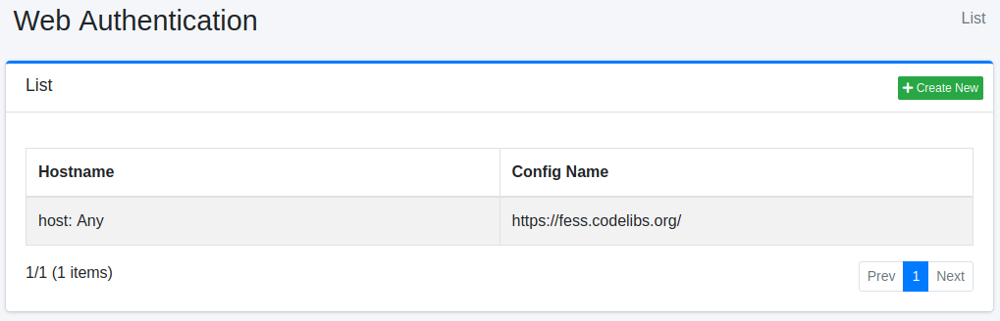

==================
Web Authentication
==================

Overview
========

Here, we will explain the configuration for web crawling that requires web authentication. |Fess| supports BASIC authentication, DIGEST authentication, and NTLM authentication.

Management Operations
=====================

Display Configurations
----------------------

To open the list page for configuring Web Authentication shown below, click on "[Crawler > Web Authentication]" in the left menu.

|image0|

To edit, click on the configuration name.

Create Configuration
--------------------

To open the Web Authentication settings page, click on the "Create New" button.

|image1|

Configurations
--------------

Hostname
::::::::

Specify the hostname of the site that requires authentication.
If omitted, it will apply to any hostname in the specified web crawl configuration.

Port
::::

Specify the port of the site that requires authentication.
Specify -1 to apply to all ports.
In that case, it will apply to any port in the specified web crawl configuration.

Realm
:::::

Specify the realm name of the site that requires authentication.
If omitted, it will apply to any realm name in the specified web crawl configuration.

Scheme
::::::

Select the authentication method.
You can use BASIC authentication, DIGEST authentication, NTLM authentication, or FORM authentication.

Username
::::::::

Specify the username to log in to the authentication site.

Password
::::::::

Specify the password to log in to the authentication site.

Parameters
::::::::::

If there are any required settings to log in to the authentication site, specify them here.
For NTLM authentication, you can set the values for workstation and domain.
To set them, use the following format:

::

    workstation=HOGE
    domain=FUGA

Web Config
::::::::::

Select the web configuration to apply the authentication settings.
You need to pre-register the web crawl configuration.

Delete Configuration
--------------------

Click on the configuration name on the list page, and when the delete button is clicked, a confirmation screen will appear. Clicking the delete button will remove the configuration.

.. |image1| image:: ../../../resources/images/en/14.15/admin/webauth-2.png