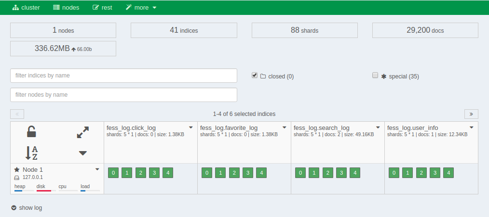

=========
Dashboard
=========

Overview
========

The dashboard provides a web-based management tool for |Fess| to manage OpenSearch clusters and indexes that it accesses.

|image0|

.. tabularcolumns:: |p{4cm}|p{8cm}|
.. list-table:: Indexes managed by |Fess|
   :header-rows: 1

   * - Index name
     - Description
   * - fess.YYYYMMDD
     - Indexed documents
   * - fess_log
     - Access logs
   * - fess.suggest.YYYYMMDD
     - Suggest words
   * - fess_config
     - |Fess| settings
   * - fess_user
     - User/role/group data
   * - configsync
     - Dictionary settings
   * - fess_suggest
     - Suggest metadata
   * - fess_suggest_array
     - Suggest metadata
   * - fess_suggest_badword
     - Suggest NG word list
   * - fess_suggest_analyzer
     - Suggest metadata
   * - fess_crawler
     - Crawl information

Indexes starting with a dot (.) are system indexes and are not displayed by default. To display system indexes, enable the "special" checkbox.

Check The Number Of Indexed Documents
=====================================

To check the number of indexed documents, navigate to the fess index as shown in the figure below.

|image1|

Click the icon in the upper right corner of each index to display the operation menu for that index. To delete indexed documents, use the management search screen. Be careful not to delete an entire index using the "delete index" option.

.. |image1| image:: ../../../resources/images/en/14.16/admin/dashboard-2.png
.. pdf            :width: 400 px
