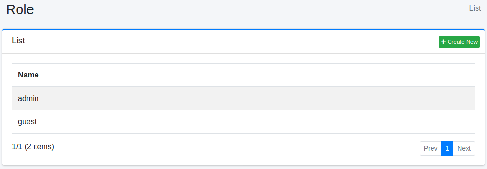

====
Role
====

Overview
========

You can manage the roles to which users belong. This feature is useful, for example, when integrating with LDAP.

Management Operations
=====================

Display Configurations
----------------------

To access the list page for role settings shown below, click on "[User > Role]" in the left menu.

|image0|

To edit, click on the configuration name.

Create Configuration
--------------------

To open the Role settings page, click on the "Create New" button.

|image1|

Configurations
--------------

Name
::::

The name of the role.

Delete Configuration
--------------------

Click on the configuration name on the list page, and when the delete button is clicked, a confirmation screen will appear. Clicking the delete button will remove the configuration.

.. |image1| image:: ../../../resources/images/en/14.16/admin/role-2.png