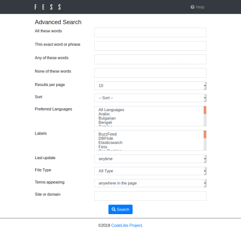

===============
Advanced Search
===============

Advanced Search
===============

Narrow down search results for complex searches by using Advanced Search.

Usage
-----

You can access Advanced Search page by clicking Advance button in Search Options dialog.

|image0|

You can search by pressing Search button at the bottom of the page.

Details
-------

All these words
:::::::::::::::

All these words provides a search result that contains all search words you type at a text box.

This exact word or phrase
:::::::::::::::::::::::::

This exact word or phrase provides a search result that contains exact word or phrase you type at a text box.

Any of these words
::::::::::::::::::

Any of these words provides a search result that contains some of search words you type at a text box.

None of these words
:::::::::::::::::::

None of these words provides a search result that does not contain specified search word. 

Results per page
::::::::::::::::

Change the number of documents in search result page to display them.

Sort
::::

Sort search results.

Preferred Languages
:::::::::::::::::::

you can select preferred language.

Labels
::::::

Narrow down search results by labels you select at a pull-down. 

Last update
:::::::::::

Narrow down search results by last update of documents.

File Type
:::::::::

Narrow down search results by file type you select at a pull down.

Terms appearing
:::::::::::::::

you can select the search target.

Site or domain
::::::::::::::

Narrow down search results by site or domain you type at a text box.

