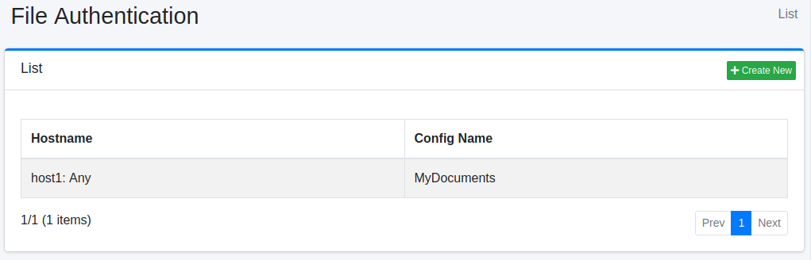
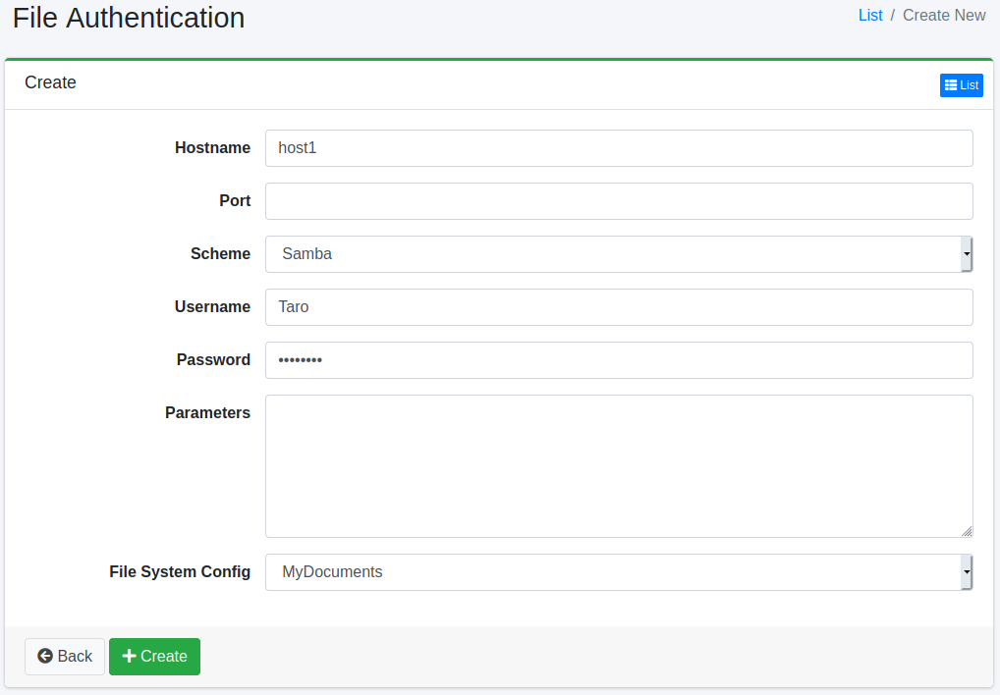

===================
File Authentication
===================

Overview
========

Here, we will explain the configuration for enabling file authentication when crawling files. |Fess| supports authentication for FTP and Windows shared folders.

Management Operations
=====================

Display Configurations
----------------------

To access the list page for configuring File Authentication shown below, click on "[Crawler > File Authentication]" in the left menu.

|image0|

To edit, click on the configuration name.

Create Configuration
--------------------

To open the File Authentication settings page, click on the "Create New" button.

|image1|

Configurations
--------------

Hostname
::::::::

Specify the hostname of the site that requires authentication.

Port
::::

Specify the port of the site that requires authentication.

Scheme
::::::

Select the authentication method.
You can choose between FTP or SAMBA (Windows shared folder authentication).

Username
::::::::

Specify the username to log in to the authentication site.

Password
::::::::

Specify the password to log in to the authentication site.

Parameters
::::::::::

If there are any additional settings required to log in to the authentication site, specify them here.
For SAMBA, you can set the value for the domain.
Use the following format to specify the parameters:

::

    domain=FUGA

File System Config
::::::::::::::::::

Specify the crawl configuration that will use this authentication setting.

Delete Configuration
--------------------

Click on the configuration name on the list page, and when the delete button is clicked, a confirmation screen will appear. Clicking the delete button will remove the configuration.

