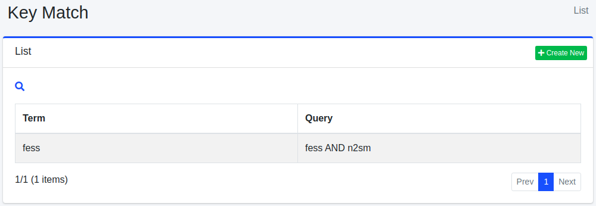

=========
Key Match
=========

Overview
=========

This section explains the settings for Key Match. By configuring Key Match settings, you can prioritize documents in search results when they are searched using specific terms. This feature is commonly used for advertising purposes.

Management Operations
=====================

Display Configurations
----------------------

To open the Key Match settings list page shown below, click on "[Crawler > Key Match]" in the left menu.

|image0|

To edit, click on the configuration name.

Create Configuration
--------------------

To open the Key Match settings page, click on the "Create New" button.

|image1|

Configurations
--------------

Term
::::

Weighting is only applied to search results when searched with this specific term.

Query
:::::

Specify the target documents that should be positioned at the top using search queries.

Size
::::

Specify the maximum number of documents that should match the query.

Boost
:::::

Specify the weighting value for the document.

Virtual Host
::::::::::::

Specify the hostname of the virtual host. For more information, refer to the :doc:`Virtual Host section of the configuration guide <../config/virtual-host>`.

Delete Configuration
--------------------

Click on the configuration name on the list page, and when the delete button is clicked, a confirmation screen will appear. Clicking the delete button will remove the configuration.

.. |image1| image:: ../../../resources/images/en/14.17/admin/keymatch-2.png