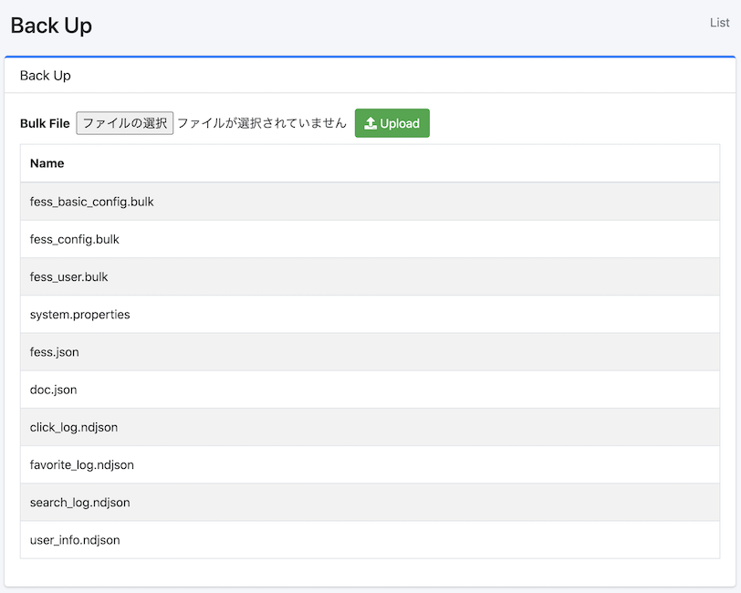

======
Backup
======

Overview
========

Backup page allows you to download and upload your configuration data for |Fess|.

Management Operations
=====================

Download Data
--------------

|Fess| manages configuration data as indices.
To download your configuration, click the index name.

|image0|

fess_config.bulk
::::::::::::::::

fess_config.bulk contains configuration information for Fess.

fess_basic_config.bulk
::::::::::::::::::::::

fess_basic_config.bulk contains Fess configuration information excluding faulty URLs.

fess_user.bulk
::::::::::::::

fess_user.bulk includes information about users, roles, and groups.

system.properties
:::::::::::::::::

system.properties contains general settings information.

fess.json
:::::::::

fess.json contains configuration information for the fess index.

doc.json
::::::::

doc.json contains mapping information for the fess index.

click_log.ndjson
::::::::::::::::

click_log.ndjson includes click log information.

favorite_log.ndjson
:::::::::::::::::::

favorite_log.ndjson contains favorite log information.

search_log.ndjson
:::::::::::::::::

search_log.ndjson includes search log information.

user_info.ndjson
::::::::::::::::

user_info.ndjson contains information about search users.

Upload
------

Configuration data can be imported by uploading a file.
Files that can be restored are \*.bulk and system.properties.

