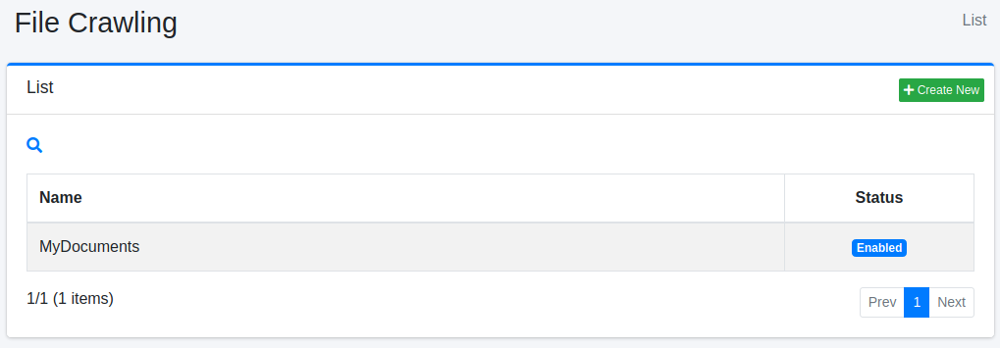
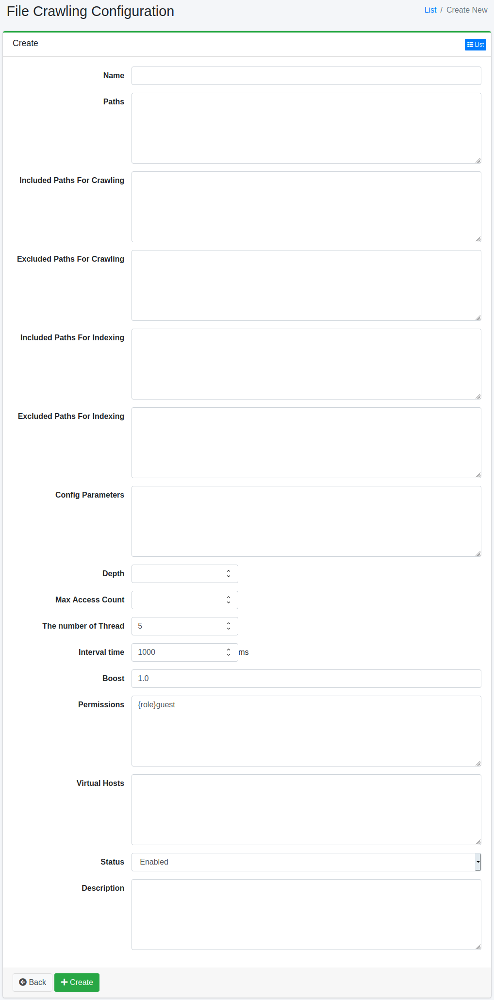

==================
File Configuration
==================

Overview
========

The File Crawling configuration page allows you to manage settings for crawling files in the file system or shared folders on the network.

Management Operations
=====================

Display Configurations
----------------------

To open the list page for File Crawling settings, click on "[Crawler > File System]" in the left menu.

|image0|

To edit, click on the setting name.

Create Configuration
--------------------

To open the File Crawling configuration page, click on the "Create New" button.

|image1|

Configurations
--------------

Name
::::

The name of the setting.

Paths
:::::

Specifies the starting location for crawling (e.g., file:/ or smb://).

Included Paths For Crawling
:::::::::::::::::::::::::::

Paths that match the specified regular expression (Java format) in this field will be crawled by the |Fess| crawler.

Excluded Paths For Crawling
:::::::::::::::::::::::::::

Paths that match the specified regular expression (Java format) in this field will not be crawled by the |Fess| crawler.

Included Paths For Indexing
:::::::::::::::::::::::::::

Paths that match the specified regular expression (Java format) in this field will be included in the search.

Excluded Paths For Indexing
:::::::::::::::::::::::::::

Paths that match the specified regular expression (Java format) in this field will be excluded from the search.

Config Parameters
:::::::::::::::::

You can specify the crawling configuration information.

Depth
:::::

Specifies the depth of the file system structure to crawl.

Max Access Count
::::::::::::::::

Specifies the number of paths to index.

The number of Thread
::::::::::::::::::::

Specifies the number of threads to use for this setting.

Interval time
:::::::::::::

Specifies the wait time for threads to crawl paths.

Boost
:::::

The boost value represents the priority of documents indexed by this setting.

Permissions
:::::::::::

Specifies the permissions for this setting.
To display search results to users belonging to the developer group, specify {group}developer.
User-level specification is {user}username, role-level specification is {role}rolename, and group-level specification is {group}groupname.

Virtual Hosts
:::::::::::::

Specifies the hostname of the virtual host.
For more information, refer to the :doc:`Virtual Host section of the Configuration Guide <../config/virtual-host>`.

Status
::::::

When this setting is enabled, the default crawler job will include this setting in the crawl.

Description
:::::::::::

You can enter a description.

Delete Configuration
--------------------

Click on the setting name on the list page, and then click the delete button to display the confirmation screen. Clicking the delete button will remove the setting.

Example
=======

Crawling Local File System
--------------------------

If you want to crawl files under /home/share, the settings would be as follows:

.. tabularcolumns:: |p{4cm}|p{8cm}|
.. list-table::
   :header-rows: 1

   * - Name
     - Value
   * - Name
     - Share Directory
   * - Paths
     - file:/home/share

Other parameters can be left as default.

Crawling Windows Shared Folder
------------------------------

If you want to crawl files under \\SERVER\SharedFolder, the configuration should be as follows:

.. tabularcolumns:: |p{4cm}|p{8cm}|
.. list-table::
   :header-rows: 1

   * - Name
     - Value
   * - Name
     - Shared Folder
   * - Path
     - smb://SERVER/SharedFolder/

If username and password are required to access the shared folder, you need to create file authentication settings from the [Crawler > File Authentication] section in the left menu. The configuration will be as follows:

.. tabularcolumns:: |p{4cm}|p{8cm}|
.. list-table::
   :header-rows: 1

   * - Name
     - Value
   * - Hostname
     - SERVER
   * - Scheme
     - SAMBA
   * - Username
     - (Enter your username)
   * - Password
     - (Enter your password)

.. pdf            :height: 940 px
