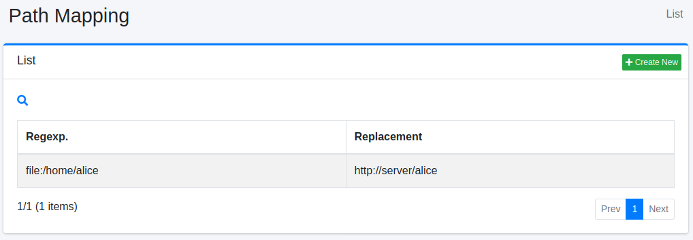
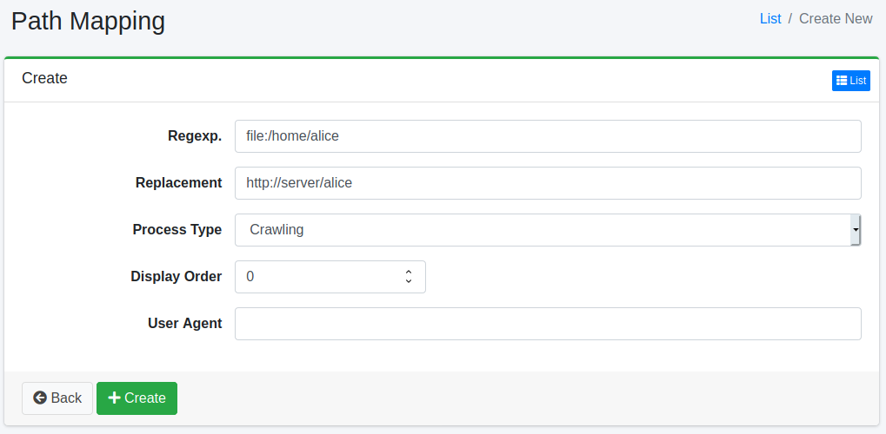

============
Path Mapping
============

Overview
========

Here, we will explain the settings for Path Mapping. Path Mapping allows you to replace links displayed in search results or perform other customizations.

Management Operations
=====================

Display Configurations
----------------------

To open the list page for configuring Path Mapping shown below, click on "[Crawler > Path Mapping]" in the left menu.

|image0|

To edit, click on the configuration name.

Create Configuration
--------------------

To open the Path Mapping settings page, click on the "Create New" button.

|image1|

Configurations
--------------

Regexp.
:::::::

Specify the string that you want to replace. Follow the Java regular expression syntax.

Replacement
:::::::::::

Specify the string to replace the matched regular expression.

Process Type
::::::::::::

Specify when the replacement should occur.

* Crawling: Replace the URL after retrieving the document during crawling, before indexing.
* Displaying: Replace the URL before displaying it during search.
* Crawling/Displaying: Replace the URL during both crawling and displaying.
* Stored URLs: Replace the URL before retrieving the document during crawling.

Display Order
:::::::::::::

You can specify the processing order of Path Mapping. It will be processed in ascending order.

Delete Configuration
--------------------

Click on the configuration name on the list page, and when the delete button is clicked, a confirmation screen will appear. Clicking the delete button will remove the configuration.

