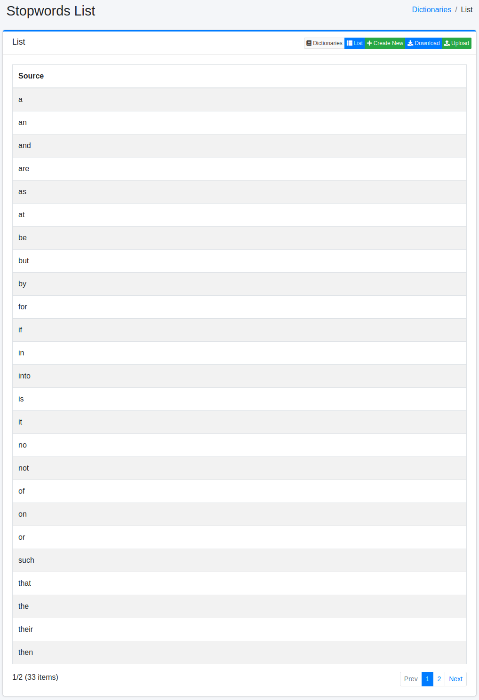
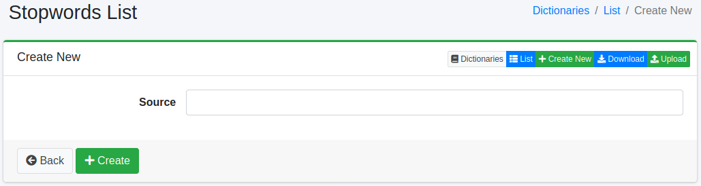

==============
Stopwords List
==============

Overview
========

Stopwords page manages dictionary of stopwords characters.
The stopwords dictionary maps characters to other one.

Management Operations
=====================

Display Configurations
----------------------

Select System > Dictionary in the left menu and click stopwords file to display a list page of Stopwords Configuration, as below.

|image0|

Click a word name if you want to edit it.

Create Configuration
--------------------

Click Create New button to display a form page for stopwords configuration.

|image1|

Configurations
--------------

Source
::::::

Replaced characters.

Target
::::::

Used character.

