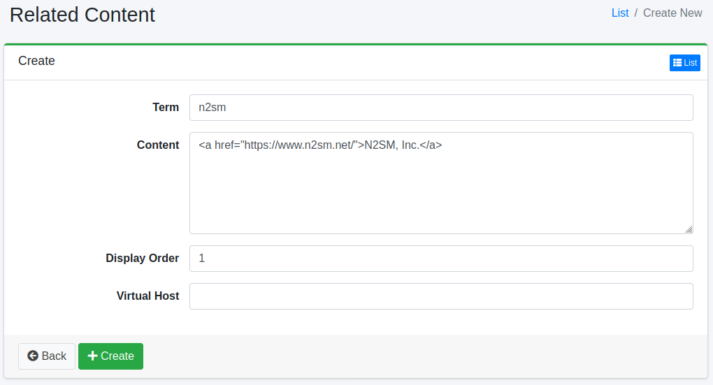

===============
Related Content
===============

Overview
========

Related Content Configuration page manages related content settings.
Related content is displayed at the top of search results if the search query matches a registered term.

Management Operations
=====================

Display Configurations
----------------------

Select Crawler > Related Content in the left menu to display a list page of Related Content Configuration, as below.

|image0|

Click a configuration name if you want to edit it.

Create Configuration
--------------------

Click Create New button to display a form page for Related Content configuration.

|image1|

Configurations
--------------

Term
::::

Term to match a search query.

Content
:::::::

Displayed content in a search result page.

Virtual Host
::::::::::::

Virtual Host key for this configuration.
e.g. fess (if setting Host:fess.codelibs.org=fess in General)

Delete Configuration
--------------------

Click a configuration on a list page, and click Delete button to display a confirmation dialog.
Click Delete button to delete the configuration.

.. |image0| image:: ../../../resources/images/en/14.5/admin/relatedcontent-1.png

