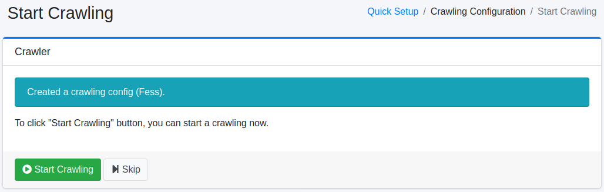

======
Wizard
======

Overview
========

Wizard page provides a quick setup tool to register crawling configurations.

Quick Setup
-----------

This page is a startup page to register crawling configurations.

|image0|

Crawling Settings
-----------------

In this page, you can create a new crawling configuration.

|image1|

Configurations
--------------

Name
::::

Configuration name. (ex. Fess Site)

Crawling Path
:::::::::::::

URL or file path to start crawling. (ex. https://fess.codelibs.org/)

Max Access Count
::::::::::::::::

The number of crawled pages.

Depth
:::::

The number of the depth of crawled paths.

Crawler
-------

You can start |Fess| crawler to click "Start Crawling" button.
If you do not start it, click "Skip" button.

|image2|

.. |image0| image:: ../../../resources/images/en/14.5/admin/wizard-1.png
.. |image1| image:: ../../../resources/images/en/14.5/admin/wizard-2.png

