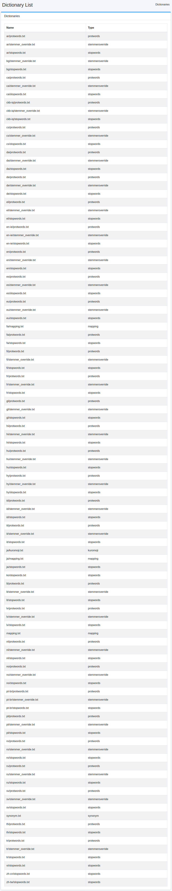

====
Dictionary
====

Overview
========

This section explains the settings related to dictionaries.

Please be sure to understand the specifications of each dictionary before making any changes. If a dictionary is changed incorrectly, it may become impossible to access the index.

List of Dictionaries
====================

To open the manageable dictionary list page shown in the figure below, click [System > Dictionary] in the left menu.

|image0|

Kuromoji
========

This manages the dictionary for Japanese morphological analysis. ja/kuromoji.txt is the dictionary used for Japanese morphological analysis.

Synonym
=======

This manages the synonym dictionary. synonym.txt is the synonym dictionary file used across languages.

Mapping
=======

This manages the character replacement dictionary. mapping.txt is the word replacement dictionary file used across languages or for each language.

Protwords
=========

This manages the protected words dictionary. protwords.txt is a list of words used for each language that are excluded from stemming.

Stopwords
=========

This manages the stop words dictionary. stopwords.txt is a list of words used for each language that are used as stop words to replace certain characters.

Stemmer Override
================

This manages the Stemmer override dictionary. stemmer_override.txt is a word replacement dictionary file used for each language to override specific characters in Stemmer. 

The translation appears to be grammatically correct and natural.

