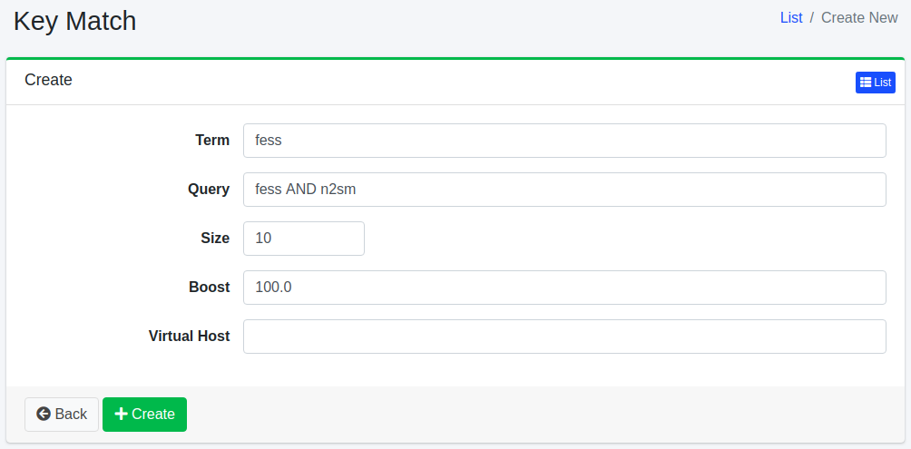

=========
Key Match
=========

Overview
========

Key Match boosts specific search results for given search word.
Key Match page manages the configurations.

Management Operations
=====================

Display Configurations
----------------------

Select Crawler > Key Match in the left menu to display a list page of Key Match Configuration, as below.

|image0|

Click a term if you want to edit it.

Create Configuration
--------------------

Click Create New button to display a form page for Key Match configuration.

|image1|

Configurations
--------------

Term
::::

Search word.

Query
:::::

Query which boosts results.

Size
::::

The number of results for Query.

Boost
:::::

Boost value.

Virtual Host
::::::::::::

Virtual Host key for this configuration.
e.g. fess (if setting Host:fess.codelibs.org=fess in General)

Delete Configuration
--------------------

Click a term on a list page, and click Delete button to display a confirmation dialog.
Click Delete button to delete the configuration.

.. |image0| image:: ../../../resources/images/en/14.7/admin/keymatch-1.png

