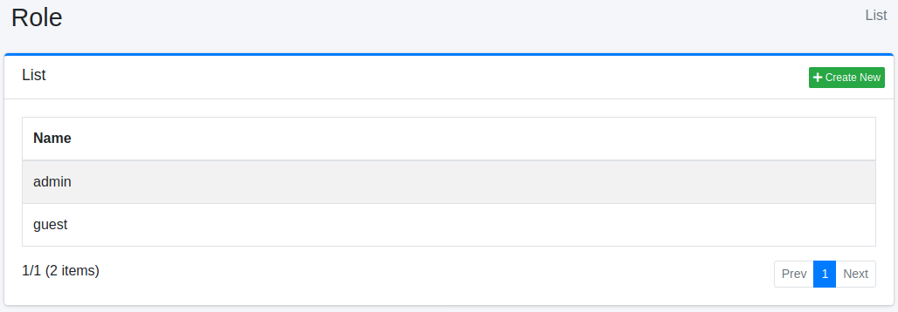

====
Role
====

Overview
========

Role Configuration page manages roles of user management.

Management Operations
=====================

Display Configurations
----------------------

Select User > Role in the left menu to display a list page of Role Configuration, as below.

|image0|

Click a role name if you want to edit it.

Create Configuration
--------------------

Click Create New button to display a form page for Role configuration.

|image1|

Configurations
--------------

Name
::::

Role name.

Delete Configuration
--------------------

Click a role name on a list page, and click Delete button to display a confirmation dialog.
Click Delete button to delete the configuration.

.. |image1| image:: ../../../resources/images/en/14.7/admin/role-2.png
