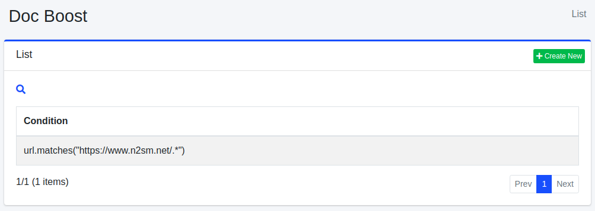

====================
Doc Boost
====================

Overview
========

This section explains the settings for Document Boost. By configuring Document Boost settings, you can position documents at the top of search results regardless of the search terms.

Management Methods
==================

Display Method
--------------

To open the Document Boost settings list page shown below, click on "[Crawler > Doc Boost]" in the left menu.

|image0|

To edit, click on the configuration name.

Creating Settings
-----------------

To open the Document Boost settings page, click on the "Create New" button.

|image1|

Setting Items
-------------

Condition
::::::::::::

Specify the condition for the documents that should be positioned at the top. For example, if you want to prioritize URLs that include "https://www.n2sm.net/", you can write url.matches("https://www.n2sm.net/.*"). Conditions can be written in Groovy.

Boost Expr
::::::::::::

Specify the weighting value for the document. Expressions can be written in Groovy.

Sort Order
::::::::::::

Set the sorting order for Document Boost.

Deleting Settings
-----------------

Click on the configuration name on the list page, and when the delete button is clicked, a confirmation screen will appear. Clicking the delete button will remove the configuration.

.. |image1| image:: ../../../resources/images/en/14.8/admin/boostdoc-2.png