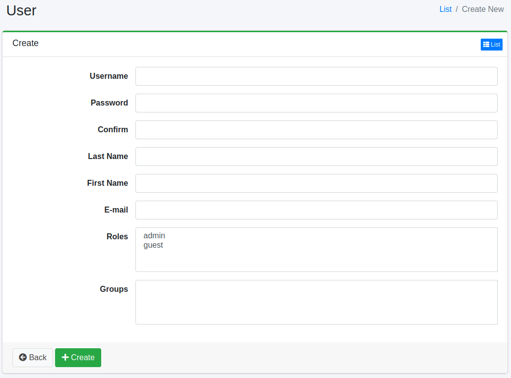

====
User
====

Overview
========

This section provides an explanation of user management in |Fess|. You can manage users who log in to the system.

Management Methods
==================

Display Method
--------------

To access the list page for user settings shown below, click on "[User > User]" in the left menu.

|image0|

To edit, click on the configuration name.

Creating Settings
-----------------

To open the User settings page, click on the "Create New" button.

|image1|

Setting Items
-------------

Username
::::::::

Specify the username of the user.

Roles
:::::

Specify the roles to which the user belongs.

Groups
::::::

Specify the groups to which the user belongs.

Deleting Settings
-----------------

Click on the configuration name on the list page, and when the delete button is clicked, a confirmation screen will appear. Clicking the delete button will remove the configuration.

.. |image0| image:: ../../../resources/images/en/14.8/admin/user-1.png

