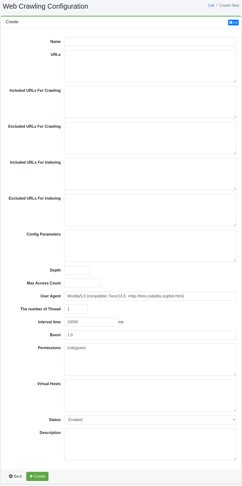

==============
Web Crawling
==============

Overview
========

The Web Crawling settings page allows you to configure web crawling.

Management
==========

Displaying Options
------------------

To open the web crawling configuration list page shown in the diagram below, click [Crawler > Web] in the left menu.

|image0|

To edit, click on the configuration name.

Creating Settings
-----------------

To open the web crawling configuration page, click the Create button.

|image1|

Configuration Items
===================

Name
::::

The name of the configuration.

URLs
::::

The starting URL for crawling.

Included URLs for Crawling
::::::::::::::::::::::::::

URLs that match the specified regular expression (in Java format) in this field will be targeted by the |Fess| crawler.

Excluded URLs For Crawling
:::::::::::::::::::::::::::

URLs that match the specified regular expression (in Java format) in this field will not be targeted by the |Fess| crawler.

Included URLs For Indexing
:::::::::::::::::::::::::::

URLs that match the specified regular expression (in Java format) in this field will be included in the search results.

Excluded URLs For Indexing
::::::::::::::::::::::::::

URLs that match the specified regular expression (in Java format) in this field will be excluded from the search results.

Config Parameters
::::::::::::::::::

You can specify crawling configuration information.

Depth
:::::

Specifies the depth to follow links within crawled documents.

Max Access Count
::::::::::::::::

The number of URLs to be indexed.

User Agent
:::::::::::

The name of the |Fess| crawler.

The number of Thread
::::::::::::::::::::

The number of threads to be used for crawling in this configuration.

Interval time
:::::::::::::

The time interval for each thread when crawling URLs.

Boost
::::::

The weight of indexed documents in this configuration.

Permissions
::::::::::::

Specify the permissions for this configuration. For example, to allow users in the developer group to view search results, specify {group}developer. User-specific settings are specified as {user}username, role-specific settings as {role}rolename, and group-specific settings as {group}groupname.

Virtual Hosts
:::::::::::::

Specify the hostname of the virtual host. For details, refer to:doc:`../config/virtual-host`.

Status
::::::

If enabled, the default crawler schedule job will include this configuration.

Description
:::::::::::

You can enter a description.

Deleting Settings
-----------------

Click on the configuration name in the list page, and then click the delete button to display the confirmation screen. Clicking the delete button will delete the configuration.

Example
=======

Crawling fess.codelibs.org
--------------------------

To create a web crawling configuration that crawls pages under https://fess.codelibs.org/, use the following settings:

.. tabularcolumns:: |p{4cm}|p{8cm}|
.. list-table::
   :header-rows: 1

   * - Name
     - Value
   * - Name
     - Fess
   * - URL
     - https://fess.codelibs.org/
   * - Included URLs for Crawling
     - https://fess.codelibs.org/.*

Other settings will use the default values.

Crawling Protected Site
------------------------

Fess supports crawling for sites protected with BASIC, DIGEST, and NTLM authentication. For detailed information on web authentication, please refer to the web authentication page.

Redmine
:::::::

To create a web crawling configuration for a password-protected Redmine page (e.g., https://<server>/), use the following settings:

.. tabularcolumns:: |p{4cm}|p{8cm}|
.. list-table::
   :header-rows: 1

   * - Name
     - Value
   * - Name
     - Redmine
   * - URL
     - https://<server>/my/page
   * - Included URLs For Crawling
     - https://<server>/.*
   * - Config Parameters
     - client.robotsTxtEnabled=false (Optional)

Next, create web authentication settings using the following values:

.. tabularcolumns:: |p{4cm}|p{8cm}|
.. list-table::
   :header-rows: 1

   * - Name
     - Value
   * - Scheme
     - Form
   * - Username
     - (Account for crawling)
   * - Password
     - (Password for the account)
   * - Parameters
     - | encoding=UTF-8
       | token_method=GET
       | token_url=https://<server>/login
       | token_pattern=name="authenticity_token"[^>]+value="([^"]+)"
       | token_name=authenticity_token
       | login_method=POST
       | login_url=https://<server>/login
       | login_parameters=username=${username}&password=${password}
   * - Web Config
     - Redmine

XWiki
:::::

To create a web crawling configuration for XWiki pages (e.g., https://<server>/xwiki/), use the following settings:

.. tabularcolumns:: |p{4cm}|p{8cm}|
.. list-table::
   :header-rows: 1

   * - Name
     - Value
   * - Name
     - XWiki
   * - URL
     - https://<server>/xwiki/bin/view/Main/
   * - Included URLs For Crawling
     - https://<server>/.*
   * - Config Parameters
     - client.robotsTxtEnabled=false (Optional)

Next, create web authentication settings using the following values:

.. tabularcolumns:: |p{4cm}|p{8cm}|
.. list-table::
   :header-rows: 1

   * - Name
     - Value
   * - Scheme
     - Form
   * - Username
     - (Account for crawling)
   * - Password
     - (Password for the account)
   * - Parameters
     - | encoding=UTF-8
       | token_method=GET
       | token_url=http://<server>/xwiki/bin/login/XWiki/XWikiLogin
       | token_pattern=name="form_token" +value="([^"]+)"
       | token_name=form_token
       | login_method=POST
       | login_url=http://<server>/xwiki/bin/loginsubmit/XWiki/XWikiLogin
       | login_parameters=j_username=${username}&j_password=${password}
   * - Web Config
     - XWiki

.. |image0| image:: ../../../resources/images/en/14.8/admin/webconfig-1.png

.. pdf            :height: 940 px