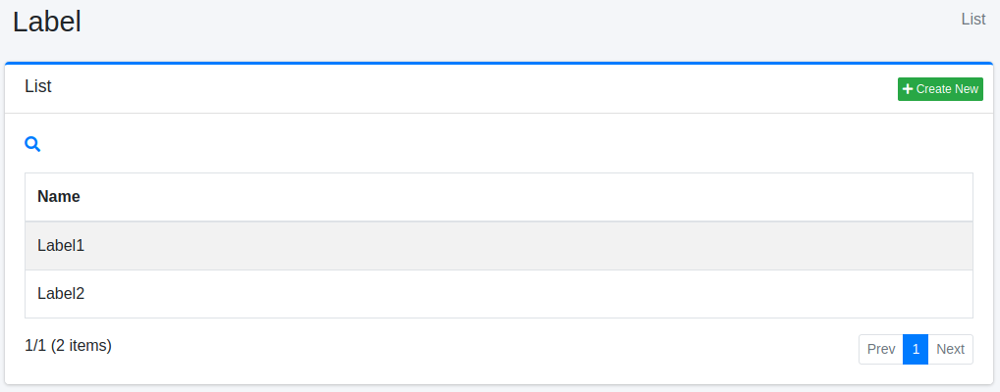
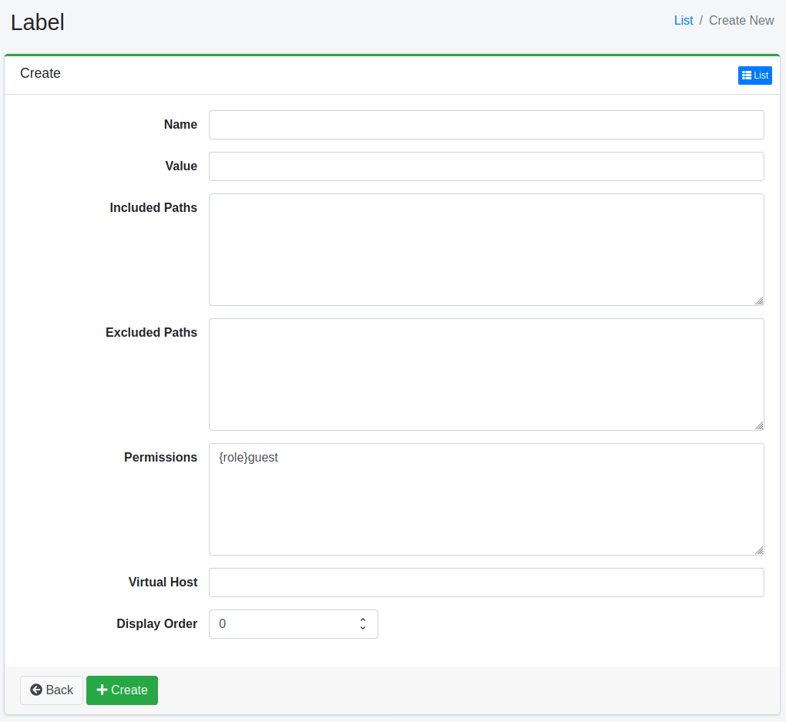

======
Labels
======

Overview
========

This section provides an explanation of label configuration. Labels can be used to classify documents displayed in search results. Label settings involve specifying the paths where labels should be applied using regular expressions. If labels are registered, a label dropdown box will appear in the search options.

Label settings described here are applicable to web or file system crawl configurations.

Management Methods
==================

Display Method
--------------

To access the label configuration page shown in the following diagram, click on "[Crawler > Labels]" in the left menu.

|image0|

To edit, click on the configuration name.

Creating Settings
-----------------

To open the label configuration page, click on the "Create New" button.

|image1|

Configuration Items
-------------------

Name
::::

Specify the name to be displayed in the label selection dropdown box during searches.

Value
:::::

Specify the identifier used for document classification. Please use alphanumeric characters.

Included Paths
::::::::::::::

Specify the paths where labels should be applied using regular expressions. You can specify multiple paths by writing them on separate lines. Labels will be applied to documents that match the specified paths.

Excluded Paths
::::::::::::::

Specify the paths that should be excluded from crawling using regular expressions. You can specify multiple patterns by writing them on separate lines.

Permissions
:::::::::::

Specify the permissions for this configuration. For example, to allow users in the developer group to view search results, use the {group}developer notation. User-level specifications use {user}username, role-level specifications use {role}rolename, and group-level specifications use {group}groupname.

Virtual Host
::::::::::::

Specify the hostname of the virtual host. For more details, refer to the :doc:`Virtual Host section of the configuration guide <../config/virtual-host>`.

Display Order
:::::::::::::

Specify the display order of labels.

Deleting Settings
-----------------

Click on the configuration name on the list page, and when the delete button is clicked, a confirmation screen will appear. Clicking the delete button will remove the configuration.

