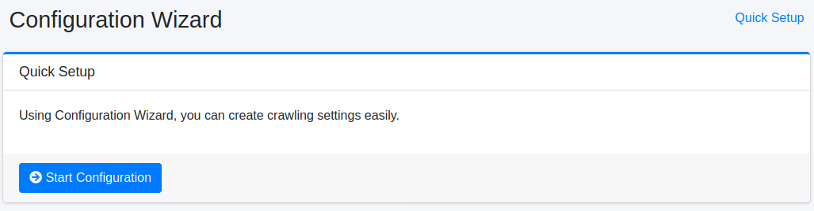
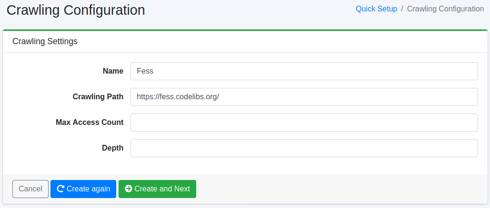

======
Wizard
======

Overview
========

The wizard page provides a setup tool for registering crawl settings.

Quick Setup
-----------

This page is the start page for registering crawl settings.

|image0|

Crawling Settings
-----------------

This page allows you to create crawl settings.

|image1|

Configurations
--------------

Name
::::

Specify the name of the settings (e.g., Fess Site).

Crawling Path
:::::::::::::

Specify the starting URL or file path for crawling (e.g., https://fess.codelibs.org/).

Max Access Count
::::::::::::::::

Set the maximum number of pages to be crawled.

Depth
:::::

Set the depth of links to be followed when crawling a document.

Crawler
-------

To start the Fess crawler, click the "Start Crawling" button. To skip crawling for now, click the "Skip" button.

|image2|

.. |image2| image:: ../../../resources/images/en/15.0/admin/wizard-3.png
