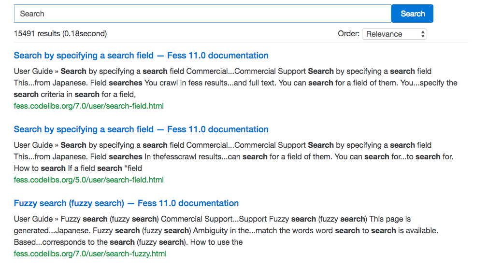

================================
Site Search
================================

|Fess| supports adding a search box to your website.

Settings
==================

Set the following code where you would like to place the search box of the website.

::

    
    <fess:search></fess:search>

Screen Image
==================

|image0|

