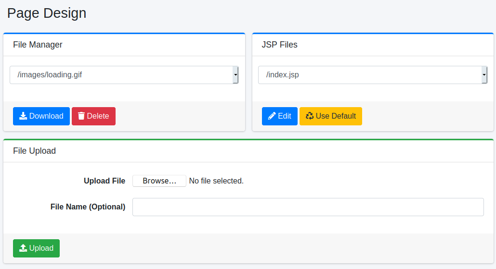
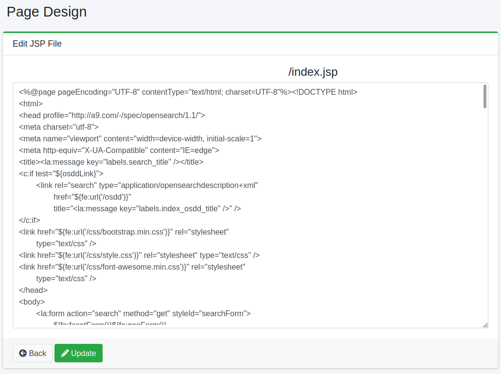

===========
Page Design
===========

Overview
========

This section explains the settings related to the design of the search page.

Page Design Menu
================

To open the list page to set the page design as shown below, click [System > Page Design] in the left menu.

|image0|

File Manager
------------

You can download or delete files available for the search page.

JSP Files
---------

You can edit the JSP files for the search screen.
By clicking the edit button for the target JSP file, you can edit that JSP file.
Also, by clicking the "Use Default" button, you can edit the JSP file installed during installation.
Changes made on the editing screen will be reflected by saving with the "Update" button.

The following is a summary of the editable pages.

.. tabularcolumns:: |p{4cm}|p{8cm}|
.. list-table::

   * - /index.jsp
     - This is the JSP file for the search top page. This JSP file includes the JSP files for each part.
   * - /header.jsp
     - This is the JSP file for the header.
   * - /footer.jsp
     - This is the JSP file for the footer.
   * - /search.jsp
     - This is the JSP file for the search result list page. This JSP file includes the JSP files for each part.
   * - /searchResults.jsp
     - This is the JSP file that represents the search result section of the search result list page. This JSP file is used when there are search results. If you want to customize the representation of search results, you should change this file.
   * - /searchNoResult.jsp
     - This is the JSP file that represents the search result section of the search result list page. This JSP file is used when there are no search results.
   * - /searchOptions.jsp
     - This is the JSP file for the search option screen.
   * - /advance.jsp
     - This is the JSP file for the advanced search screen.
   * - /help.jsp
     - This is the JSP file for the help page.
   * - /error/error.jsp
     - This is the JSP file for the search error page. If you want to customize the representation of search errors, you should change this file.
   * - /error/notFound.jsp
     - This is the JSP file for the error page displayed when the page is not found.
   * - /error/system.jsp
     - This is the JSP file for the error page displayed when there is a system error.
   * - /error/redirect.jsp
     - This is the JSP file for the error page displayed when an HTTP redirect occurs.
   * - /error/badRequest.jsp
     - This is the JSP file for the error page displayed when an invalid request occurs.
   * - /cache.hbs
     - This is the file that displays the search result cache.
   * - /login/index.jsp
     - This is the JSP file for the login screen.
   * - /profile/index.jsp
     - This is the JSP file for the password change screen for users.

Table: Editable JSP files

|image1|

The translated text is understandable, but it could be improved for clarity and naturalness. Here is a possible revised version:

File Upload
-----------

You can upload files to be used in the search interface. The supported file types are JPG, GIF, PNG, CSS, and JS.

Upload File
:::::::::::

Specify the file to upload.

File Name (optional)
::::::::::::::::::::

Use this option to specify a filename for the uploaded file. If you omit this option, the uploaded filename will be used. For example, specifying "logo.png" will change the image on the search home page.

