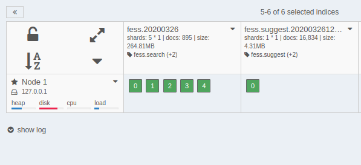

=========
Dashboard
=========

Overview
========

The Dashboard provides a web-based management tool for administering the OpenSearch cluster and indices that |Fess| accesses.

|image0|

.. tabularcolumns:: |p{4cm}|p{8cm}|
.. list-table:: Indices Managed by |Fess|
   :header-rows: 1

   * - Index Name
     - Description
   * - fess.YYYYMMDD
     - Indexed documents
   * - fess_log
     - Access logs
   * - fess.suggest.YYYYMMDD
     - Suggest words
   * - fess_config
     - |Fess| configuration
   * - fess_user
     - User/role/group data
   * - configsync
     - Dictionary configuration
   * - fess_suggest
     - Suggest metadata
   * - fess_suggest_array
     - Suggest metadata
   * - fess_suggest_badword
     - Suggest bad word list
   * - fess_suggest_analyzer
     - Suggest metadata
   * - fess_crawler
     - Crawl information

Indices starting with a dot (.) are system indices and are not displayed by default.
To display system indices, enable the "special" checkbox.

Checking Indexed Document Count
================================

The number of indexed documents is displayed in the fess index as shown below.

|image1|

Clicking the icon in the upper right corner of each index displays the operation menu for that index.
To delete indexed documents, use the administrative search screen. Do not use "delete index" to remove documents.

.. |image0| image:: ../../../resources/images/en/15.3/admin/dashboard-1.png

.. pdf            :width: 400 px
