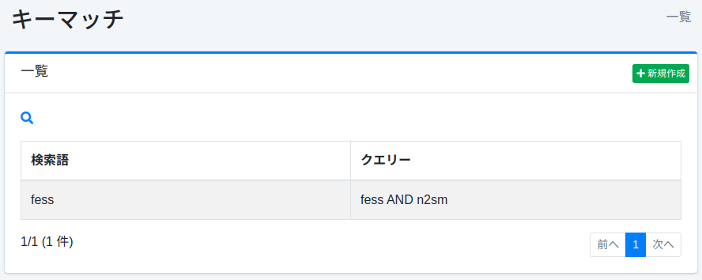
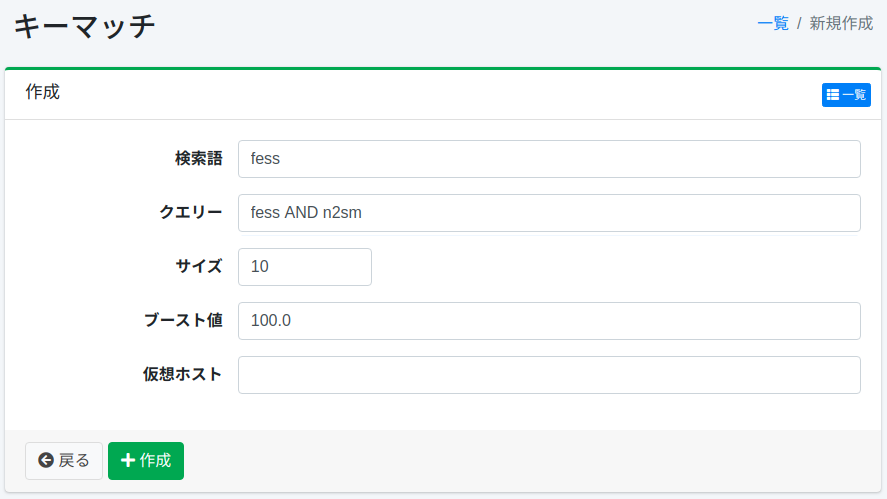

=========
Key Match
=========

Overview
========

This page explains the configuration settings related to key match.
By configuring key match settings, you can position documents at the top of search results when searched with registered search terms.
A common use case is advertising.

Management Operations
=====================

Display Method
--------------

To open the key match configuration list page shown below, click [Crawler > Key Match] in the left menu.

|image0|

Click the configuration name to edit it.

Creating Configuration
----------------------

To open the key match configuration page, click the New button.

|image1|

Configuration Items
-------------------

Search Term
:::::::::::

Weighting is applied only in search results when searched with this term.

Query
:::::

Target documents to position at the top are determined by search queries.

Size
::::

Specifies the maximum number of documents matching the query.

Boost Value
:::::::::::

Specifies the weighting value for documents.

Virtual Host
::::::::::::

Specifies the virtual host hostname.
For details, refer to :doc:`Virtual Host in the Configuration Guide <../config/virtual-host>`.

Deleting Configuration
----------------------

Click the configuration name on the list page, then click the Delete button to display a confirmation screen.
Click the Delete button to remove the configuration.

