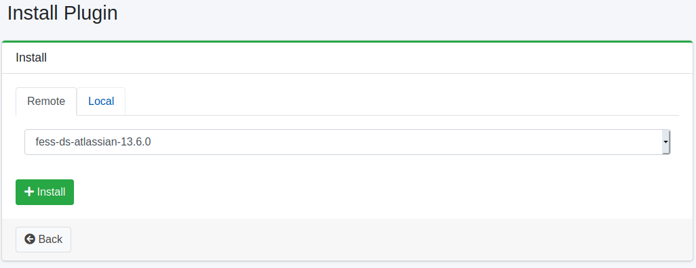

======
Plugin
======

Overview
========

The Plugin Settings page allows you to manage plugins.

Management Operations
=====================

Display Installed Plugins
-------------------------

To open the list page of installed plugins shown in the figure below, click [System > Plugins] in the left menu.

|image0|

To uninstall, click the delete button.

Install New Plugins
-------------------

To install a new plugin, click the install button.

|image1|

Select the desired plugin from the dropdown menu and click the install button to initiate the installation process.

.. |image0| image:: ../../../resources/images/en/15.3/admin/plugin-1.png

