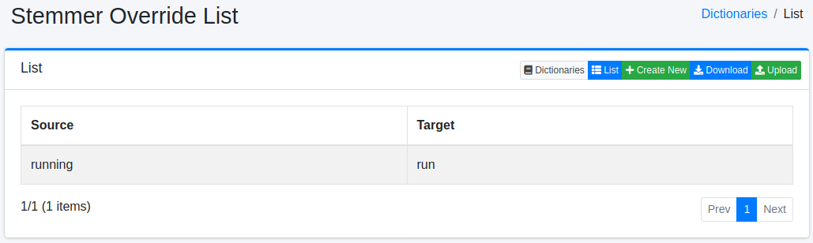
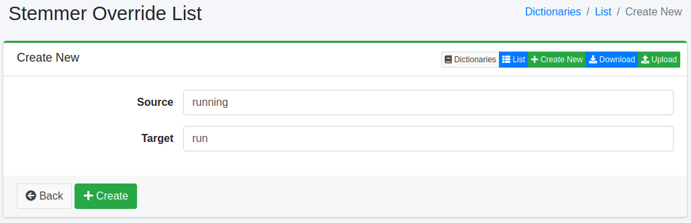

=============================
Stemmer Override Dictionary
=============================

Overview
========

You can override stemmer processing for specific characters (symbols, character codes, full-width/half-width).

Management Operations
=====================

Display Method
--------------

To open the stemmer override configuration list page shown below, click [System > Dictionary] in the left menu, then click stemmeroverride.

|image0|

Click the configuration name to edit it.

Configuration Method
--------------------

To open the stemmer override configuration page, click the New button.

|image1|

Configuration Items
-------------------

Source
::::::

Enters the characters (symbols, character codes, full-width/half-width) for stemmer override.

Target
::::::

Expands the characters entered in the source field with the converted characters.

Download
========

You can download in stemmer override dictionary format.

Upload
======

You can upload in stemmer override dictionary format.

