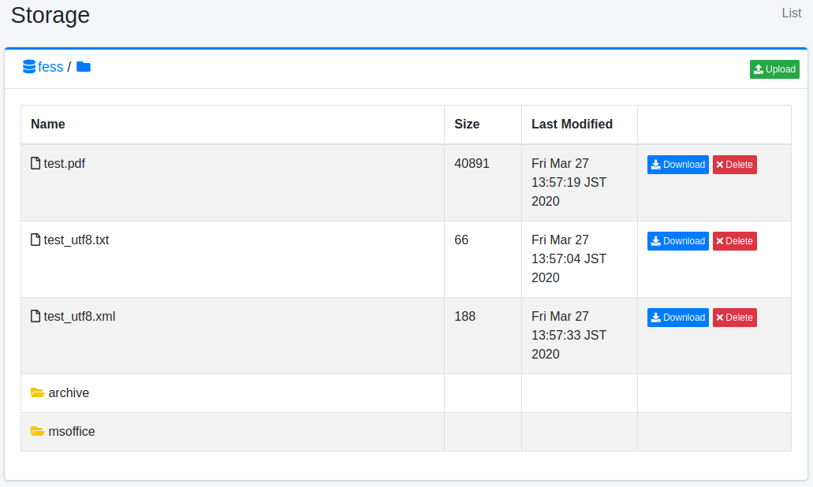

=======
Storage
=======

Overview
========

On the storage page, you can manage files on MinIO, an Amazon S3-compatible object storage.

Management Operations
=====================

Object Storage Server Configuration
------------------------------------

Open the storage settings from [System > General] and configure the following items:

- Endpoint: The endpoint URL of the storage server
- Access Key: The access key of the storage server
- Secret Key: The secret key of the storage server
- Bucket: The bucket name to manage

Display Method
--------------

To open the object list page shown below, click [System > Storage] in the left menu.

|image0|

Name
::::

The file name of the object.

Size
::::

The size of the object.

Last Modified
:::::::::::::

The last modified date and time of the object.

Download
--------

You can download the object by clicking the Download button.

Delete
------

You can delete the object by clicking the Delete button.

Upload
------

You can open the file upload window by clicking the File Upload button in the upper right.

Create Folder
-------------

You can open the folder creation window by clicking the Create Folder button to the right of the path display. Note that you cannot create empty folders.

