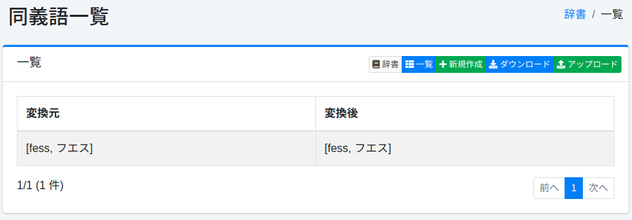
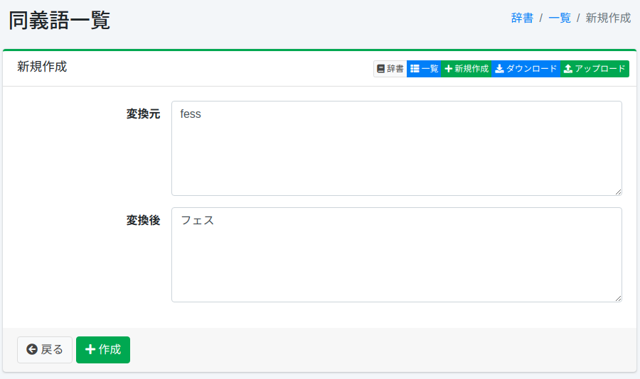

==================
Synonym Dictionary
==================

Overview
========

You can manage synonyms for words with the same meaning (such as GB, gigabyte, etc.).

Management Operations
=====================

Display Method
--------------

To open the synonym configuration list page shown below, click [System > Dictionary] in the left menu, then click synonym.

|image0|

Click the configuration name to edit it.

Configuration Method
--------------------

To open the synonym configuration page, click the New button.

|image1|

Configuration Items
-------------------

Since the default configuration for index creation uses bi-gram, you need to register words so that the converted word is not a single character.
When registering synonyms, follow these guidelines:

* Register hiragana as katakana
* Register small katakana as large katakana
* Register full-width alphanumeric characters as half-width alphanumeric characters
* Do not register duplicate synonyms

Source
::::::

Enters the word to be treated as a synonym.

Target
::::::

Expands the word entered in the source field with the converted word.
For example, to treat "TV" as both "TV" and "テレビ", enter "TV" in the source field and enter "TV" and "テレビ" in the target field.

Download
========

You can download in the synonym dictionary format provided by Apache Lucene.

Upload
======

You can upload in the synonym dictionary format provided by Apache Lucene.
Since synonyms replace one word group with another word group, the dictionary notation uses commas (,) and conversion (=>).
For example, to replace "TV" with "テレビ", use => and write as follows:

::

    TV=>テレビ

To treat "fess" and "フェス" as equivalent, write as follows:

::

    fess,フェス=>fess,フェス

In cases like above, you can omit => and write as follows:

::

    fess,フェス

