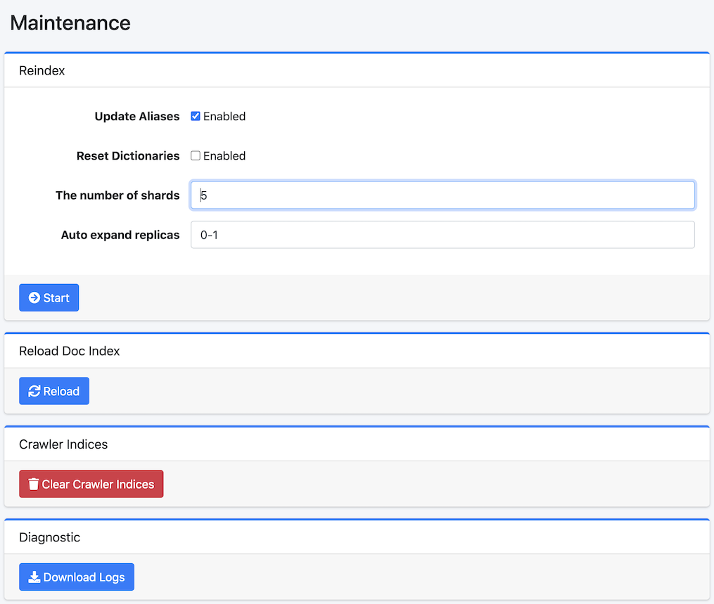

===========
Maintenance
===========

Overview
========

Maintenance page provides system tools for managing |Fess|.

|image0|

To display this page, select System Info > Maintenance in a left menu.

Operations
==========

Reindex
-------

Create new fess.YYMMDD index and copy documents from old fess index.

Update Aliases
::::::::::::::

Switch fess.search and fess.update aliases after reindexing if enabled.

Reset Dictionaries
::::::::::::::::::

Select Enabled if using factory default dictionaries.

The number of shards
::::::::::::::::::::

Specify the number of shards(index.number_of_shards).

Auto expand replicas
::::::::::::::::::::

Specify auto-expand the number of replicas(index.auto_expand_replicas).

Rebuild Config Index
--------------------

You can rebuild configuration indices (fess_config, fess_user, fess_log) with the latest mappings.
This operation runs in the background. Please back up your configuration before executing.

Target Indices
::::::::::::::

Select the indices to rebuild. You can choose from fess_config, fess_user, and fess_log.

Load Default Data
:::::::::::::::::

If enabled, default data will be loaded during the rebuild. Existing documents will not be overwritten.

Reload Doc Index
----------------

Reload(Close/Open) fess index to apply index settings.

Crawler Indices
---------------

Remove Crawler index to clear crawling data.
Do not execute this task when Crawler is running.

Diagnostic
----------

Download log files and system state information.

