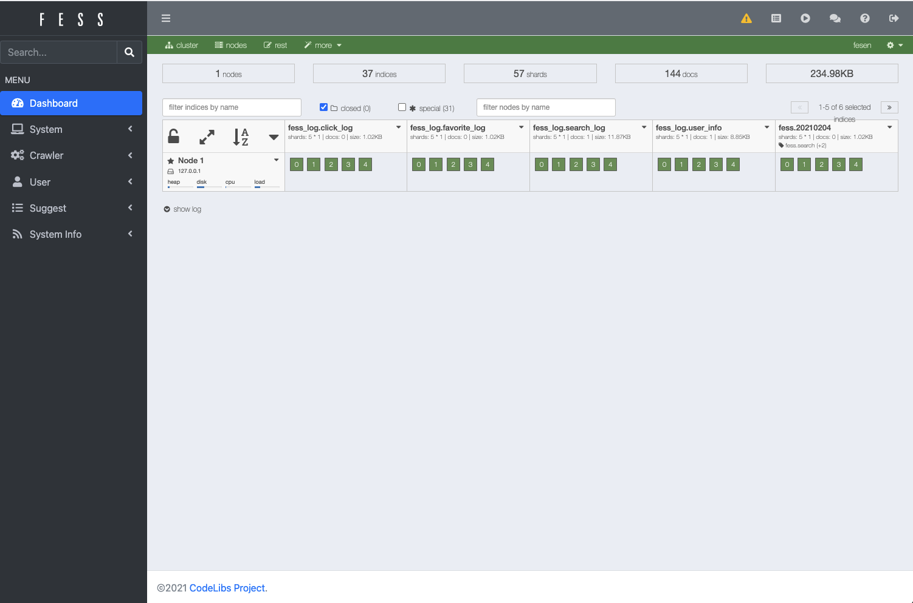
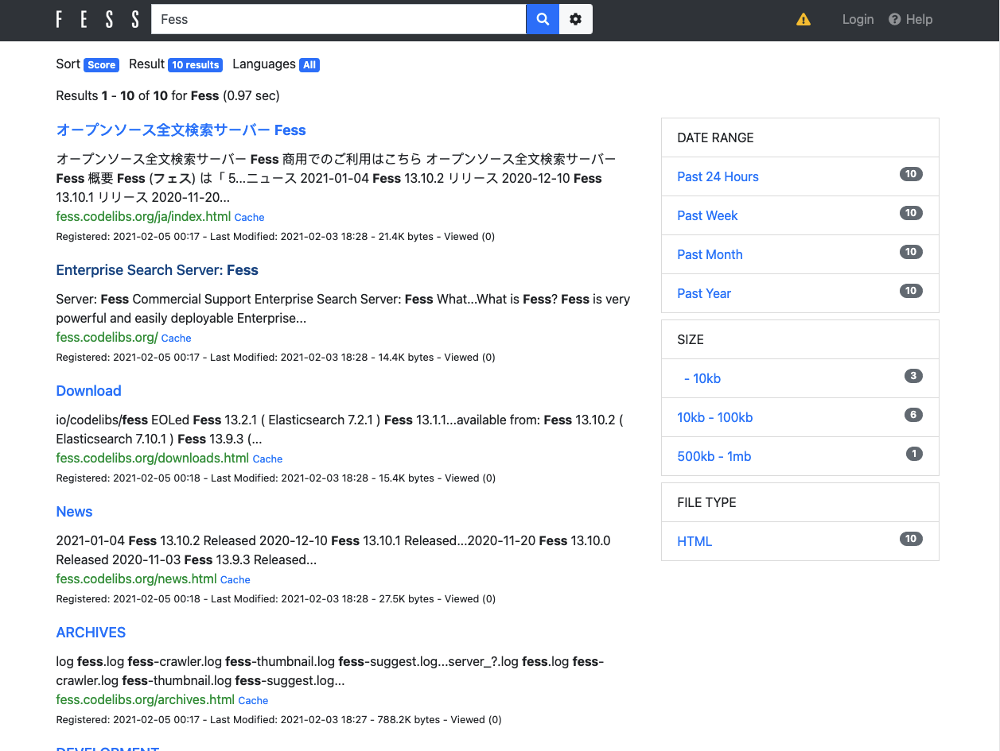
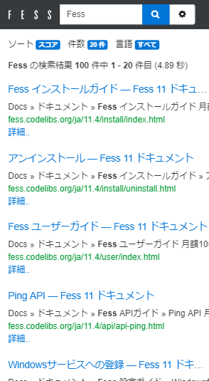

=========================
Part 1: Getting Started with Fess
=========================

**This page is generated by Machine Translation from Japanese. PR is welcome!**

The number of files owned by companies and individuals is increasing year by year. Ever wanted to find what you needed efficiently?
I think that the number of cases where search servers are introduced to solve such needs is increasing.
A long time ago, there was namazu, etc., but now there are various options from low-layer libraries such as Apache Lucene to search servers that can be used immediately after introduction such as Fess introduced this time.

In this series, we will introduce how to use the full-text search server Fess to implement web search and corporate search.
I would like to give a practical explanation based on how to respond to actual search tasks, not the theoretical story of search.

This first time, I will introduce the introduction method of Fess.

What is Fess
============

Fess is an open source full-text search server that can handle a wide range of searches from web search to corporate search.
It has a wealth of features, but the biggest feature is that it can be easily installed without the need for full-text search expertise, and a search system can be built simply by setting it on the browser.
If you start Fess, the following search screen is available immediately.

|image0|

The search system needs to be able to respond to search results, but Elasticsearch is used as the search engine, which can be said to be the heart of Fess.
Achieving a high response speed by making the most of Elasticsearch's functions, it can also respond to complex search requirements such as searching for file servers that exceed several Tbytes in the company and giving priority to specific files. I can do it.

Installation
============

Let's build a search server immediately.
Fess requires a Java execution environment, so please install Java 11 in advance.

You can download the Fess distribution from https://fess.codelibs.org/\ .
As of this writing (September 2017), the latest version is 13.5, so this time we will introduce the ZIP version.

After downloading, extract fess-13.5.0.zip to any folder and execute fess-13.5.0\\bin\\fess.
Fess can be used only by the above procedure.
If it does not start properly, check that the environment variable JAVA\_HOME is set correctly and that there is no space in the extracted path.

Login
=====

First, access ``http://localhost:8080/admin/`` on the administration screen and create settings to crawl search targets.
The admin account/password for logging in to the administration screen is admin/admin.
When you log in to the management screen, the dashboard will be displayed.

|image1|

Web Crawl Settings
==================

Select "Crawl" > "Web" from the menu on the left to display the list of web crawl settings.
Web crawl settings are settings for crawling documents (web pages) on the web and making them searchable.
Fess can be set to search for shared folders and databases in addition to the web.

Press the "New" button on the upper right to display the crawl setting screen.
The explanation of the main setting items is as follows.

.. tabularcolumns:: |p{4cm}|p{8cm}|
.. list-table::
   :header-rows: 1

   * - Name
     - Description 
   * - URL
     - URL to start crawling (start crawling from this URL)
   * - URLs to be included / excluded
     - Specify URLs to be included or excluded by regular expressions
   * - Depth
     - Depth to crawl from the starting URL and follow links in the page
   * - Maximum number of accesses
     - Maximum number of pages to crawl and get
   * - Number of threads
     - Number of threads to crawl (if 5, crawl the site with 5 threads simultaneously)
   * - Interval
     - Interval to crawl the page (in case of 5000, one thread gets every 5 seconds)

This time, create a crawl setting with the following settings.
This setting crawls the page group under ``https://fess.codelibs.org/`` with two threads at 1 second intervals (crawls about 2 pages per second) and searches about 100 pages.

.. tabularcolumns:: |p{4cm}|p{8cm}|
.. list-table::
   :header-rows: 1

   * - Name
     - Value
   * - Name
     - Fess
   * - URL
     - ``https://fess.codelibs.org/``
   * - URL to crawl
     - ``https://fess.codelibs.org/.*``
   * - Maximum access
     - 100
   * - Number of threads
     - 2
   * - Interval
     - 1000

Start Cralwer
=============

Start crawl after creating crawl settings.
Fess manages the crawler as a job, so you can start crawling by starting the job.

Select "System"> "Scheduler" from the menu on the left to display the job list.
Select the "Default Crawler" job to display the job details, and press the "Start Now" button to start crawling.
A running job is displayed as "Running" in the job list.
The crawl is completed in a few minutes, depending on network conditions.

"Default Crawler" is set by default to start at midnight every day.
So, if you start Fess, crawling will start automatically at the specified time.
As in this case, you can start at a time other than the scheduled time with the "Start Now" button.

Search
======

After crawling is complete, go to ``http://localhost:8080/`` and enter "Fess" to search.
The following search result list is displayed.

|image2|

Since Fess's search result screen uses responsive web design, we also provide the best search screen for each device.

|image3|

Summary
=======

This time, we introduced that you can build a search server with simple settings using Fess.
You can build and use a search server with just these simple steps.

In a next article, we will explain how to embed search results in existing web pages.

.. |image0| image:: ../../../resources/images/en/article/1/fess-search-top.png

