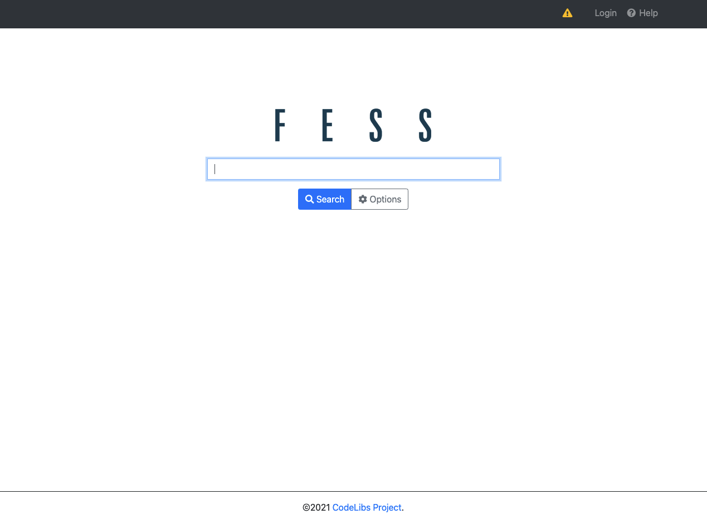
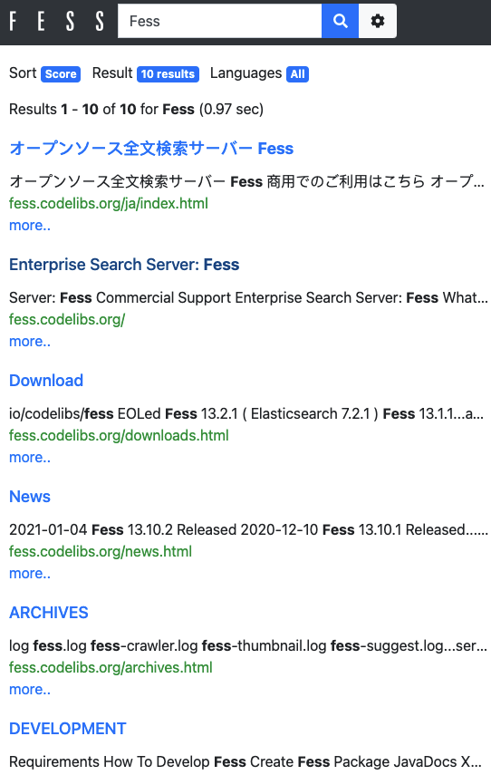

=================================
Part 1: Getting Started with Fess
=================================

After Google ended its Google Site Search in March 2018, many people began looking for a search service to incorporate into their websites.
At the same time, the number of files owned by companies and individuals is increasing year by year.
A long time ago, there was Namazu (http://www.namazu.org/), but now there are various low-level libraries such as Apache Lucene to use.
Fess is a search service based on Apache Lucene.

In this series, we will introduce how to use the full-text search server Fess to implement web search and corporate search.
This document provides a practical explanation of how to perform actual search tasks, not just theoretical discussions on search.

Fess is easy to deploy, and it is worth your time!

What is Fess?
=============

Fess is an open-source full-text search server that can handle a wide range of searches, from web searches to corporate searches.
It has a wealth of features, but its biggest advantage is that it can be easily installed without requiring expertise in full-text search, allowing you to build a search system simply by using a browser.
If you start Fess, the following search screen is available immediately.

|image0|

The search system needs to be able to respond to search results quickly.
Elasticsearch is used as the search engine, which can be considered the heart of Fess.
By making the most of Elasticsearch's functions, Fess achieves high response speeds and can meet complex search requirements, such as searching for file servers that exceed several terabytes and prioritizing specific files.

Installation
============

Let's build a search server immediately.
Fess requires a Java execution environment, so please install Java 11 in advance.

You can download the Fess distribution from https://fess.codelibs.org/.
As of this writing (Feb 2021), the latest version is 13.11.

Please follow the detailed steps for installation here: https://fess.codelibs.org/13.10/install/install.html.
If it does not start properly, check that the environment variable JAVA_HOME is set correctly and that there are no spaces in the extracted path.

Login
=====

First, access ``http://localhost:8080/admin/`` to open the administration screen and create settings to crawl search targets.
The admin account/password for logging in to the administration screen is admin/admin.
After logging in to the management screen, the dashboard will be displayed.

|image1|

Web Crawl Settings
==================

Select "Crawl" > "Web" from the menu on the left to display the list of web crawl settings.
Web crawl settings are for crawling documents (web pages) on the web and making them searchable.
Fess can be set to search for shared folders and databases in addition to the web.

Press the "New" button on the upper right to display the crawl setting screen.
The explanation of the main setting items is as follows:

.. tabularcolumns:: |p{4cm}|p{8cm}|
.. list-table::
   :header-rows: 1

   * - Name
     - Description 
   * - URL
     - URL to start crawling (start crawling from this URL)
   * - URLs to be included/excluded
     - Specify URLs to be included or excluded by regular expressions
   * - Depth
     - Depth to crawl from the starting URL and follow links on the page
   * - Maximum number of accesses
     - Maximum number of pages to crawl and retrieve
   * - Number of threads
     - Number of threads to use for crawling (if 5, crawl the site with 5 threads simultaneously)
   * - Interval
     - Interval to crawl the page (in case of 5000, one thread retrieves a page every 5 seconds)

This time, create a crawl setting with the following parameters.
This setting crawls the page group under ``https://fess.codelibs.org/`` with two threads at 1-second intervals (crawling about 2 pages per second) and searches about 100 pages.

.. tabularcolumns:: |p{4cm}|p{8cm}|
.. list-table::
   :header-rows: 1

   * - Name
     - Value
   * - Name
     - Fess
   * - URL
     - ``https://fess.codelibs.org/``
   * - URLs to crawl
     - ``https://fess.codelibs.org/.*``
   * - Maximum access
     - 100
   * - Number of threads
     - 2
   * - Interval
     - 1000

Start Crawler
=============

Start crawling after creating the crawl settings.
Fess manages the crawler as a job, so you can start crawling by starting the job.

Select "System" > "Scheduler" from the menu on the left to display the job list.
Select the "Default Crawler" job to display the job details, and press the "Start Now" button to start crawling.
A running job is displayed as "Running" in the job list.
The crawl completes in a few minutes, depending on network conditions.

The "Default Crawler" is set by default to start at midnight every day.
So, if you start Fess, crawling will start automatically at the specified time.
As in this case, you can start at a time other than the scheduled time with the "Start Now" button.

Search
======

After crawling is complete, go to ``http://localhost:8080/`` and enter "Fess" to search.
The following search result list is displayed.

|image2|

Since Fess's search result screen uses responsive web design, it provides the best search screen for each device.

|image3|

Summary
=======

This time, we demonstrated how you can build a search server with simple settings using Fess.
You can build and use a search server with just these straightforward steps.

In the next article, we will explain how to embed search results in existing web pages.

.. |image1| image:: ../../../resources/images/en/article/1/fess-admin-dashboard.png
.. |image2| image:: ../../../resources/images/en/article/1/fess-search-result.png

