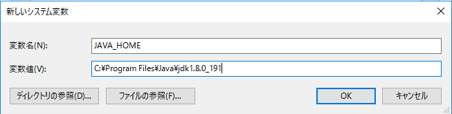
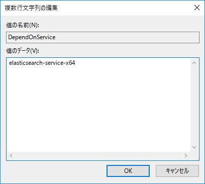
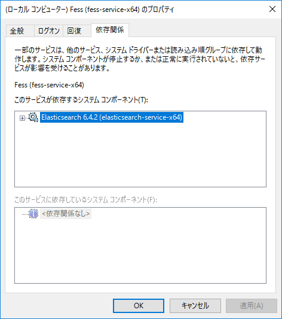

=========================
Part 10: How to build in Windows environment
=========================

**<<This page is generated by Machine Translation from Japanese. Pull Request is welcome!>>**

Fess offers three types of packages: ZIP/RPM/DEB.

The RPM/DEB packages are for Red Hat and Ubuntu respectively, and the standard Elasticsearch RPM/DEB packages corresponding to them are installed and used. The ZIP package is easy to use on any OS and is distributed with Elasticsearch built in.

You can easily create a Fess environment by expanding the ZIP package file, but when using it in production operation, we do not recommend running it with embedded Elasticsearch. Like RPM/DEB package, you need to build and use Elasticsearch separately from Fess.

This time, we will explain the construction assuming production operation in a Windows environment.

Java installation
=============

As with other operating systems, Java is required to start Fess. Please install Java 8u131 or later.

After installing Java, set the environment variables as follows.

1. Select Control Panel> System and Security> System> Advanced system settings> Environment variables.
1. Click "New" of "System environment variable".
1. Enter "JAVA_HOME" in "Variable name" and the address of the JDK file in "Variable value" and press "OK". The JDK file is usually located in " C:\Program File\java\jdk1.8.0_XXX" (XXX is the java version).
|image0|
1. In System Variables, select Path and click Edit.
1. In Edit Environment Variable Name, click New %JAVA_HOME%\bin, type in and click OK.

Install Elasticsearch
============

The version of Elasticsearch depends on the version of Fess used. Please read and install as appropriate.

You can check the Elasticsearch version corresponding to your Fess on the Fess `download page <https://fess.codelibs.org/ja/downloads.html>`__. This time I use Fess 12.3.5, so download Elasticsearch 6.4.3.

Download the Windows version from the Elasticsearch `download page <https://www.elastic.co/jp/downloads/past-releases/elasticsearch-oss-6-4-2>`__. and unzip it. This time I will c:\opt\deploy it to.

Install plugin
------------

Enter the following command at the command prompt to install the required plugins.

Please install the plugin corresponding to the version of Elasticsearch to be installed.

.. code-block:: doscon

    > c:\opt\elasticsearch\bin\elasticsearch-plugin.bat install org.codelibs:elasticsearch-analysis-fess:6.4.0
    > c:\opt\elasticsearch\bin\elasticsearch-plugin.bat install org.codelibs:elasticsearch-analysis-extension:6.4.1
    > c:\opt\elasticsearch\bin\elasticsearch-plugin.bat install org.codelibs:elasticsearch-configsync:6.4.0
    > c:\opt\elasticsearch\bin\elasticsearch-plugin.bat install org.codelibs:elasticsearch-dataformat:6.4.0
    > c:\opt\elasticsearch\bin\elasticsearch-plugin.bat install org.codelibs:elasticsearch-langfield:6.4.1
    > c:\opt\elasticsearch\bin\elasticsearch-plugin.bat install org.codelibs:elasticsearch-minhash:6.4.0
    > c:\opt\elasticsearch\bin\elasticsearch-plugin.bat install org.codelibs:elasticsearch-learning-to-rank:6.4.0

The plugin to install also depends on the Elasticsearch version, so please refer to the Fess installation guide to install the correct version.

Configuration
------------

In order to save the dictionary file distributed from Fess on Elasticsearch elasticsearch\config\elasticsearch.yml, add the following settings to.

.. code-block:: properties

    configsync.config_path: c:/opt/elasticsearch/config/

Registration to Windows service
------------

Register the Elasticsearch service with the Windows service. Start the command prompt with administrator privileges and execute the following command.

.. code-block:: doscon

    > c:\opt\elasticsearch\bin\elasticsearch-service.bat install

Install Fess
==================

You can get the Fess ZIP file from the `download page <https://fess.codelibs.org/ja/downloads.html>`__ .

This time I use Fess 12.3.5. I c:\opt\will deploy it here as well .

Configuration
------------

fess\bin\fess.in.batModify to access Elasticsearch as follows.

.. code-block:: properties

    set FESS_PARAMS=%FESS_PARAMS% -Dfess.es.http_address=http://localhost:9200
    set FESS_PARAMS=%FESS_PARAMS% -Dfess.es.transport_addresses=localhost:9300
    set FESS_PARAMS=%FESS_PARAMS% -Dfess.dictionary.path="c:/opt/elasticsearch/config/"

Specify the port number for connecting with Elasticsearch. fess\app\WEB-INF\classes\fess_config.properties To change.

.. code-block:: properties

    elasticsearch.http.url=http://localhost:9200

The default port number on the Fess search screen and management screen is 8080. If you c:\opt\fess\bin\fess.in.batwant to change to 80, change fess.port of.

.. code-block:: properties

    set FESS_JAVA_OPTS=%FESS_JAVA_OPTS% -Dfess.port=80

Registration to Windows service
------------

Register the Fess service as a Windows service. Start the command prompt with administrator privileges and execute the following command.

.. code-block:: doscon

    > c:\opt\fess\bin\service.bat install

Service startup
==================

If you want to start the service manually, start the Elasticsearch service first, and then start the Fess service.

Run the following command to start Elasticsearch.

.. code-block:: doscon

    > c:\opt\elasticsearch\bin\elasticsearch-service.bat start

Start Fess.

.. code-block:: doscon

    > c:\opt\fess\bin\service.bat start

Service auto-start settings
=============

If you want to start the service automatically when Windows starts, set as follows.

1. Open Control Panel> System and Security> Administrative Tools> Services.
1. Open the properties of "elasticsearch 6.4.2 (elasticsearch-service-x64)" from the service list and set "Startup type" to "Automatic" and click "OK".
1. Open the property of "Fess (fess-service-x64)" from the service list, set "Startup type" to "Automatic (delayed start)" and click "OK".
1. Press "R" key while pressing "Windows" key on the keyboard to display "Run". After entering "regedit", click "OK" to open the registry editor.
1. "COMPUTER\HKEY_LOCAL_MACHINE\SYSTEM\CurrentControlSet\Services\fess-service-x64\DependOnServiceAdd" elasticsearch-service-x64 "to the value of the" click "OK".
|image1|
1. Once added, elasticsearch-service-x64 appears in the Fess service properties dependency.
|image2|

Stop service
======

When stopping the service, the Fess service is stopped first, and then the Elasticsearch service is stopped.

Execute the following command to stop Fess.

.. code-block:: doscon

    > c:\opt\fess\bin\service.bat stop

Stop Elasticsearch.

.. code-block:: doscon

    > c:\opt\elasticsearch\bin\elasticsearch-service.bat stop

Summary
=======

This time, we introduced how to build Fess in a Windows environment assuming production operation. Please refer to it when building Fess in Windows environment.

