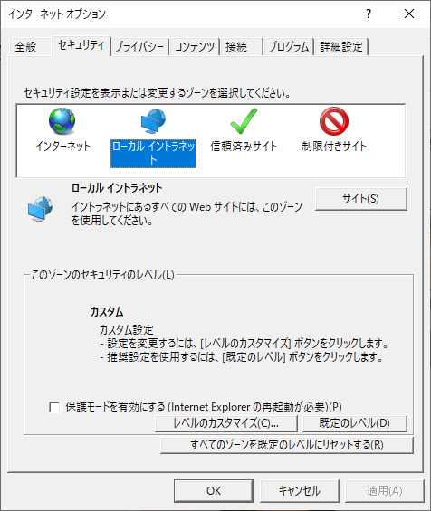
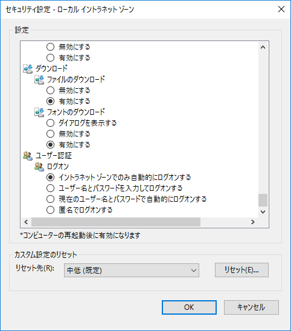
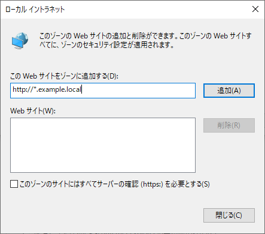
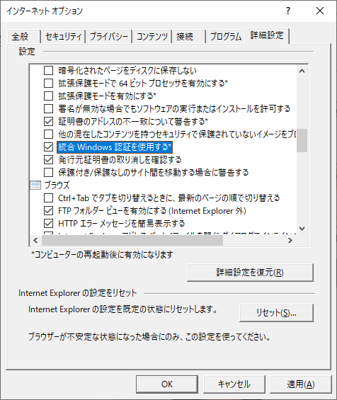
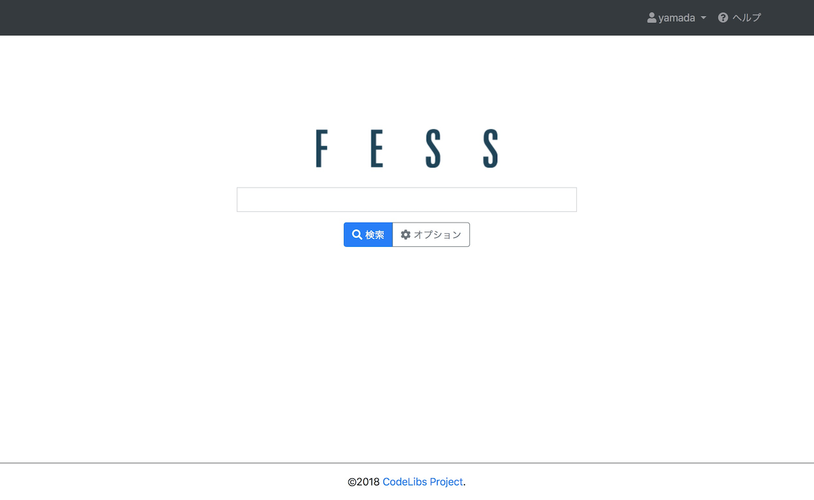

=========================
Part 11: Single sign-on with Fess
=========================

**<<This page is generated by Machine Translation from Japanese. Pull Request is welcome!>>**

In the in-house system, there is a case where a single scion environment is constructed in which it is not necessary to log in again for each application when logging in to the terminal.

Fess supports various single sign-on environments, but this time I will show you how to use single sign-on with Fess linked with Active Directory.

What is single sign-on?
=============

Single Sign-On (SSO) is a mechanism for logging in to multiple applications and services with a single authentication operation.

By using single sign-on, you do not need to log in individually, and you can combine multiple IDs and passwords registered for each service into one.

Login operation can be omitted by setting single sign-on on Fess.

This time, I will explain how to set up single sign-on using integrated Windows authentication.

AD server settings
=============

In this article, we will use Windows Server 2016 and assume that the following settings have been made.

.. tabularcolumns:: |p{4cm}|p{8cm}|
.. list-table::
   :header-rows: 1

   * - item
     - Set value
   * - Domain name
     - example.local
   * - AD server
     - AD-SERVER.example.local
   * - AD access user
     - hoge
   * - Password of the above user
     - fuga

Start Fess
=============

Fess uses 12.3.2. You can get the Fess ZIP file from the Fess `download page <https://fess.codelibs.org/downloads.html>`__ .

Extract the ZIP file and bin/fess.[sh|bat]execute to start Fess.

The server name of Fess is as follows.

.. tabularcolumns:: |p{4cm}|p{8cm}|
.. list-table::
   :header-rows: 1

   * - item
     - Set value
   * - Fess server
     - FESS-SERVER.example.local

Before setting up single sign-on, set up linkage with Active Directory in advance.

Open "System"> "General" on the Fess management screen, and enter the following values ​​in the LDAP settings.

.. tabularcolumns:: |p{4cm}|p{8cm}|
.. list-table::
   :header-rows: 1

   * - item
     - Set value
   * - LDAP URL
     - ldap://AD-SERVER.example.local:389
   * - Base DN
     - dc=example, dc=local
   * - Bind DN
     - hoge@example.local
   * - password
     - fuga
   * - User DN
     - %s@example.local
   * - Account filter
     - (&(objectClass=user)(sAMAccountName=%s))
   * - memberOf attribute
     - memberOf

After entering, click the "Update" button.

After setting LDAP, please confirm that you can log in as a general user registered in LDAP from the login screen of Fess. If the login user name is displayed in the upper right of the search screen, login is successful.

|image0|

Java settings
=============

For Java 8 u151 and earlier you need to replace JCE with Unlimited Strength as follows:

1. Download the file from https://www.oracle.com/technetwork/java/javase/downloads/jce8-download-2133166.html and unzip it.
2. Place the US_export_policy.jar and local_policy.jar files in $JAVA_HOME/jre/lib/security.

You do not need to replace JCE after Java 8 u161.

SPN settings
=============

Set the SPN (Service Principal Name).

Log in to Windows in the same Active Directory domain setspnand use the command prompt to register using.

.. code-block:: doscon

    > setspn -S HTTP/FESS-SERVER.example.local hoge

Check if you have registered.

.. code-block:: doscon

    > setspn -L hoge

If you execute it on the Fess server, log out of Windows once and log in again.

Fess settings
=============

Create app/WEB-INF/classes/krb5.conf with the following contents.

.. code-block:: properties

    [libdefaults]
        default_realm = EXAMPLE.LOCAL
        default_tkt_enctypes = aes128-cts rc4-hmac des3-cbc-sha1 des-cbc-md5 des-cbc-crc
        default_tgs_enctypes = aes128-cts rc4-hmac des3-cbc-sha1 des-cbc-md5 des-cbc-crc
        permitted_enctypes   = aes128-cts rc4-hmac des3-cbc-sha1 des-cbc-md5 des-cbc-crc

    [realms]
        EXAMPLE.LOCAL = {
            kdc = AD-SERVER.EXAMPLE.LOCAL
            default_domain = EXAMPLE.LOCAL
        }

    [domain_realm]
        example.local = EXAMPLE.LOCAL
        .example.local = EXAMPLE.LOCAL

Create app/WEB-INF/classes/auth\_login.conf with the following contents.

.. code-block:: properties

    spnego-client {
    	com.sun.security.auth.module.Krb5LoginModule required;
    };

    spnego-server {
    	com.sun.security.auth.module.Krb5LoginModule required
    	storeKey=true
    	isInitiator=false;
    };

Change the settings related to SSO in app/WEB-INF/classes/fess\_config.properties as shown below.

.. code-block:: properties

    sso.type=spnego
    spnego.logger.level=0
    spnego.krb5.conf=krb5.conf
    spnego.login.conf=auth_login.conf
    spnego.preauth.username=hoge
    spnego.preauth.password=fuga
    spnego.login.client.module=spnego-client
    spnego.login.server.module=spnego-server
    spnego.allow.basic=true
    spnego.allow.unsecure.basic=true
    spnego.prompt.ntlm=true
    spnego.allow.localhost=true
    spnego.allow.delegation=false

After completing the settings, restart Fess.

After starting, log in to the management screen. Open System> General, enable Login Required and click the Update button.

IE/edge settings
=============

Please set the Internet option settings of the terminal to access Fess as follows.

1. Open Internet Options and select the Security tab.
2. Click Custom Level in the Local Intranet zone.

|image1|

3. Select User Authentication> Logon> Automatic Logon Only in Intranet Zone.

|image2|

4. Click the "OK" button.
5. On the Security tab, click Site in the Local intranet zone.
6. Click the "Advanced" button.
7. Enter the URL of Fess in "Add this website to the zone" and click the "Add" button.

|image3|

8. After confirming that the entered URL has been set in the "Website" field, click the "Close" button.

|image4|

9. When you return to the Internet Options screen, select the [Advanced] tab, check [Security]> [Use Integrated Windows Authentication], and click the [OK] button.

|image5|

10. After changing the settings, log out of Windows once.

Access to Fess
=============

Let's access Fess on a domain-joined device.

When you access Fess as a Windows login user, it automatically switches to the state where you are logged in to Fess.

If the Windows login user name is displayed in the upper right of the search screen, it is successful.
|image6|

This time, I explained how to make single sign-on with Fess linked with Active Directory.

By using single sign-on, you can expect to omit login operations and reduce the burden of password management. Please use it together with Active Directory integration.

.. |image4| image:: ../../../resources/images/en/article/11/add_local_intranet.png

