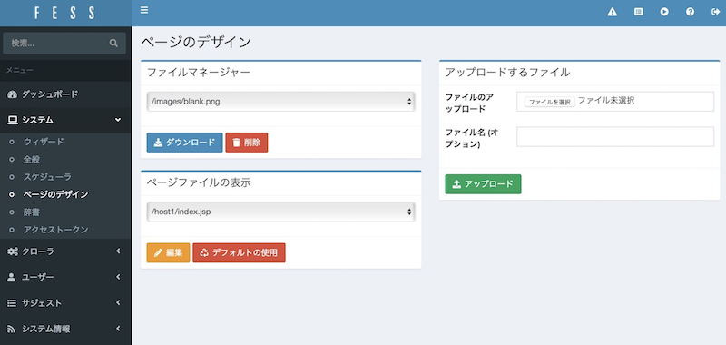
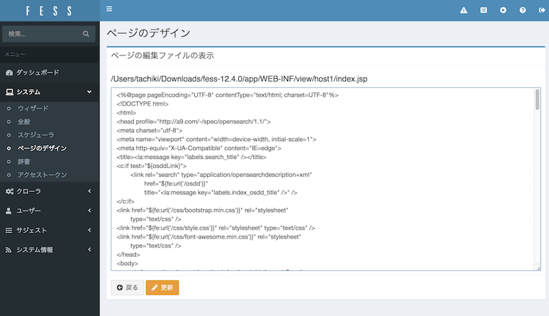
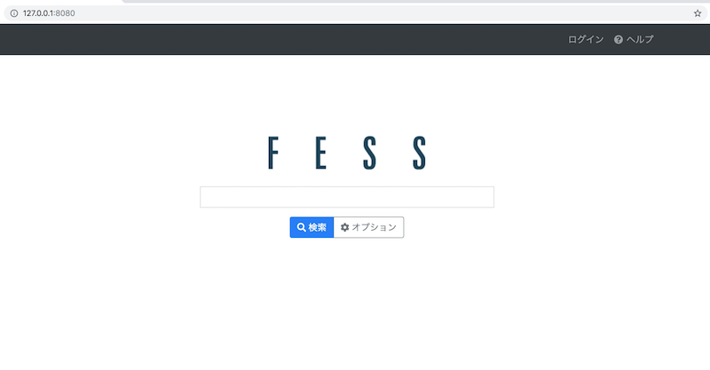
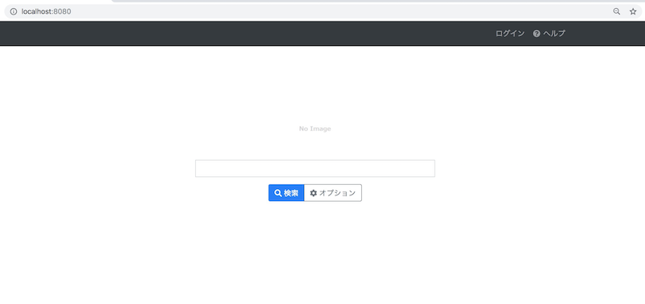
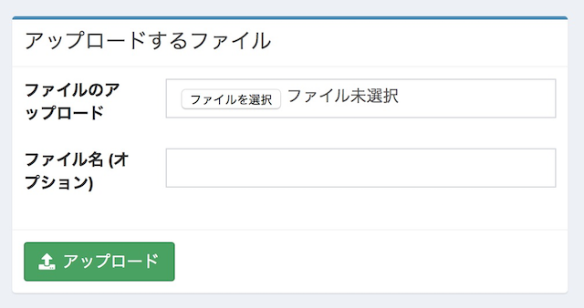
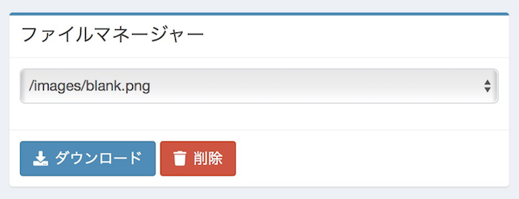
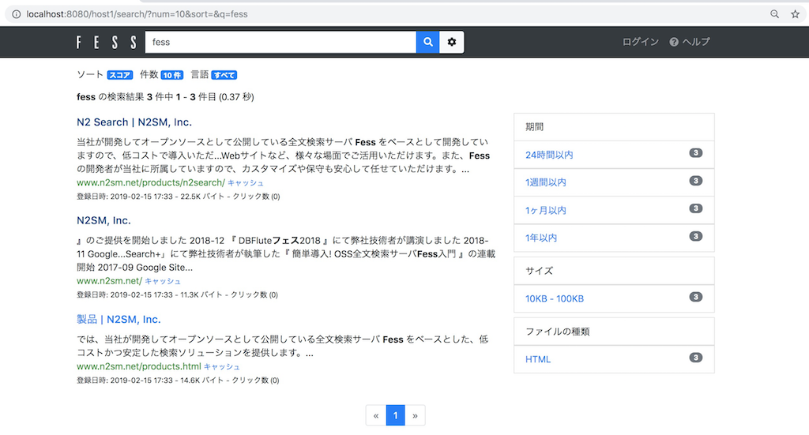
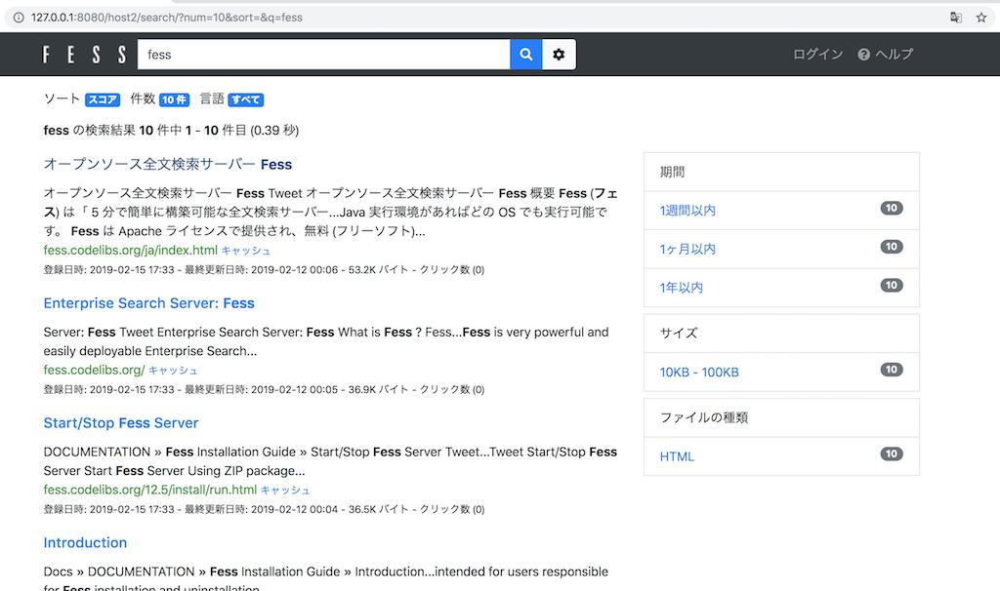

=========================
Part 12: How to use the virtual host function
=========================

**<<This page is generated by Machine Translation from Japanese. Pull Request is welcome!>>**

This time, I will explain how to use the virtual host function of Fess.

If there are multiple search targets and you want to install a search system for each, you can easily display search screens and search results simply by setting virtual hosts without preparing Fess for each search target.

By using the virtual host function, a single Fess can realize a search system for multiple sites.

What is the virtual host function?
=============

With the virtual host function, search results can be sorted according to the host name (URL host part) accessed by Fess.
Search results are displayed in each JSP, so it is possible to change the screen design.

Virtual Host Settings
=============

This time, we will use two sites and distribute search results and change the screen design for each site.

I will explain using Fess-12.4.0. You can get the Fess ZIP file from the Fess `download page <https://fess.codelibs.org/downloads.html>`__ .

Extract the ZIP file and bin/fess.[sh|bat]execute to start.

First, open "System"> "General" in the Fess administration screen. Set the host name and virtual host name to be used in the virtual host item.

The format for a virtual host is as follows.

.. code-block:: properties

    Host: ``host name`` [:``port number used``] = ``virtual host name``

For the host name and port number, specify the host name and port number for accessing Fess. If you need to specify the port to access, specify the port.

Specify an arbitrary name for the virtual host name. This value is used for virtual host specification such as crawl settings.

This time, enter the virtual host items as follows to make it easier to check in your environment.

.. code-block:: properties

    Host:localhost:8080=host1
    Host:127.0.0.1:8080=host2

After entering, click Update to save your settings.

Change the search screen for each virtual host
=============

Setting the virtual host app/WEB-INF/view/``virtual host name`` will generate a JSP for the search page.

You can change the design of the search screen by editing these. It is possible to edit the file directly with an editor, but here we will edit it on the Fess management screen.

This time, I will replace the logo on the search top page.

On the Fess administration screen, click System> Page Design. For View Page File, select /host1/index.jsp and click Edit.
|image0|

The contents of "/host1/index.jsp" are displayed.

|image1|

Replace the title logo of Fess with "noimage.png" included in Fess.
Find the img tag that specifies the logo in the main tag, and change the file name from /images/logo.png to /images/noimage.png as shown below.

.. code-block:: jsp

    " />>

Click Update when you are finished editing.

Let's access the search top page of each virtual host.

On host2 (``http://127.0.0.1:8080/``), nothing has changed, so the logo has not changed.

|image2|

On the other hand, the logo has been changed on host1 (``http://localhost:8080/``) where the file name was changed.

|image3|

This time I used the image file bundled with Fess, but if you want to use another image file, please upload the file with "File to upload" on the page design screen. If you use a newly created css file or js file, you can also place it in the same way.

|image4|

If you want to edit the css file or js file on the Fess server, use "File Manager". After downloading and editing the file with the file manager, uploading with "File to upload" overwrites the contents of the file.

|image5|

Distributing search results for each virtual host
=============

Then create a crawl configuration for each virtual host. This time, set up so that you can search the N2SM site on host1 and the Fess site on host2.

Create a web crawl setting by clicking Crawler> Web> New on the Fess admin page.

Since search results are output separately for each virtual host, create each crawl setting and enter the corresponding virtual host name in the "Virtual host" item.

This time, create the following two settings.

.. tabularcolumns:: |p{4cm}|p{8cm}|
.. list-table::
   :header-rows: 1

   * -
     - N2SM
     - Fess
   * - name
     - N2SM
     - Fess
   * - URL
     - https://www.n2sm.net/
     - https://fess.codelibs.org/
   * - URL to be crawled
     - https://www.n2sm.net/.*
     - https://fess.codelibs.org/.*
   * - Maximum number of accesses
     - 10
     - 10
   * - interval
     - 3000 ms
     - 3000 ms
   * - Virtual host
     - host1
     - host2

After entering, click “Create” to save.

After creating the crawl settings, go to System> Scheduler> Default Crawler and click Start Now to start the crawl.

Wait for a while until the crawl is complete.

After crawling is completed, let's access ``http://localhost:8080/`` and search.
Since ``localhost:8080`` is the host name of host1, only the search result of ``https://www.n2sm.net/`` will be displayed.

|image6|

Next, access ``http://127.0.0.1:8080/`` and search.
Since ``127.0.0.1: 8080`` is the host name of host2, only the search result of ``https: // fess.codelibs.org /`` will be displayed.

|image7|

This time, we introduced the sorting of search results as an example, but you can also specify virtual hosts with labels, key matches, related contents, and related queries.

Specify the virtual host name on each setting screen.

This time, I explained how to use the virtual host function of Fess.

If you want to separate the screen design and search results for each host name, you can easily separate the design and search target, so please use it.

