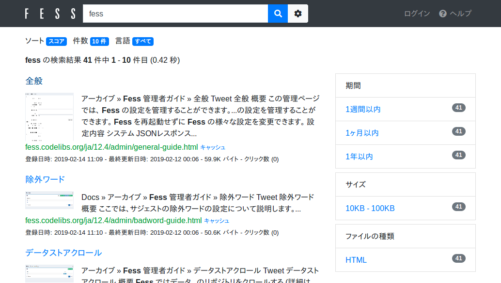
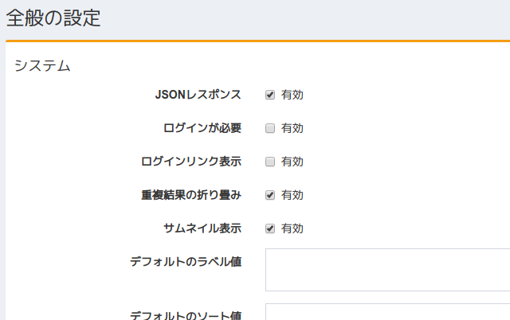

=========================
Part 13: How to display thumbnail images in search results
=========================

**<<This page is generated by Machine Translation from Japanese. Pull Request is welcome!>>**

This time I will introduce the thumbnail image display function of Fess.

You may find it difficult to see if the search result screen is full of text.
Also, you may not know what the contents are just by the title and summary displayed on the search result screen. In such cases, Fess can convey the content visually with thumbnail images.

|image0|

Setting method
=============

Setting up thumbnail images in Fess is easy. Please enable thumbnail display from "System"> "General" on the management screen.

|image1|

The information required to generate thumbnail images is collected during crawling, so please crawl again after changing the settings.

Thumbnail image display
=============

Fess generates thumbnail images based on the MIME type of search results.
If the crawled document has a MIME type that allows thumbnail image generation, thumbnail images can be generated.

Fess can generate thumbnail images of HTML files as standard. Also, if it is a Linux OS, you can generate thumbnails for PDF files, MS Office files, and PostScript files.
The thumbnail image generation process can be set and added for each MIME Type.

HTML file thumbnail image
=============

This section describes the thumbnail image display of HTML files.

The thumbnail image of the HTML file uses the image specified as the thumbnail image in HTML or the image included in HTML.
Thumbnail images are searched in HTML in the following order.

1. The value of the content of the meta tag whose name attribute is specified by thumbnail
1. The value of the content of the meta tag whose property attribute is specified by og:image
1. Image with a size suitable for thumbnails with the img tag

The images found in the above order will be used as thumbnail images.

There are fess_config.propertiesthe following settings for detecting the image specified by the img tag . By default, images with an aspect ratio of 100px or more and an aspect ratio of 3 times or less are detected.

.. code-block:: properties

    thumbnail.html.image.min.width=100
    thumbnail.html.image.min.height=100
    thumbnail.html.image.max.aspect.ratio=3.0

Other thumbnails
=============

If a thumbnail image can be generated from the target file using some command, etc., it can be displayed in the search results.

Fess provides for Linux environment bin/generate-thumbnail.
generate-thumbnailIf there is an image generation command suitable for the target file, the script will generate a thumbnail image using it.
This script is app/WEB_INF/classes/fess_thumbnail.xmlset up for use with. By modifying these files you can configure different thumbnail image processing.

ImageMagick's convert command can be used to generate thumbnail images of PDF files. If you have a Redhat OS, you can install ImageMagick using yum.

.. code-block:: properties

    $ sudo yum install ImageMagick

In addition to ImageMagick, unoconv is used to generate thumbnail images of MS Office files. You can install unoconv as follows like ImageMagick.

.. code-block:: properties

  $ sudo yum install unoconv

Thumbnail image size
=============

The thumbnail image size of fess_config.propertiesthe HTML file is generated with the following value of and the thumbnail image is saved.

.. code-block:: properties

    thumbnail.html.image.thumbnail.width=100
    thumbnail.html.image.thumbnail.height=100

generate-thumbnailThe image size generated by IMAGE_SIZEcan change the size of the thumbnail image by changing the value in the script .

This time, I explained the thumbnail of Fess. By using the thumbnail function of Fess, it is possible to construct a search screen that is easier to see. Even in a Windows environment, fess_thumbnail.xmlyou can display thumbnail images by specifying a command to generate an image with.

