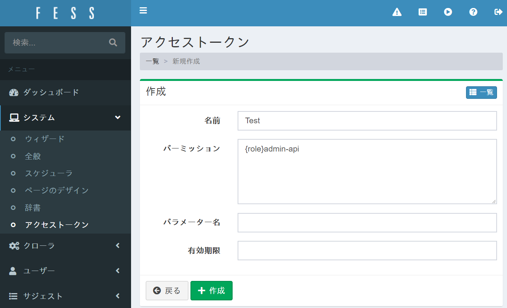

=========================
Part 14: How to use the management API
=========================

**<<This page is generated by Machine Translation from Japanese. Pull Request is welcome!>>**

What is the management API?
=============

Management API is a RESTful API for management operation provided by Fess, and you can set Fess via HTTP request.

Most things that can be set on the Fess management screen, such as crawler settings and dictionary settings, can also be set from the management API. This is useful when you want to change Fess settings from an external application.

This time we will introduce the management API while creating the settings for crawl and scheduler.

Please refer to the `Administrator's Guide <https://fess.codelibs.org/ja/13.1/admin/index.html>`__ for a description of the Fess administration features themselves . Please refer to /api/admin/ etc. of `I/F guide <https://fess.codelibs.org/13.1/lastadoc-fess.html>`__ for the explanation of parameters sent by HTTP request and the setting items not introduced this time .

In the following explanation, it is assumed that the Fess environment has been built.

Preparation for using the management API
=============

To use the management API, first create an access token on the Fess management screen.

From "System"> "Access Token" on the management screen of Fess, click "New" in the upper right, and set the following settings to issue an access token.

.. tabularcolumns:: |p{4cm}|p{8cm}|
.. list-table::
   :header-rows: 1

   * - item name
     - Set value
   * - name
     - Test
   * - permission
     - {role}admin-api

|image0|

The name can be any value, but a admin-apirole is required to access the management API .

To confirm the generated access token, click the setting created from the access token list page and save the value displayed in the "Token" column.

|image1|

If you use the access token obtained here, you can change the settings without logging in as an administrator, so be careful when managing the access token.

This time access_token, assume that the value of the access token obtained is .

Crawler settings
=============

In the crawler settings, you can register the settings to perform crawling.

Here, as an example , register the setting to crawl the `Fess official website <http://fess.codelibs.org>`__ .

First, write the web crawl settings in JSON format as follows. Those that are marked as Required in the annotations column of the `I/F guide <https://fess.codelibs.org/13.1/lastadoc-fess.html>`__ must always be included in the body part of the HTTP request.

.. code-block:: json

    json
    {
       "name":"Fess : https://fess.codelibs.org/",
       "description":"Enterprise Search Server: Fess",
       "urls":"https://fess.codelibs.org/",
       "included_urls":"https://fess.codelibs.org/.*",
       "user_agent":"Mozilla/5.0",
       "num_of_thread":1,
       "interval_time":10000,
       "boost":1.0,
       "available":true,
       "sort_order":0
    }

Next, use the PUT method to send the above JSON to Fess using the management API.

The access token is specified in the Autorization request header. access_tokenPlease replace the curl command with the access token obtained on the management screen and execute it.

.. code-block:: bash

    $ curl -H "Authorization: access_token" -XPUT "http://localhost:8080/api/admin/webconfig/setting" -d '{"name":"Fess : https://fess.codelibs.org/","description":"Enterprise Search Server: Fess","urls":"https://fess.codelibs.org/","included_urls":"https://fess.codelibs.org/.*","user_agent":"Mozilla/5.0","num_of_thread":1,"interval_time":10000,"boost":1,"available":true,"sort_order":0}'

The following JSON response will be returned.

.. code-block:: json

    {"response":{"id":"webconfig_id","created":true,"version":"13.1","status":0}}

createdIf the field is true and the statusfield is 0 (0 is a normal end), registration is successful. idThe field string will be the ID for this crawler setting. Here it is webconfig_idreplaced with.

In addition to the web crawl settings API, there are also `file crawl settings API <https://fess.codelibs.org/13.1/lastadoc-fess.html#.api.admin.fileconfig.settings::settings>`__ and `data store crawl settings API <https://fess.codelibs.org/13.1/lastadoc-fess.html#.api.admin.dataconfig.settings::settings>`__ .

Registration of various setting information can be performed in the same way as above.

Scheduler
=============

The scheduler can manage the execution schedule of various jobs such as crawlers.

Use the following command to get the list of jobs registered in the scheduler.

.. code-block:: bash

    $ curl -H "Authorization: access_token" -XGET "http://localhost:8080/api/admin/scheduler/settings"

The following JSON response will be returned.

.. code-block:: json
    {
       "response":{
          "settings":[
             {
                "running":false,
                "id":"default_crawler",
                "version_no":-1,
                "name":"Default Crawler",
                "target":"all",
                "cron_expression":"0 0 * * *",
                "script_type":"groovy",
                "script_data":"return container.getComponent(\"crawlJob\").logLevel(\"info\").execute(executor);",
                "crawler":"true",
                "job_logging":"true",
                "available":"true",
                "sort_order":0
             },
             ... (omit) ...
          ],
          "total":10,
          "version":"13.1",
          "status":0
       }
    }

`settings` Contains information about currently registered jobs. You can check the jobs registered as standard.

Next, use the scheduler API to register the job with the web crawl settings you registered earlier.

Job settings to be registered are described in JSON format as follows. Here, the time to execute the crawl job is assumed to be 12:00 every day, and the ID of the web crawl settings registered in the job is `webconfig_id`.

.. code-block:: json
    {
       "name":"Fess : https://fess.codelibs.org/",
       "target":"all",
       "cron_expression":"0 12 * * *",
       "script_type":"groovy",
       "script_data":"return container.getComponent(\"crawlJob\").logLevel(\"info\").sessionId(\"webconfig_id\").webConfigIds([\"webconfig_id\"] as String[]).fileConfigIds([] as String[]).dataConfigIds([] as String[]).jobExecutor(executor).execute();",
       "sort_order":0,
       "crawler":true,
       "job_logging":true,
       "available":true
    }

Send the created JSON text by PUT method to create a job in the scheduler.

.. code-block:: bash

    $ curl -H "Authorization: access_token" -XPUT "http://localhost:8080/api/admin/scheduler/setting" -d '{"name":"Fess : https://fess.codelibs.org/","target":"all","cron_expression":"0 12 * * *","script_type":"groovy","script_data":"return container.getComponent(\"crawlJob\").logLevel(\"info\").sessionId(\"webconfig_id\").webConfigIds([\"webconfig_id\"] as String[]).fileConfigIds([] as String[]).dataConfigIds([] as String[]).jobExecutor(executor).execute();","sort_order":0,"crawler":true,"job_logging":true,"available":true}'

It is successful if the following JSON response is returned.

.. code-block:: json

    {"response":{"id":"(ID of the created job)","created":true,"version":"13.1","status":0}}

Although the example of `creating (PUT) <https://fess.codelibs.org//13.1/lastadoc-fess.html#.api.admin.scheduler.setting::put_d_setting>`__ is shown here, you can also operate to `get (GET) <https://fess.codelibs.org/13.1/lastadoc-fess.html#.api.admin.webconfig.setting._b_id_e_::get_d_setting>`__ , `edit (POST) <https://fess.codelibs.org/13.1/lastadoc-fess.html#.api.admin.scheduler.setting::post_d_setting>`__ , and `delete (DELETE) <https://fess.codelibs.org/13.1/lastadoc-fess.html#.api.admin.scheduler.setting._b_id_e_::delete_d_setting>`__ in the same way.
Also, if you want to run a specific job immediately,

.. code-block:: bash
    $ curl -H "Authorization: access_token" -XPOST "http://localhost:8080/api/admin/scheduler/(ジョブのID)/start"

will do.

This time, we introduced a specific example of using the management API provided by Fess. I think it will be helpful when using the management API not introduced this time.

When you want to embed Fess, you can build a system that embeds the function of Fess by using the management API.

.. |image1| image:: ../../../resources/images/en/article/14/access_token.png
