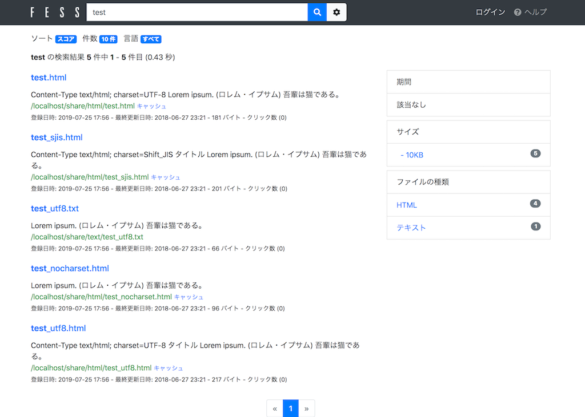

=========================
Part 15: File server crawls that require authentication
=========================

**<<This page is generated by Machine Translation from Japanese. Pull Request is welcome!>>**

Fess can crawl local files as well as files on file servers. Crawling is possible even when authentication is required to access the file server.

This time, I will introduce how to crawl a file server that requires authentication.

File authentication
=============

The file authentication function in Fess is a setting required when crawling to a file server. It supports authentication for SMB or FTP.

Windows shared folders use the SMB (Server Message Block) protocol for communication. SMB has versions such as SMBv1, SMBv2, and SMBv3, but the latest version at the time of this writing, Fess 13.2.0, supports SMBv1 or SMBv2.

When setting file authentication, specify "Samba" as the scheme. Specify "FTP" as the scheme when setting the file authentication to the FTP server.

Crawl shared folders on Windows
=============

This section describes how to crawl Windows shared folders.

To crawl a Windows shared folder, you need an account that has access to the target folder.

This time I use Fess 13.2.0. You can get the Fess ZIP file from the `download page <https://fess.codelibs.org/ja/downloads.html>`__ . Extract the ZIP file and bin/fess.[sh|bat]execute to start.

Creating a crawl setting
=============

First, create a crawl setting.

Log in to the management screen of Fess and set the information of the crawl destination in "Crawl"> "File system" on the left menu.

This time \\localhost\share\, set as below to crawl " ". When specifying the path, specify "smb://" at the beginning and "/" for "\". Specify "/" at the end of the path.

.. tabularcolumns:: |p{4cm}|p{8cm}|
.. list-table::
   :header-rows: 1

   * - item
     - Set value
   * - name
     - smb_crawl
   * - path
     - smb://localhost/share/

When crawling a file server that supports only SMBv1, specify "smb1://" instead of "smb://" for the protocol.

File authentication settings
=============

After creating the crawl settings, select [Crawl]> [File Authentication] in the left menu to set the file authentication.

The main setting items are explained below.

.. tabularcolumns:: |p{4cm}|p{8cm}|
.. list-table::
   :header-rows: 1

   * - item
     - Explanation
   * - hostname
     - Host name of the target server (arbitrary host name if omitted)
   * - port
     - Port number of target site (arbitrary port number if omitted)
   * - scheme
     - Authentication method
   * - username
     - User name for logging in to the target server
   * - password
     - Password for logging in to the target server
   * - The parameter
     - Set when there is a setting value required to log in to the target server
   * - File crawl settings
     - Crawl settings that use this authentication setting

This time, set below. When crawling a Windows shared folder, specify "Samba" as the scheme value.

.. tabularcolumns:: |p{4cm}|p{8cm}|
.. list-table::
   :header-rows: 1

   * - item
     - Set value
   * - hostname
     - localhost
   * - scheme
     - Samba
   * - username
     - hoge
   * - password
     - hoge password
   * - File crawl settings
     - smb_crawl

Execution
=============

After the crawl settings and file authentication settings are registered, crawl is executed.
Click [System]> [Scheduler]> [Default Crawler] on the left menu, and click the [Start Now] button.
Wait a while for the crawl to finish.

After crawling, go to http://localhost:8080 and search. It will be successful if the files in the shared folder can be searched.

|images0|

Active Directory integration
=============

With Fess, if you crawl a Windows shared folder, you can automatically get permission information for the shared folder at the crawl destination.

By linking with Active Directory, you can easily implement different search results for each user according to their access privileges. Fess 12.2 and later support nested groups.

"How about the cooperation Active Directory `[9th] Active Directory work together in Fess <https://news.mynavi.jp/itsearch/article/bizapp/4283>`__ please refer to the article of".

FTP server crawl
=============

To crawl the FTP server, you also need an account that has access to the FTP server.

The file crawl of the FTP server is the same as that of SMB, so create the file crawl settings first. When crawling an FTP server, the path protocol should be "ftp://" instead of "file://".

After creating the crawl settings, select [Crawl]> [File Authentication] in the left menu to set the file authentication. If you want to crawl the FTP server, set the scheme to "FTP".

After the crawl settings and file authentication settings are registered, crawl is executed.

This time, I introduced how to crawl file authentication with Fess.

You can easily crawl shared folders simply by setting crawl settings and credentials, so please give it a try.

