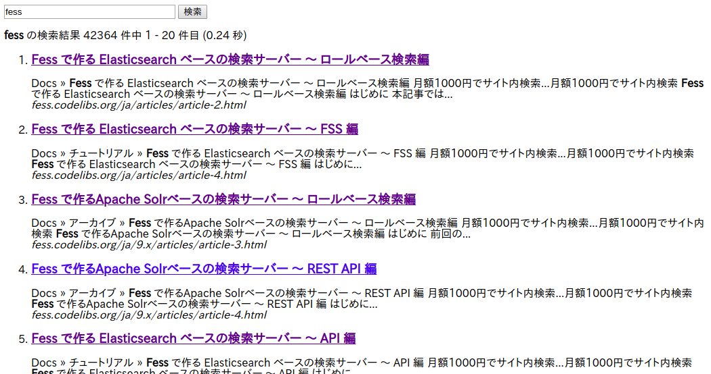

=========================
Part 16: How to use the search API
=========================

**<<This page is generated by Machine Translation from Japanese. Pull Request is welcome!>>**

This time, we will introduce the method of searching and displaying results on the client side using the search API provided by Fess.
By using Fess's search API, it is possible to incorporate it into existing websites by simply changing the HTML.

JSON API
=============

In addition to the usual HTML search expression, Fess can respond to JSON search results as an API. By using the JSON API, it is possible to easily query only the search results from the existing system.

Since the search results can be handled in a format that does not depend on the development language, Fess can be easily integrated with systems other than Java.

Please refer to the `Fess site <https://fess.codelibs.org/ja/13.2/api/api-search.html>`__ for what kind of response the API provided by Fess returns .

Fess uses Elasticsearch as a search engine, but the APIs of Elasticsearch and Fess are different.

The advantage of using Fess API is that you can use Fess-specific functions such as management of search logs and control of viewing authority.

If you want to develop your own document crawl mechanism from scratch, it's better to use Elasticsearch, but if you want to add a search function easily, you can use Fess to reduce many development costs.

Build a search site using JSON API
=============

CORS
-------------

You need to pay attention to the Same-Origin policy when accessing with JSON. If the server that outputs HTML and the Fess server exist in different domains, CORS (Cross-Origin Resource Sharing) must be used.

This time, I will explain on the assumption that the server where HTML is placed and the Fess server are in different domains.

Fess settings
-------------

I use Fess 13.2.0.

To download and install Fees, see the `Fess installation page <https://fess.codelibs.org/ja/13.2/install/install.html>`__ .

Fess supports CORS, and the set value can app/WEB-INF/classes/fess_config.propertiesbe set with. The following is set by default.

.. code-block:: properties

    api.cors.allow.origin=*
    api.cors.allow.methods=GET, POST, OPTIONS, DELETE, PUT
    api.cors.max.age=3600
    api.cors.allow.headers=Origin, Content-Type, Accept, Authorization, X-Requested-With
    api.cors.allow.credentials=true

This time, use it as it is, but if you change the settings, restart Fess.

File to create
-------------

This time we will implement search processing using JavaScript on HTML. JQuery is used for easy implementation.

The file to be created is as follows.

- HTML file "index.html" that displays the search form and search results
- JS file "fess.js" that communicates with the Fess server

In this construction example, the following functions are implemented.

- Send a search request using the search button
- Displaying a list of search results
- Search results paging

Creating an HTML file
-------------

First, create the HTML that displays the search form and search results.
This time, use the HTML file with the following contents.

.. code-block:: html

    <html>
    <head>
    <meta http-equiv="Content-Type" content="text/html; charset=UTF-8"/>
    <title>Search site</title>
    </head>
    <body>
    

      <form id="searchForm">
        <input id="searchQuery" type="text" name="query" size="30"/>
        <input id="searchButton" type="submit" value="検索"/>
        <input id="searchStart" type="hidden" name="start" value="0"/>
        <input id="searchNum" type="hidden" name="num" value="20"/>
      </form>
    

    

    

    
    
    </body>
    </html>

Looking below the body tag, the search input field and search button are located at the div tag where the id attribute is header. The hidden form holds the display start position (start) and the display count (num).

After sending the search request, the start and num values ​​will be updated in JavaScript, but since the sample code this time does not have the function to change the number of items displayed, the num value will not be changed.

Information such as the number of hits in the search is displayed at the div tag of the following subheader. The search result and paging link are displayed in the div tag of result.

Finally, load the jQuery JS file and the fess.js created this time. You can save the jQuery JS file in the same directory as "index.html", but this time I will try to get it via Google's CDN.

Creating a JS file
-------------

Next, create a JS file "fess.js" that communicates with the Fess server and displays the search results.
Create "fess.js" with the following contents and place it in the same directory as "index.html".

.. code-block:: js

    $(function(){
        // Fess URL
        var baseUrl = "http://SERVERNAME:8080/json/?q=";
        // JQuery object for search button
        var $searchButton = $('#searchButton');

        // Search processing function
        var doSearch = function(event){
          // Acquisition of display start position and display count
          var start = parseInt($('#searchStart').val()),
              num = parseInt($('#searchNum').val());
          // Checking the display start position
          if(start < 0) {
            start = 0;
          }
          // Check the number of items displayed
          if(num < 1 || num > 100) {
            num = 20;
          }
          // Acquisition of display page information
          switch(event.data.navi) {
            case -1:
              // For the previous page
              start -= num;
              break;
            case 1:
              // On the next page
              start += num;
              break;
            default:
            case 0:
              start = 0;
              break;
          }
          // Store search field value after trimming
          var searchQuery = $.trim($('#searchQuery').val());
          // Search form is empty
          if(searchQuery.length != 0) {
            var urlBuf = [];
            // Disable search button
            $searchButton.attr('disabled', true);
            // URL construction
            urlBuf.push(baseUrl, encodeURIComponent(searchQuery),
              '&start=', start, '&num=', num);
            // Send search request
            $.ajax({
              url: urlBuf.join(""),
              dataType: 'json',
            }).done(function(data) {
              // Search result processing
              var dataResponse = data.response;
              // Status check
              if(dataResponse.status != 0) {
                alert("There was a problem searching. Please consult your administrator.");
                return;
              }

              var $subheader = $('#subheader'),
                  $result = $('#result'),
                  record_count = dataResponse.record_count,
                  offset = 0,
                  buf = [];
              if(record_count == 0) { // If there are no search results
                // Output to subheader area
                $subheader[0].innerHTML = "";
                // Output to result area
                buf.push("<b>", dataResponse.q, "No information was found matching </b>.");
                $result[0].innerHTML = buf.join("");
              } else { // If the search hits
                var page_number = dataResponse.page_number,
                    startRange = dataResponse.start_record_number,
                    endRange = dataResponse.end_record_number,
                    i = 0,
                    max;
                offset = startRange - 1;
                // Output to subheader
                buf.push("Results <b>", startRange, "</b> - <b>", endRange,
                    "</b> of <b>", record_count, "</b> for <b>", dataResponse.q,
                    "</b>(", dataResponse.exec_time," sec)");
                $subheader[0].innerHTML = buf.join("");

                // Clear search result area
                $result.empty();

                // Search result output
                var $resultBody = $("<ol/>");
                var results = dataResponse.result;
                for(i = 0, max = results.length; i < max; i++) {
                  buf = [];
                  buf.push('<li><h3 class="title">', '<a href="',
                    results[i].url_link, '">', results[i].title,
                    '</a></h3>
', results[i].content_description,
                    ' <cite>', results[i].site, '</cite>
</li>');
                  $(buf.join("")).appendTo($resultBody);
                }
                $resultBody.appendTo($result);

                // Output page number information
                buf = [];
                buf.push('
', page_number, 'page ');
                if(dataResponse.prev_page) {
                  // Link to the previous page
                  buf.push('<a id="prevPageLink" href="#">&lt;&lt;previous page</a> ');
                }
                if(dataResponse.next_page) {
                  // Link to next page
                  buf.push('<a id="nextPageLink" href="#">next page&gt;&gt;</a>');
                }
                buf.push('
');
                $(buf.join("")).appendTo($result);
              }
              // Update page information
              $('#searchStart').val(offset);
              $('#searchNum').val(num);
              // Move page display to the top
              $(document).scrollTop(0);
            }).always(function() {
              // Enable search button
              $searchButton.attr('disabled', false);
            });
          }
          // Returns false because it does not submit
          return false;
        };

        // Processing when the Enter key is pressed in the search input field
        $('#searchForm').submit({navi:0}, doSearch);
        // Processing when the previous page link is clicked
        $('#result').on("click", "#prevPageLink", {navi:-1}, doSearch)
        // Processing when next page link is clicked
          .on("click", "#nextPageLink", {navi:1}, doSearch);
      });

In ``baseUrl``, specify the URL of the Fess server. Please specify ``SERVERNAME`` as the Fess server name. Since it is acquired in JSON format, specify ``json /? q =`` after the URL of the server.

"Fess.js" defines the search processing function doSearch. Invokes doSearch when the search form is submitted and when a page link is clicked.

Search processing function doSearch
-------------

The search processing function doSearch will be explained below. doSearch sends the search request and displays the search result.

When the request returns normally, the function of done is executed. The object of the search result returned from the Fess server is passed to the done argument.

Search results are stored as an array in data.response.result. You can get the field value of the search result document by accessing with results[i].

Execution
=============

When you access "index.html" with a browser, the search form is displayed.

|images0|

Enter an appropriate search term and press the search button to display the search results.
The default display number is 20, but if there are many hits, a link to the next page is displayed below the search result list.

|images1|

I built a jQuery-based client search site using Fess's JSON API. By using the JSON API, you can build a system that uses Fess by calling from another application, not limited to browser-based applications.

