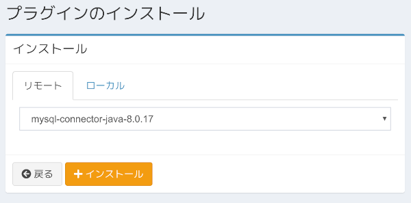
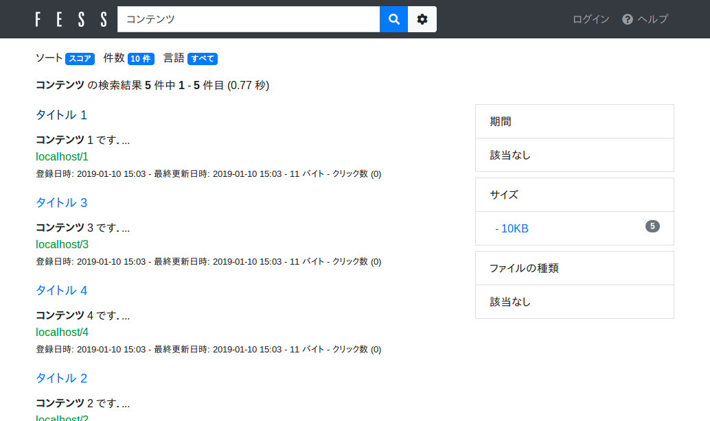

===================================
Part 17: Database crawl
===================================

**<<This page is generated by Machine Translation from Japanese. Pull Request is welcome!>>**

In this article, I will introduce how to crawl and search the data stored in the database.

When retrieving data from a database with SQL, if you want to search under conditions that require linguistic processing, you can use Fess to efficiently search the data in the database.
In addition, Fess can crawl and search for any database for which a JDBC driver is provided.

Database settings
==========================

This time I will introduce MySQL database crawl as an example.
Prepare a MySQL server with the following settings.

.. tabularcolumns:: |p{4cm}|p{8cm}|
.. list-table::
   :header-rows: 1

   * - item
     - value
   * - url
     - mysql://localhost:3306
   * - Database name
     - testdb
   * - username
     - hoge
   * - password
     - fuga

Also, prepare the following table in testdb.

.. code-block:: mysql

    CREATE TABLE doc (
        id BIGINT NOT NULL AUTO_INCREMENT,
        title VARCHAR(100) NOT NULL,
        content VARCHAR(255) NOT NULL
        PRIMARY KEY (id)
    );

Enter data in the table as follows.

.. code-block:: mysql

    INSERT INTO doc (title, content) VALUES ('title 1', 'contents 1 ');
    INSERT INTO doc (title, content) VALUES ('title 2', 'contents 2 ');
    INSERT INTO doc (title, content) VALUES ('title 3', 'contents 3 ');
    INSERT INTO doc (title, content) VALUES ('title 4', 'contents 4 ');
    INSERT INTO doc (title, content) VALUES ('title 5', 'contents 5 ');

Build Fess
==========================

Next, build Fess. This time I will use Fess-13.3.2.
You can get the Fess ZIP file from the `download page <https://fess.codelibs.org/downloads.html>`__.

JDBC driver installation
--------------------------

After starting Fess, press "Install" in "System in Management Screen"> "Plugins" to display the plugin installation screen.
Select "mysql-connector-java-8.0.17" on the remote tab and click "Install" to install the MySQL JDBC driver.

|images0|

If you want to install one that is not listed, upload the file from the local tab and install it.

Crawl settings
==========================

From here, I will explain the setting of MySQL database crawl.

Log in to Fess management screen, and then to New "crawl"> "data store". Set the following four items on the setting screen.

* name
* Handler name
* The parameter
* script

Please enter any string in the name. Set the handler name to "DataBaseDataStore".

This parameter is in accordance with the contents of the database, is set as follows.

.. code-block:: properties

    driver=com.mysql.jdbc.Driver
    url=jdbc:mysql://localhost:3306/testdb?useUnicode=true&characterEncoding=UTF-8
    username=hoge
    password=fuga
    sql=select * from doc

Parameter has become a "key = value" format. The explanation of the key is as follows.

.. tabularcolumns:: |p{4cm}|p{8cm}|
.. list-table::
   :header-rows: 1

   * - Key
     - value
   * - driver
     - Driver class name
   * - url
     - Database server URL
   * - username
     - Username for connecting to the database
   * - password
     - Password to connect to the database
   * - sql
     - SQL statement to get the crawling target

Set the script as follows.

.. code-block:: properties

    url="http://localhost/" + id
    host="localhost"
    site="localhost"
    title=title
    content=content
    cache=content
    digest=content
    anchor=
    content_length=content.length()
    last_modified=new java.util.Date()

Script also has become the same as the parameter "key = value" format.
A description of each key is as follows.

.. tabularcolumns:: |p{4cm}|p{8cm}|
.. list-table::
   :header-rows: 1

   * - Key
     - value
   * - url
     - URL (link to be displayed on the search results)
   * - host
     - hostname
   * - site
     - Site pass
   * - title
     - title
   * - content
     - Document content of the (index target string)
   * - cache
     - Document of cache (not indexed)
   * - digest
     - Digest part displayed in search results
   * - anchor
     - Links included in the document (usually not required)
   * - content_length
     - Document length
   * - last_modified
     - Last updated date of the document

The value is treated as Groovy. Close the string with double quotes. You can use the database column name as a variable.

The value you specify will be indexed for searching, so specify it according to your requirements.

Start Crawl/Perform Search
==========================

After registering the crawl settings, click "Start Now" from "System"> "Scheduler"> "Default Crawler". Wait for a while until the crawl is complete.

After the crawl is complete, go to "http://localhost:8080/" and search. You should see the following search results.

|images1|

This time, I explained how to crawl Fess database. Fess can crawl databases other than MySQL with the same settings as long as it has a JDBC driver. Please, try it.

