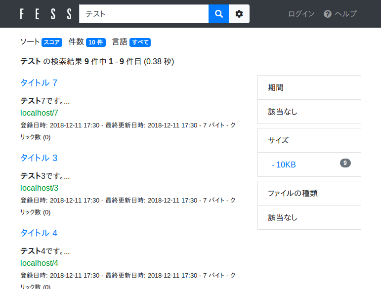
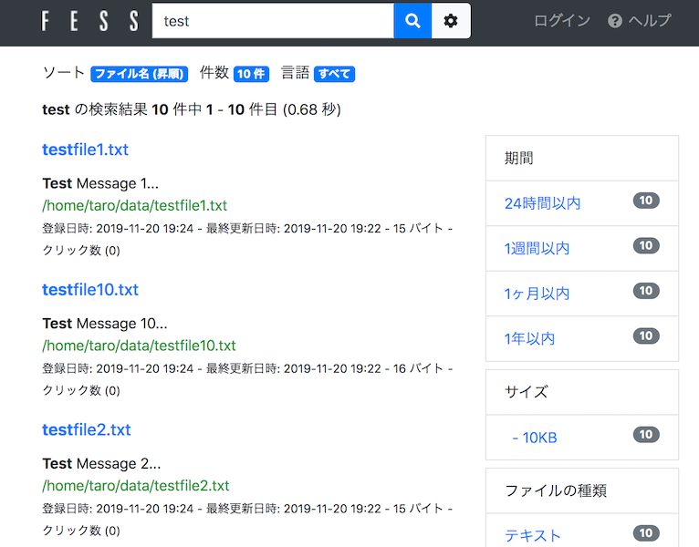

=========================
Part 19: CSV file crawl
=========================

**<<This page is generated by Machine Translation from Japanese. Pull Request is welcome!>>**

I think there are many situations where CSV files are handled, such as managing data in Excel and downloading the data in the service you are using as a CSV file.
Fess can crawl CSV files as data sources.
This time, I will explain how to crawl a CSV file.

Introduction
=============

A CSV file is text data in which each field is separated by commas, but in Fess, by specifying a delimiter character, a tab-delimited TSV file can be handled in the same way as a CSV file.
By changing the settings, it is possible to support various formats other than delimiters.

Fess's CSV file crawl indexes each record as a single document.

This time, I will explain "CsvDataStore" that creates an index from the contents of the CSV file and "CsvListDataStore" that crawls the path described in the CSV file.

For the explanation, we will use Fess-13.4.3 this time. Get the Fess ZIP file from the `download page <https://fess.codelibs.org/downloads.html>`__ .

CsvDataStore
=============

First, let's talk about CsvDataStore.

With CsvDataStore, you can create an index with the contents described in the CSV file, so you can freely set the title and URL of the indexed document.

This time, crawl the CSV file with the following contents.
The CSV file is placed in the "/home/taro/csv" directory, and the file encoding is saved as "Shift_JIS".

.. code-block:: properties

    1,title 1,test1
    2,title 2,test2
    3,title 3,test3
    4,title 4,test4
    5,title 5,test5
    6,title 6,test6
    7,title 7,test7
    8,title 8,test8
    9,title 9,test9

CsvDataStore crawl settings
-------------

After starting Fess, log in to the administration screen and open [Crawler]> [Datastore].
Click "New" in the upper right of the screen to open the crawl settings for the datastore.
This time, set the following 4 items, and proceed with the other items as default.

* name
* Handler name
* The parameter
* script

Enter a name for the crawl settings in Name and select "CsvDataStore" for the handler name.
The parameters are described as follows.

.. code-block:: properties

    directories=/home/taro/csv
    fileEncoding=Shift_JIS

As described above, parameters are described in the "key=value" format.
The details of the key set by the parameter are as follows.

.. tabularcolumns:: |p{4cm}|p{8cm}|
.. list-table::
   :header-rows: 1

   * - Key
     - Explanation
   * - directories
     - Directory containing CSV file (.csv or .tsv)
   * - files
     - CSV file (when specified directly)
   * - fileEncoding
     - CSV file encoding
   * - separatorCharacter
     - Delimiter
   * - quoteDisabled
     - Disable enclosing characters (true by default)
   * - skipLines
     - Number of rows to skip

If you set the directory in "directories", all CSV files/TSV files in the directory will be crawled.
f you want to crawl individually, specify the CSV file directly in "files".

In "separatorCharacter", you can set the separator character.
If there are delimiters other than commas, specify them here.
For example, if the delimiter is a tab, describe "separatorCharacter=\t" in the parameter.

"QuoteDisabled" sets whether to use the enclosing character.
If you set "quoteDisabled=false", if there is an enclosing character in the CSV file data when crawling, it will be omitted.
Enclosing characters are usually written with double quotes """.

"SkipLines" excludes up to the specified number of lines from crawling.
For example, if you specify "skipLines=1", the first line of the CSV file will be skipped.

The script is written as follows.

.. code-block:: properties

    url="http://localhost/" + cell1
    host="localhost"
    site="localhost"
    title=cell2
    content=cell3
    cache=cell3
    digest=cell3
    anchor=
    content_length=cell3.length()
    last_modified=new java.util.Date()

The script is written in the “key=value” format as well as the parameters.
For details on the keys set by the script, refer to the following.

.. tabularcolumns:: |p{4cm}|p{8cm}|
.. list-table::
   :header-rows: 1

   * - Key
     - Explanation
   * - url
     - URL (link displayed in search results)
   * - host
     - hostname
   * - site
     - Site pass
   * - title
     - title
   * - content
     - Document contents (index target string)
   * - cache
     - Document cache (not indexed)
   * - digest
     - Digest part displayed in search results
   * - anchor
     - Links included in the document (usually not required)
   * - content_length
     - Document length
   * - last_modified
     - Date and time the document was last updated

The values ​​in the script are written in Groovy.
Close the string with double quotes. In addition, the data in the CSV file is stored in cell [number] (numbers start from 1).
Please note that it may be null if there is no data in the cells of the CSV file.

Crawl execution
-------------

After registering the crawl settings, click Start Now from System> Scheduler> Default Crawler (it will take a while for the crawl to complete).

After crawling is complete, please access http://localhost:8080/ and search. The search results are displayed as shown below.

|images0|

CsvListDataStore
=============

Next, I will explain about CsvListDataStore.

CsvListDataStore can be used when crawling a large number of files.
The feature is that the crawl execution time can be shortened by placing a CSV file in which the updated file path is written and crawling only the specified path.

The CSV file format when describing the path is as follows.

.. code-block:: properties

    [action]<Delimiter>[path]

Specify one of the following for the action.

* create: file created
* modify: File was updated
* delete: The file was deleted

For the path, describe the path in the same notation as when specifying the path to be crawled by file crawl.
For example, specify "file:/[path]" or "smb://[path]".

This time, create a CSV file that crawls the local file with the following contents.

.. code-block:: properties

    modify,file:/home/taro/data/testfile1.txt
    modify,file:/home/taro/data/testfile2.txt
    modify,file:/home/taro/data/testfile3.txt
    modify,file:/home/taro/data/testfile4.txt
    modify,file:/home/taro/data/testfile5.txt
    modify,file:/home/taro/data/testfile6.txt
    modify,file:/home/taro/data/testfile7.txt
    modify,file:/home/taro/data/testfile8.txt
    modify,file:/home/taro/data/testfile9.txt
    modify,file:/home/taro/data/testfile10.txt

CsvListDataStore crawl settings
-------------

Log in to the administration screen and open "Crawler"> "Datastore".
Click "New" at the top right of the screen to open the crawl settings for the datastore.
This time, the following 4 items are set, and other items are set as default.

* name
* Handler name
* The parameter
* script

Enter the name of the crawl setting as the name and select "CsvListDataStore" as the handler name.

The parameters are described as follows. Specify in directories the path where the created CSV is placed.

.. code-block:: properties

    directories=/opt/fess/csvlist
    fileEncoding=Shift_JIS

The script description is as follows.

.. code-block:: properties

    event_type=cell1
    url=cell2

Crawl execution
-------------

After registering the crawl settings, click Start Now from System> Scheduler> Default Crawler as you would for CsvDataStore.

After the crawl is complete, go to http://localhost:8080/ and try searching. The search results are displayed as shown below.

|images1|

This time, I explained how to crawl CSV files. By using CsvDataStore, if there is something like CSV dump function in the linked system, it will be possible to build a system linked with Fess.

When CsvListDataStore has many crawl targets, it outputs the update file list log of NAS and crawls only the update files to support large-scale system search. It should be usable for various purposes depending on the settings.

