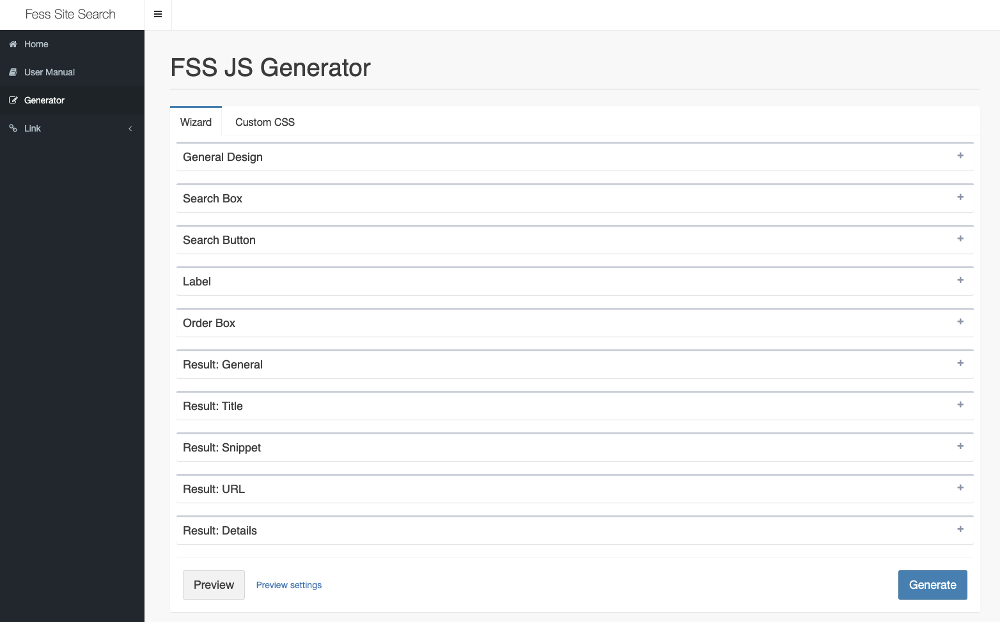
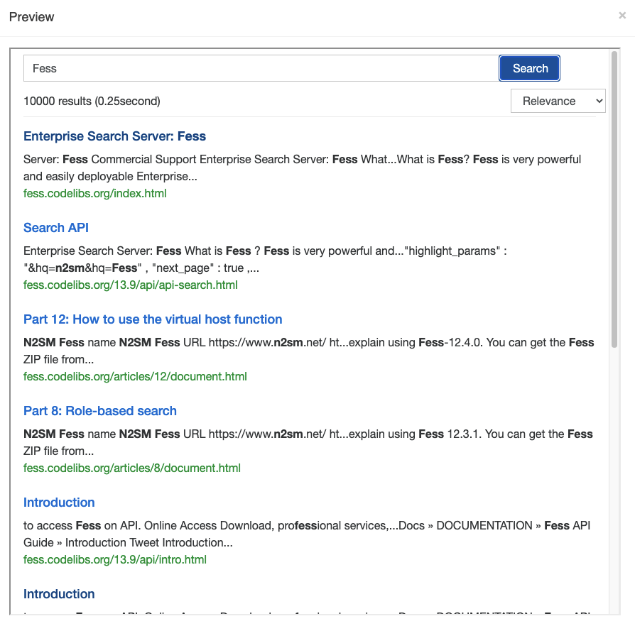

===================================
Part 2: Migrate from GSS to FSS
===================================

**<<This page is generated by Machine Translation from Japanese. Pull Request is welcome!>>**

Last time we introduced how to build and use the full text search server Fess.
This time, we will explain how to incorporate a search service into our website using the Fess server that we have built.
There are several ways to incorporate Fess into your website as a search service, but this time, how do you make a smooth transition from Google Site Search (GSS)? Let's talk about that.

If you want to incorporate GSS into your own website, you can use it simply by embedding the javascript tag on the page where you want to use the search service.
Fess provides the same function as Fess Site Search (FSS).
Therefore, you can use the search function of the built Fess server just by adding the FSS JavaScript to the page where you want to display the search results.
If you want to save the trouble of building and operating a Fess server, we provide an inexpensive Fess server as a commercial service, so if you use it, you can search the site simply by placing the FSS JavaScript on your own website can do.

Then, I will explain the JavaScript of FSS (FSS JS) and the introduction method in order.

What is FSS JS?
===============

FSS JS is a JavaScript file that displays Fess search results.
By placing this JavaScript file on your company website, you will be able to display search results.
FSS JS can be generated and obtained from the site called FSS JS Generator at `https://fss-generator.codelibs.org/`__.

|image0|

At the time of writing this article, you can specify a background color (Background) and a button color (Button) to generate a JavaScript file.
FSS JS is compatible with Fess 11.3 and above.
In the future, the items that can be customized with FSS JS Generator will increase.

When "Generate" button is pressed, a preview of the search result is displayed with the generated JavaScript.

|image1|

If there is no problem in this preview display, press the "Download JS" button to download the JavaScript file.

Use FSS on Your Site
====================

This time, let's consider an example of introducing site search to www.n2sm.net made of static HTML.
Search results will be displayed in search.html within the site, and the Fess server will be built separately on nss833024.n2search.net.
The downloaded FSS JS JavaScript file is placed on the site as /js/fess-ss.min.js.

The above information is summarized as follows.

.. tabularcolumns:: |p{4cm}|p{8cm}|
.. list-table::
   :header-rows: 1

   * - Subject name
     - URL
   * - Search target site
     - `https: // www.n2sm.net /`
   * - Search results page
     - `https://www.n2sm.net/search.html`
   * - FSS JS
     - `https://www.n2sm.net/js/fess-ss.min.js`
   * - Fess server
     - `https://nss833024.n2search.net/`

To embed the javascript tag, place the following tag in the place where you want to display search results in search.html.

.. code-block:: javascript

   
   <fess:search></fess:search>

When you access search.html, a search form will be displayed.
When you enter a search term, the search results can be displayed as follows.

|image2|

To display a search result by placing a search form on another page, place a search form as shown below on each page and set it to transition to `https://www.n2sm.net/search.html?q=word`__.

.. code-block:: html

   <form action="https://www.n2sm.net/search.html" method="get">
     <input type="text" name="q">
     <input type="submit" value="Search">
   </form>

Summary
=======

This time, I introduced how to embed Fess search results on the site just by placing JavaScript tags.
With FSS, migration from GSS can be achieved simply by replacing existing JavaScript tags.
FSS JS has other display methods and methods to link search logs with Google Analytics.
For other settings, refer to the FSS `Manual <https://fss-generator.codelibs.org/docs/manual>`__.

Next time I will show you how to use Fess as a web scraping platform.

.. |image2| image:: ../../../resources/images/en/article/2/fss-result.png

