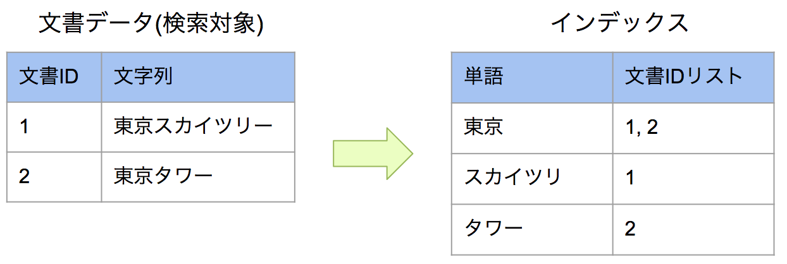
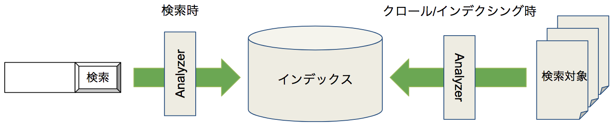
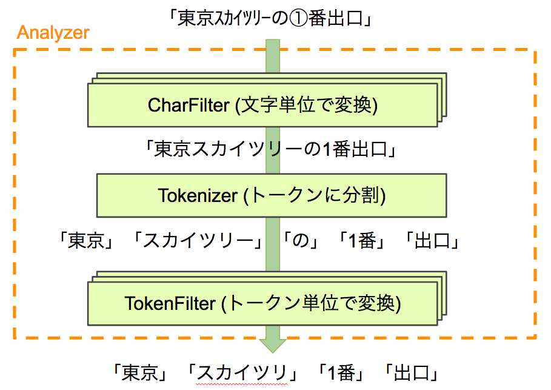

===================================
Part 5: Tokenizing for Full-Text Search
===================================

**<<This page is generated by Machine Translation from Japanese. Pull Request is welcome!>>**

The search system finds documents that contain words that match the words you are searching for, but what these words look like is an important factor that also affects the quality of the search system.
This time, I will introduce Analyzer, which is a function to make that word.
Fess uses Elasticsearch as its search engine, but Elasticsearch uses Apache Lucene as its search library.
Analyzer introduced this time is a function provided by Apache Lucene.

First, let's look at the inverted index in order to consider how the words created by the Analyzer are used.

What is an inverted index?
==========================

An inverted index is an index structure that uses words extracted from a group of documents to be searched and stores the word and the location information of the documents.

For example, suppose you have two document data as shown on the left side below and want to search them.

|image0|

If the number of search targets is small, you can quickly find all documents by looking at them in order, but as the volume increases, the search time increases, which is not practical.
In the search system, an index like the one on the right is created in order to look efficiently.

When searching for "tower", instead of searching for document data groups, find the tower row from the words in the index.
From the document ID list on that line, you can see that "tower" is included in the document ID of 2.
After that, the search system simply responds with the found documents as search results.

Fess generates words that the Analyzer uses in its index.
At the time of crawling / indexing, the text of documents to be searched is converted into words by Analyzer and stored in the index as shown in the figure below.
In addition, when searching, the character string of the search term is divided into words by the Analyzer, and based on the word, a target document group is found from the index and obtained as a search result.

|image1|

You may have noticed at the beginning that this is an important factor affecting search quality, but if the words at indexing and searching do not match, you will not be able to find the document, and even if you split it too much, the number of words will increase (Increase in index size) and inefficiency.
Therefore, it can be said that Analyzer plays a large role in building a search system.

What is Analyzer
================

Analyzer is a function to analyze text.
Analyzer is a common word, but in this article we will describe it as an Analyzer provided by Apache Lucene.

Briefly, it receives text such as a document, breaks it down into words, and returns it.
It's easy to actually try it out, so try using Elasticsearch's Analyze API.
If you are running the zip version of Fess 12.1, you can analyze "this is a test" with Standard Analyzer with the following request.

.. code-block:: bash

   curl -XGET 'localhost:9201/_analyze?pretty' -H 'Content-Type: application/json' -d'
   {
     "analyzer" : "standard",
     "text" : "this is a test"
   }'

The response is as follows.

.. code-block:: json

   {
      "tokens" : [
       {
         "token" : "this",
         "start_offset" : 0,
         "end_offset" : 4,
         "type" : "<ALPHANUM>",
         "position" : 0
       },
       {
         "token" : "is",
         "start_offset" : 5,
         "end_offset" : 7,
         "type" : "<ALPHANUM>",
         "position" : 1
       },
       {
         "token" : "a",
         "start_offset" : 8,
         "end_offset" : 9,
         "type" : "<ALPHANUM>",
         "position" : 2
       },
       {
         "token" : "test",
         "start_offset" : 10,
         "end_offset" : 14,
         "type" : "<ALPHANUM>",
         "position" : 3
       }
     ]
   }

The divided word information is returned as information called a token, and the given text can be obtained as a token array.
token is the word string, start_offset and end_offset are the number of characters in the original text, type is the word type, and position is the word.
Such information can be used as the position information of the highlight to be displayed in the search result from start_offset and end_offset, and the search that considers the order of words from position can be used as tokens. is included.
In addition to the above, it is a general-purpose mechanism that can acquire various things such as reading information in Japanese.

If you take a closer look at the Analyzer, the Analyzer consists of three functions called CharFilter, Tokenizer, and TokenFilter.

* CharFilter: Processes the passed string for each character
* Tokenizer: Turn the passed string into a token array
* TokenFilter: Process the passed token array in token units

When the Analyzer receives the string to be analyzed, it first applies the string to the CharFilter group, then converts it to a token array with the Tokenizer, and finally applies it to the TokenFilter group to obtain the final token array To do.
This time, I described it as a token array to make it easier to understand, but since the internal processing of the Analyzer is very efficient, the processing is actually performed in a stream without wasting arrays.

Let's consider an example in which the character string "Tokyo Skyline Exit No." is applied to the Analyzer and converted as shown in the figure below.

|image2|

To make the search hit as much as possible, first prepare a character filter that converts half-width katakana and round numbers and apply it.
By converting characters, you can make it the "Tokyo Sky Tree Exit 1".

By applying this to a Tokenizer that performs morphological analysis such as Kuromoji, it can be divided into tokens for "Tokyo", "Sky Tree", "No", "No. 1", and "Exit".

Considering the case of actual search, words that do not match with or without long notes or that have little effect even if they are not searched for particles are removed.
So, by setting and applying what performs those processes to the TokenFilter group, the token array of "Tokyo" "Sky Tree" "No. 1" "Exit" is finally obtained.

Elasticsearch also has various built-in analyzers such as standard.
In addition, you can define your own Analyzer by adding Kuromoji etc. with a plug-in or combining CharFilter, Tokenizer, TokenFilter.
Fess supports multiple languages, and defines and uses Analyzers for various languages.

Summary
=======

This time, we introduced Analyzer, which is the heart of the search system.
What Analyzer is Best for You? Since the requirements such as depend on the search target, the tuning of the Analyzer is indispensable if you aim for better search quality.
If you know how Analyzer works, you can define and use your own Analyzer.

Next time, I plan to take a closer look at Analyzer in Japanese documents.

