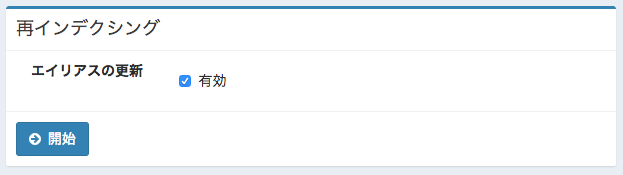

===================================
Part 6: Analyzer in Japanese
===================================

**<<This page is generated by Machine Translation from Japanese. Pull Request is welcome!>>**

Last time, I think you got to know how Analyzer works.
This time, based on that, I will explain the Analyzer that Fess actually applies to Japanese documents.

Because Fess is internationalized software, it defines Analyzer in various languages besides Japanese (at the time of writing, it corresponds to 37 languages).
The Fess index is composed of the following two types of tokenized indexes.

* Analyzer for each language: For Japanese, split by morphological analysis
* Analyzer for all languages: 2-gram based segmentation

A search system is realized by automatically determining the language of the document to be searched, indexing it with the language analyzer and the language common analyzer, and performing an OR search on them.

### Analyzer definition

This time, I will explain using Fess 12.1.2.
The Fess ZIP file can be obtained from the `download page <https://fess.codelibs.org/ja/downloads.html>`__.
Extract the ZIP file and execute ``bin/fess.[sh|bat]`` to start.

Access Elasticsearch of Fess and check the operation of Japanese Analyzer.
Confirmation of word segmentation uses `Analyze API <https://www.elastic.co/guide/en/elasticsearch/reference/6.2/indices-analyze.html>`__ of Elasticsearch.
Fess's Japanese Analyzer is defined in Japanese_analyzer, so specify it in analyzer and execute the following request.

.. code-block:: bash

   $ curl -XGET 'localhost:9201/fess.search/_analyze?pretty' -H 'Content-Type: application/json' -d'
   {
     "analyzer" : "japanese_analyzer",
     "text" : "東京ｽｶｲﾂﾘｰの①番出口"
   }'
   {
     "tokens" : [
       {
         "token" : "東京",
         "start_offset" : 0,
         "end_offset" : 2,
         "type" : "word",
         "position" : 0
       },
       {
         "token" : "スカイ",
         "start_offset" : 2,
         "end_offset" : 5,
         "type" : "word",
         "position" : 1
       },
       {
         "token" : "ツリー",
         "start_offset" : 5,
         "end_offset" : 8,
         "type" : "word",
         "position" : 2
       },
       {
         "token" : "1",
         "start_offset" : 9,
         "end_offset" : 10,
         "type" : "word",
         "position" : 4
       },
       {
         "token" : "番",
         "start_offset" : 10,
         "end_offset" : 11,
         "type" : "word",
         "position" : 5
       },
       {
         "token" : "出口",
         "start_offset" : 11,
         "end_offset" : 13,
         "type" : "word",
         "position" : 6
       }
     ]
   }

The divided words are stored as the value of token in the tokens array.
You can see that the character string of "Tokyo Skyline's No. Exit" is tokenized and that half-width katakana is also converted to full-width katakana.
Search engines are indexing and searching on this word.

Analyzer: japanese_analyzer
=====================

First, let's see how Japanese_analyzer is defined.
Various analyzers used for Fess search are defined in ``app/WEB-INF/classes/fess_indices/fess.json``.

japanese_analyzer is defined as follows:

.. code-block:: json

   "japanese_analyzer": {
     "type": "custom",
     "char_filter": [
       "mapping_ja_filter",
       "fess_japanese_iteration_mark"
     ],
     "tokenizer": "japanese_tokenizer",
     "filter": [
       "truncate10_filter",
       "fess_japanese_baseform",
       "fess_japanese_stemmer",
       "japanese_pos_filter",
       "lowercase"
     ]
   },

As mentioned earlier, Analyzer consists of CharFilter, Tokenizer and TokenFilter.
Let's take a look at the structure of Japanese_analyzer above.

CharFilter: mapping_ja_fileter
===============================

The first processing applied in japanese_analyzer is mapping_ja_filter.
This CharFilter replaces characters based on the contents of ``app/WEB-INF/classes/fess_indices/fess/ja/mapping.txt``.
mapping.txt defines character normalization from a Japanese perspective, such as converting full-width alphanumeric characters to half-width alphanumeric characters.

.. code-block:: json

   "mapping_ja_filter": {
     "type": "mapping",
     "mappings_path": "${fess.dictionary.path}ja/mapping.txt"
   },
   

CharFilter: fess_japanese_iteration_mark
======================================

fess_japanese_iteration_mark is a built-in CharFilter provided by the analysis-fess plugin, which normalizes dance characters.
For example, convert "days" to "days".
Internally, it provides the same function as kuromoji_iteration_mark.

There are some that are defined in fess_[lang]_*, but the functions applied to them change depending on the installation status of Elasticsearch plugin.
In the case of Japanese, if the analysis-kuromoji-neologd plug-in is installed, Kuromoji with the NEologd dictionary applied will be used, otherwise, normal Kuromoji will be applied.

Tokenizer: japanese_tokenizer
=============================

japanese_tokenizer is Tokenizer of fess_japanese_reloadable_tokenizer provided by analysis-fess plugin.
By default, reloadable_kuromoji that dictionary automatically reloads provided by analysis-ja plugin is used.
Functionally similar to kuromoji.

.. code-block:: json

   "japanese_tokenizer": {
     "type": "fess_japanese_reloadable_tokenizer",
     "mode": "normal",
     "user_dictionary": "${fess.dictionary.path}ja/kuromoji.txt",
     "discard_punctuation": false,
     "reload_interval":"1m"
   },

The user dictionary uses ``app/WEB-INF/classes/fess_indices/fess/ja/kuromoji.txt`` and checks for updates at one-minute intervals. If updated, the Tokenizer dictionary information is updated.
As for mode, normal is divided by normal morphological analysis, search is divided in the case of compound words, extended is divided into unknown words into 1-grams, and normal is used.
discard_punctuation specifies whether to delete punctuation.

TokenFilter: truncate10_filter
=============================

This is the process of TokenFilter.
japanese_tokenizer will process each word divided.

truncate10_filter truncates words with more than 10 characters to 10 characters.

.. code-block:: json

   "truncate10_filter" : {
     "type" : "truncate",
     "length" : 10
   },

Words longer than 10 characters are treated as the same word, but Fess believes that there are few cases where you want to search for words longer than 10 characters that are not split.
If you have a requirement to search for long words, consider increasing the limit.

TokenFilter: fess_japanese_baseform
===================================

fess_japanese_baseform is the same as kuromoji_baseform.
Make the word the original form.
For example, "run" is converted to "run".

TokenFilter: fess_japanese_stemmer
==================================

fess_japanese_stemmer is the same as kuromoji_stemmer.
Remove long symbols from words longer than the specified number of characters (default is 4 or more).
For example, "server" is converted to "server".

TokenFilter: japanese_pos_filter
================================

japanese_pos_filter is a TokenFilter that removes words in the part of speech specified by stoptags and is defined as follows:

.. code-block:: json

        "japanese_pos_filter" : {
          "type" : "fess_japanese_part_of_speech",
          "stoptags" : [
            "その他", "その他-間投", "フィラー", "感動詞", "記号", "記号-アルファベット",
            "記号-一般", "記号-括弧開", "記号-括弧閉", "記号-句点", "記号-空白", "記号-読点",
            "形容詞", "形容詞-接尾", "形容詞-非自立", "語断片", "助詞", "助詞-格助詞",
            "助詞-格助詞-一般", "助詞-格助詞-引用", "助詞-格助詞-連語", "助詞-間投助詞",
            "助詞-係助詞", "助詞-終助詞", "助詞-接続助詞", "助詞-特殊", "助詞-副詞化",
            "助詞-副助詞", "助詞-副助詞／並立助詞／終助詞", "助詞-並立助詞", "助詞-連体化",
            "助動詞", "接続詞", "接頭詞", "接頭詞-形容詞接続", "接頭詞-数接続",
            "接頭詞-動詞接続", "接頭詞-名詞接続", "動詞-接尾", "非言語音", "連体詞"
          ]
        },

Part of speech information is added by Japanese_tokenizer.
Particles are omitted because they are often unnecessary in search.
If you want to search for symbols, do not specify the target part of speech in stoptags.

TokenFilter: lowercase
======================

Use the built-in TokenFilter to convert uppercase alphanumeric characters to lowercase.

By normalizing words as described above, appropriate searches can be performed, and unnecessary items can be removed as much as possible to reduce the index size.

Update Analyzer
===============

If you want to update the Analyzer defined by Fess, you need to regenerate the fess.YYYYMMDD index after changing ``app/WEB-INF/classes/fess_indices/fess.json``.

To rebuild the index with Fess, go to ``http://localhost:8080/admin/upgrade/``, enable alias update in the following figure and press the start button.

|image0|

A new fess.YYYMMDD index is created on the dashboard to indicate the re-indexing process, so you can check the number of documents.
When the process is complete, the fess.search and fess.update aliases will move to the new index.
If there is no problem, delete the old fess.YYYYMMDD index.

Summary
=======

This time, I explained the Japanese analyzer used by Fess.
If you want to improve the quality of Japanese search on Fess, you can improve the scoring of search results by adjusting the Japanese_analyzer.
This Japanese Analyzer may be useful not only for Fess but also for making Lucene based search.

Next time, I will explain the Analyzer used in common languages.

