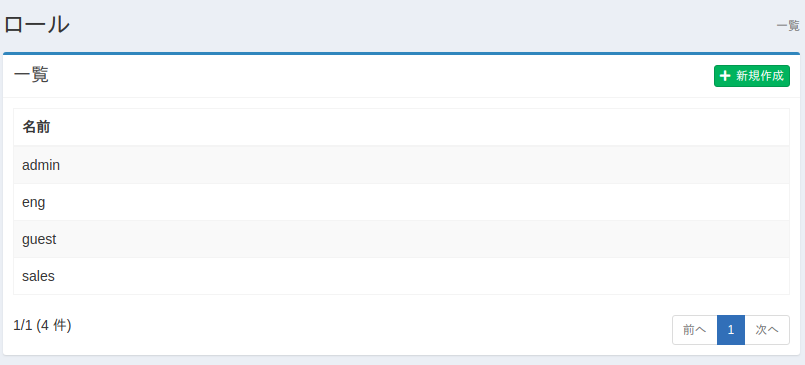
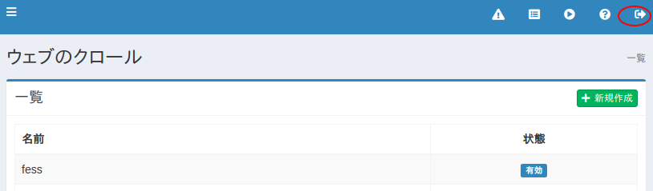
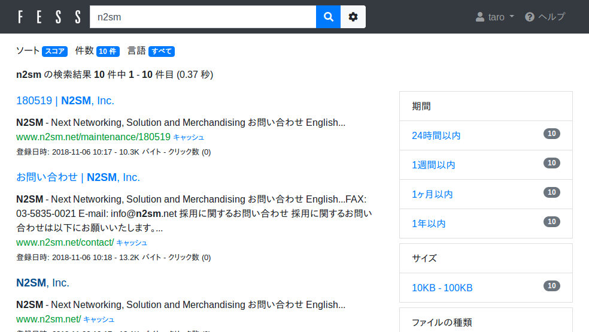
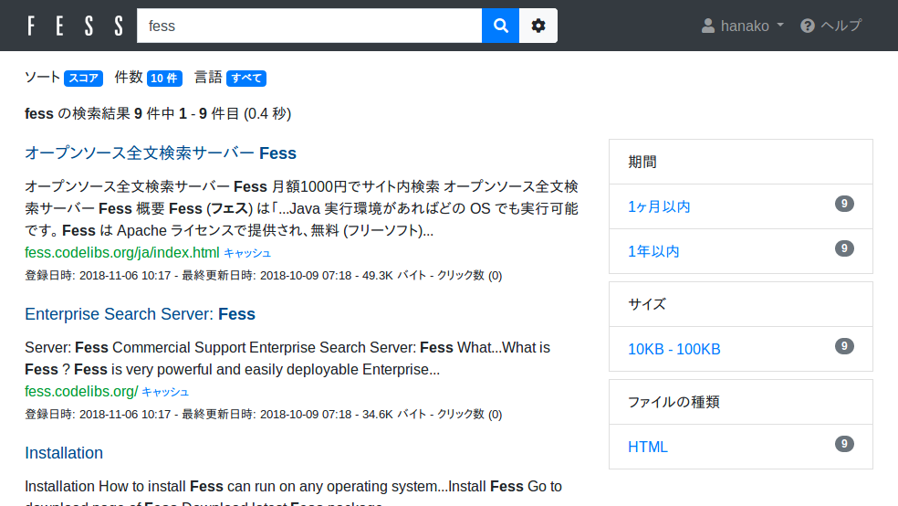

===================================
Part 8: Role-based search
===================================

**<<This page is generated by Machine Translation from Japanese. Pull Request is welcome!>>**

This time, I will introduce role-based search, which is one of the characteristic features of Fess.

The search results you want to display may differ depending on the user. In such a case, you can easily divide the search results by using this role-based search function.

What is role-based search?
==========================

Fess's role-based search is a function that separates the search results based on the authentication information of the authenticated user.

For example, a salesperson A with the sales department role will see information about the sales department role in the search results, but a technician B who does not have the sales department role will not see it when they search. By using this function, it is possible to search by the department or post to which the logged-in user belongs in the company's intranet environment.

By default, Fess's role-based search can sort search results based on user information managed by Fess. Other than that, it can also be used by linking with the authentication information of LDAP or Active Directory. In addition to those authentication systems, role information can be obtained from the following locations.

1. Request parameter
2. Request header
3. cookie

As a usage method, the role information can be passed to Fess by saving the authentication information as a cookie for the domain and path where Fess is operating at the time of authentication in the portal server or agent type single sign-on system. Also, in the reverse proxy type single sign-on system, role information can be acquired by Fess by adding authentication information to request parameter and request header when accessing Fess.

By linking with various authentication systems in this way, search results can be output separately for each user.

This time, I will introduce an example of role search using the user management function of Fess.

Role-based search settings
================================

I will explain using Fess 12.3.1.

You can get the Fess ZIP file from the `download page <https://fess.codelibs.org/ja/downloads.html>`__.

Extract the ZIP file and bin/fess.[sh|bat]execute to start.

Setting summary
====================

This time, we will create two roles: sales department (sales) and engineering department (eng). The user shall be able to view the search results as follows:

taro user belongs to sales role and can display `https://www.n2sm.net/` in search results
hanako user belongs to eng role and can display `https://fess.codelibs.org/` in search results

Create Role
=====================

First, access `http://localhost:8080/admin/` on the administration screen.

Create a sales role by typing sales as the name from Users> Roles> New. Create the eng role as well.

|image0|

Create user
===================

Create taro user and hanako user with the following settings from User> User> New.

.. tabularcolumns:: |p{4cm}|p{8cm}|p{8cm}|
.. list-table::
   :header-rows: 1

   * -
     - Taro
     - Hanako
   * - username
     - taro
     - hanako
   * - password
     - taro
     - hanako
   * - roll
     - sales
     - eng

Confirmation of registered users
===================

With this setting, three users, admin, taro, and hanako can log in to Fess. Make sure you can log in in order.

If you access `http://localhost:8080/admin/` and log in as the admin user, the administration screen will be displayed as usual.

Then log out the admin user. Click the button at the top right of the management screen.

|image1|

Please enter your user name and password to log in with taro or hanako. If the login is successful, the search screen of `http://localhost:8080/` will be displayed.

Add crawl settings
=======

Register the crawling target. This time, let's let users in the Sales role only search `https://www.n2sm.net/` and users in the Engineering role only `https://fess.codelibs.org/`.

To register these crawl settings, click Crawler> Web> New to create a web crawl setting.

This time, make the following settings. Leave the other settings at their default values.

.. tabularcolumns:: |p{4cm}|p{8cm}|p{8cm}|
.. list-table::
   :header-rows: 1

   * -
     - N2SM
     - Fess
   * - name
     - N2SM
     - Fess
   * - URL
     - `https://www.n2sm.net/`
     - `https://fess.codelibs.org/`
   * - URL to be crawled
     - `https://www.n2sm.net/.*`
     - `https://fess.codelibs.org/.*`
   * - Maximum number of accesses
     - 10
     - 10
   * - interval
     - 3000 ms
     - 3000 ms
   * - permission
     - {role}sales
     - {role}eng

Start crawl
=======

After registering the crawl settings, click [Start Now] from System> Scheduler> Default Crawler. Wait for a while until the crawl is complete.

Search
=======

After the crawl is complete, go to `http://localhost:8080/` and search for a word such as "fess" while not logged in and see that the search results are not displayed.

Then log in as a taro user and search again. The taro user has the sales role, so only the search results for `https://www.n2sm.net/` are displayed.

|image2|

Log out the taro user and log in as the hanako user. If you search the same way as before, the hanako user has the eng role, so you will only see the search results for `https://fess.codelibs.org/`.

|image3|

This time, I introduced the sharing of search results by role, but by putting "{user} user name" or "{group} group name" in the crawler permission, you can distribute search results by user or group. You can also

Summary
=======

We introduced role-based search, which is one of the security functions of Fess. Passing the authentication information to Fess is a general-purpose implementation, so I think that it can support various authentication systems.

Since the search results can be output separately for each user attribute, it is possible to realize a system that requires a search for each browsing authority such as the company portal site and shared folders.

