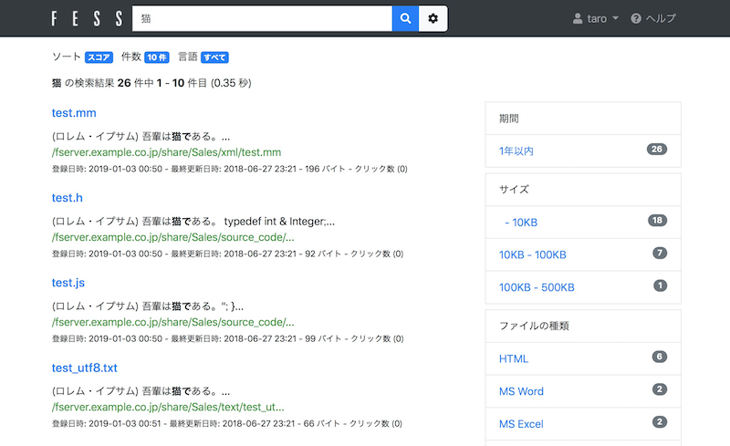

=========================
Part 9: Fess Active Directory integration
=========================

**<<This page is generated by Machine Translation from Japanese. Pull Request is welcome!>>**

Last time, I introduced the method of sharing search results by registering users and roles in Fess. This time, I will explain the role-based search when registering a user in Active Directory and linking with Active Directory.

I think Active Directory is widely used for information management in companies.

By linking with Active Directory, the access authority specified in the company can be applied to the search results of Fess and the results can be output appropriately.

This time, I will explain how to link with the example of crawling the document of the file server managed by Active Directory.

What is Active Directory
=============

Active Directory is a mechanism developed by Microsoft for managing users and computers. It comes standard with Windows Server.

Active Directory defines the management range in units called domains. Administrators can manage computers joined to the domain. Users will also be able to log in with their account on any computer in the domain.

By linking Fess with Active Directory, the same management information can be used, so seamless corporate search can be realized.

Access settings on the file server
============

On the file server of the crawl destination to be searched, it is assumed that the following access rights are set in advance in the shared folder.

.. tabularcolumns:: |p{4cm}|p{8cm}|
.. list-table::
   :header-rows: 1

   * - Folder name
     - Access right
   * - Sales
     - Sales group
   * - Eng
     - Eng Group

AD server settings
=====

This time we will use Active Directory built with Windows Server 2016.

In order for Fess to work with Active Directory, a user is required to access Active Directory.

This time, register the access user with the following settings.

.. tabularcolumns:: |p{4cm}|p{8cm}|
.. list-table::
   :header-rows: 1

   * - item
     - Set value
   * - Domain name
     - example.co.jp
   * - User name for access
     - hoge
   * - Access user password
     - fuga

In addition, in order to confirm that they have been sorted out at the time of search, register users beforehand in the linked domain.

.. tabularcolumns:: |p{4cm}|p{8cm}|
.. list-table::
   :header-rows: 1

   * - User
     - Belongs
   * - taro
     - Sales group
   * - hanako
     - Eng Group

Fess settings
==================

This time I use Fess 12.3.1.

You can get the Fess ZIP file from the `download page <https://fess.codelibs.org/ja/downloads.html>`__.

Extract the ZIP file and bin/fess.[sh|bat]execute to start.

`http://localhost:8080/admin/` Go to and open the fess management screen. Click System> General to open the general settings. Enter the LDAP items as shown below and click the "Update" button.

.. tabularcolumns:: |p{4cm}|p{8cm}|
.. list-table::
   :header-rows: 1

   * - item
     - Set value
   * - LDAP URL
     - ldap://example.co.jp:389
   * - Base DN
     - dc=example,dc=co,dc=jp
   * - Bind DN
     - hoge@example.co.jp
   * - password
     - fuga
   * - User DN
     - %s@example.co.jp
   * - Account filter
     - (&(objectClass=user)(sAMAccountName=%s))
   * - memberOf attribute
     - memberOf

Crawl settings
==================

Next, register the crawling target.

This time, specify the shared folder of the file server as the crawl destination.

Log in as the admin user and click the "Crawler"> "File system"> "New" button on the management screen to open the file crawl settings creation screen.

After entering the "Name" and "Path", click the "Create" button.

The following is an input example, so replace the path with the path of the crawling destination.

   * - item
     - Set value
   * - Name
     - ShareDocuments
   * - path
     - `smb://fserver.example.co.jp/share/`

File authentication settings
=============

If the shared folder to be crawled requires authentication, file authentication settings are required. Click the [Crawler]> [File Authentication]> [New] button on the management screen to open the file authentication creation screen.

The following is an input example. Enter the host name etc. according to the environment.

   * - hostname
     - fserver.example.co.jp
   * - port
     - (Specify port if changed)
   * - scheme
     - SAMBA
   * - User name
     - hoge
   * - password
     - fuga
   * - File crawl settings
     - ShareDocuments

After entering, click the "Create" button.

Start crawling
======

After registering the crawl settings, click [Start Now] from [System]> [Scheduler]> [Default Crawler].

By crawling, an index with access privileges is automatically created.

Wait for a while until the crawl is complete.

Search
======

After crawling is completed, log out from the management screen and log in with the created user "taro".

After logging in, try entering a search word from the search screen to search. Since I logged in with taro, only matching results will be displayed in the "Sales" folder.

|image0|

Summary
=======

This time, I introduced the method of Fess's Active Directory integration.

Active Directory Linkage function is often used for corporate information search because it can display the appropriate search result by the access authority of the user in the company. As explained this time, role-based search can be realized with only simple settings, so please try using it.

