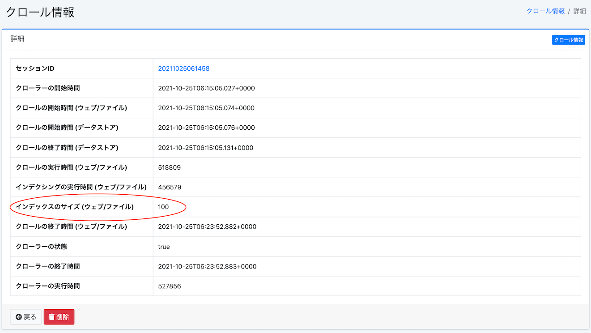

===============================================
Building an Enterprise Search Environment with Fess - Introduction
===============================================

Introduction
========

The documents we manage increase day by day, and there is a growing need to efficiently manage these documents and leverage them as knowledge assets.
As the number of documents to be managed increases, it becomes increasingly difficult to find specific information among them.
One solution to this problem is to introduce a full-text search server that can search through vast amounts of information.

Fess is a Java-based open-source full-text search server that is easy to deploy.
Fess uses Elasticsearch as its search engine.
Elasticsearch is a Lucene-based, scalable, flexible, and highly functional search engine.
On the other hand, if you try to build a full-text search system with Elasticsearch, you need to implement various features such as the crawler component yourself.
Fess uses Fess Crawler as its crawler component, allowing you to collect and index various types of documents from the web and file systems.

In this article, we will introduce how to build a search server using Fess.

Target Audience
========

-  Those who want to build an enterprise search/search system

-  Those who want to add search functionality to existing systems

- Those who want to create an environment where internal search is implemented and knowledge can be leveraged

-  Those interested in search software such as Lucene and Elasticsearch

Required Environment
==========

The content of this article has been tested in the following environment.

-  Ubuntu 22.04

-  OpenJDK 21

What is Fess
=========

Fess is an open-source full-text search system for the web and file systems.
It is provided under the Apache license from the `Fess site <https://fess.codelibs.org/ja/>`__\ of the CodeLibs project on GitHub.

Features of Fess
-----------

Java-based Search System
~~~~~~~~~~~~~~~~~~~~~~~~~

Fess is built using various open-source products.

The distribution is provided as an executable application.
Fess provides search and administration interfaces.
Fess uses LastaFlute as its web framework.
Therefore, if you need to customize screens, you can easily do so by modifying JSP files.
Configuration data and crawl data are stored in OpenSearch, and access to this data uses the O/R mapper DBFlute.

Since Fess is built as a Java-based system, it can run on any platform that supports Java.
It also provides a UI that allows you to easily configure various settings from a web browser.

Using OpenSearch as the Search Engine
~~~~~~~~~~~~~~~~~~~~~~~~~~~~~~~~~~~~

OpenSearch is an open-source search and analytics engine provided by AWS, based on Lucene.
Its features include support for real-time search, search result highlighting, and aggregation functions.
Additionally, the number of documents that can be indexed depends on the OpenSearch server configuration and can scale to hundreds of millions of documents, making it a search server that can scale out to large sites.
It is one of the search engines that has many proven use cases in Japan and is attracting attention.

Fess uses OpenSearch as its search engine.
The Docker version of Fess is distributed with OpenSearch built-in, but it is also possible to separate the Fess server and OpenSearch onto different servers.
In addition, Fess and OpenSearch can each be configured with redundancy, taking advantage of their high scalability.

Using Fess Crawler as the Crawling Engine
~~~~~~~~~~~~~~~~~~~~~~~~~~~~~~~~~~~~~~~~~

Fess Crawler is a crawler framework provided by the CodeLibs project.
Fess Crawler can crawl and collect documents on the web and file systems.
Document collection can efficiently process multiple documents simultaneously using multiple threads.
It also supports numerous formats including HTML, MS Office files such as Word and Excel, archive files such as zip, and image and audio files (for images and audio files, it extracts metadata).

Fess uses Fess Crawler to crawl documents on the web and file systems and collect text information.
The file formats supported are those that Fess Crawler can handle.
Parameters for executing crawls with Fess Crawler can be configured from the Fess administration UI.

Installation and Startup
==================

Here, we will explain the steps from starting Fess to performing a search.
The explanation assumes execution on Ubuntu 22.04, but the installation and startup can be performed in almost the same way on macOS and Windows.

Download and Installation
--------------------------

Downloading Fess
^^^^^^^^^^^^^^^^^^^

Download the latest package from https://github.com/codelibs/fess/releases.
At the time of writing this article (November 2025), the latest version is 15.3.0.
After downloading, extract it to any directory.

Downloading Fess
|image1|

Downloading OpenSearch
^^^^^^^^^^^^^^^^^^^^^^^^^

Download from the OpenSearch `download page <https://opensearch.org/downloads.html>`__\.
The Fess download page lists the corresponding OpenSearch version for each version, so check the version before downloading.
The version corresponding to Fess 15.3.0 is 3.3.0, so download this version.
After downloading, extract it to any directory.

Configuration
----

Before starting, configure the settings for Fess to connect to the OpenSearch cluster.
For configuration methods for ZIP/TAR.GZ packages, refer to the `installation method <https://fess.codelibs.org/ja/15.3/install/install.html>`__\ on the installation page.
If you are using RPM/DEB packages, refer to the same installation page.

Startup
----

Startup is simple. Execute the following commands in the extracted directories opensearch-<version> and fess-<version>.
Start OpenSearch → Fess in this order.

Starting OpenSearch
::

    $ ./bin/opensearch

Starting Fess
::

    $ ./bin/fess

Access http://localhost:8080/ in your browser, and if you see a screen like the following, it is running.

Search Top Page
|image2|

Shutdown
----

To stop the Fess server, stop (kill) the Fess process.
When stopping, stop in the order Fess → OpenSearch.

Directory Structure
----------------

The directory structure is as follows.

Fess Directory Structure
::

    fess-15.3.0
    ├── LICENSE
    ├── README.md
    ├── app
    │   ├── META-INF
    │   ├── WEB-INF
    │   │   ├── cachedirs
    │   │   ├── classes
    │   │   ├── conf
    │   │   ├── env
    │   │   ├── fe.tld
    │   │   ├── lib
    │   │   ├── logs
    │   │   ├── orig
    │   │   ├── plugin
    │   │   ├── project.properties
    │   │   ├── site
    │   │   ├── thumbnails
    │   │   ├── view
    │   ├── css
    │   │   ├── admin
    │   │   ├── fonts
    │   │   └── style.css
    │   ├── favicon.ico
    │   ├── images
    │   └── js
    ├── bin
    ├── extension
    ├── lib
    ├── logs
    └── temp

Fess is structured based on TomcatBoot provided by LastaFlute.
Fess application files are placed under the app directory.
Although they can be edited from the administration interface, JSPs for search screens are stored under app/WEB-INF/view.
Additionally, js, css, and images directly under the app directory are the files used by the search screen.

OpenSearch Directory Structure
::

    opensearch-3.3.0
    ├── LICENSE.txt
    ├── NOTICE.txt
    ├── README.md
    ├── bin
    ├── config
    │   ├── opensearch.yml
    │   ├── jvm.options
    │   ├── jvm.options.d
    │   ├── log4j2.properties
    │   └── ...
    ├── data
    ├── lib
    ├── logs
    ├── modules
    └── plugins

Index data is stored in the data directory.

From Index Creation to Search
==============================

Immediately after startup, no index for searching has been created, so searching will not return any results.
Therefore, you first need to create an index. Here, we will use https://fess.codelibs.org/ja/ and below as an example of creating an index and performing a search.

Logging into the Administration Page
----------------------

First, access the administration page at http://localhost:8080/admin and log in.
By default, both the username and password are admin.

Logging into the Administration Page
|image3|

Registering Crawl Targets
------------------

Next, register the crawl target. Since we are targeting web pages this time, select [Web] from the left side of the administration page.
In the initial state, nothing is registered, so select [New].

Select [New]
|image4|

As a web crawl configuration, this time we will crawl the pages under https://fess.codelibs.org/ja/ at 10-second intervals with 2 threads (crawling about 2 pages every 10 seconds), targeting about 100 pages for search.
Set the configuration items as follows: URL: \https://fess.codelibs.org/ja/, URL to crawl: \https://fess.codelibs.org/ja/.*, Max Access Count: 100, Number of Threads: 2, Interval: 10000 milliseconds, and leave the rest as default.

Web Crawl Configuration
|image5|

By clicking [Create], you can register the crawl target.
You can change the registered content by clicking each configuration.

Web Crawl Configuration Registration Complete
|image6|

Starting the Crawl
------------------

Next, select System > Scheduler > Default Crawler and click [Start Now].

Selecting the Scheduler
|image7|

You can check whether crawling has started and the index is being created from System Information > Crawl Information.
If crawling is complete, the number of documents indexed will be displayed in Index Size (Web/File) in [Crawl Information].

Checking Crawl Status
|image8|

Example when Crawling is Complete
|image9|

Search Example
----------

After crawling is complete, searching will return results like the image below.

Search Example
|image10|

Customizing the Search Screen
======================

Here, we will introduce how to customize the search top page and search results list page, which users view most often.

This time, we will show how to change the logo file name.
If you want to change the design itself, it is described in simple JSP files, so you can change it if you have knowledge of HTML.

First, the search top page is the "app/WEB-INF/view/index.jsp" file.

Part of the Search Top Page JSP File
::

    <la:form action="/search" method="get" styleId="searchForm">
      ${fe:facetForm()}${fe:geoForm()}
      ・
      ・
      ・
      <main class="container">
        

          

            <h1 class="mainLogo">
              " />
            </h1>
            
${notification}

            

              <la:info id="msg" message="true">
                
${msg}

              </la:info>
              <la:errors header="errors.front_header"
                footer="errors.front_footer" prefix="errors.front_prefix"
                suffix="errors.front_suffix" />
            

To change the image displayed on the search top page, replace "logo.png" in the above with the file name you want to use.
Place the file in "app/images".

<la:form> and <la:message> are JSP tags.
For example, <s:form> is converted to a form tag when displayed as actual HTML.
For detailed explanations, please refer to the LastaFlute site and JSP-related sites.

Next, the header part of the search results list page is the "app/WEB-INF/view/header.jsp" file.

Part of the Header JSP File
::

				<la:link styleClass="navbar-brand d-inline-flex" href="/">
					"
						class="align-items-center" />
				</la:link>

To change the image displayed at the top of the search results list page, change the file name in "logo-head.png" above.
As with "logo.png", place it in "app/images".

Additionally, these settings can also be configured from System > Page Design.

If you want to change the CSS file used in the JSP file, edit "style.css" located in "app/css".

Summary
======

We have explained the full-text search system Fess, from installation to search and simple customization methods.
We were able to demonstrate that you can easily build a search system without any special environment setup, as long as you have a Java runtime environment.
It can also be deployed when you want to add site search functionality to existing systems, so please give it a try.

References
========

-  `Fess <https://fess.codelibs.org/ja/>`__

-  `OpenSearch <https://opensearch.org/>`__

-  `LastaFlute <https://lastaflute.dbflute.org/>`__
.. |image1| image:: ../../resources/images/ja/article/1/fess-download.png
.. |image2| image:: ../../resources/images/ja/article/1/top.png
.. |image3| image:: ../../resources/images/ja/article/1/login.png
.. |image4| image:: ../../resources/images/ja/article/1/web-crawl-conf-1.png
.. |image5| image:: ../../resources/images/ja/article/1/web-crawl-conf-2.png
.. |image6| image:: ../../resources/images/ja/article/1/web-crawl-conf-3.png
.. |image7| image:: ../../resources/images/ja/article/1/scheduler.png
.. |image8| image:: ../../resources/images/ja/article/1/session-info-1.png

