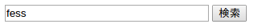
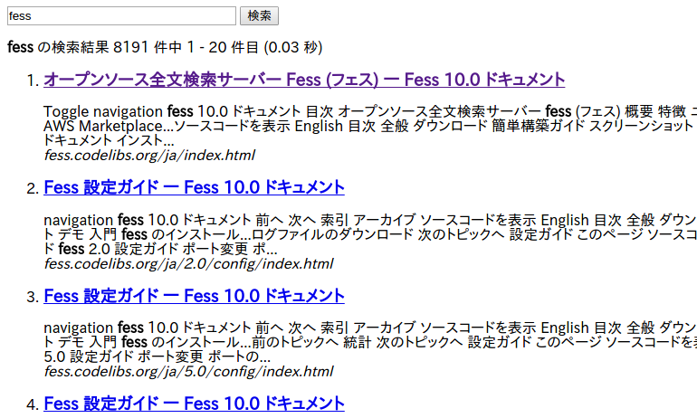

========================================================
Building an Elasticsearch-based Search Server with Fess - API
========================================================

Introduction
========

This article will introduce how to use the API provided by Fess to perform searches and display results on the client side (browser side).
By using the API, it becomes possible to use Fess as a search server in existing web systems and integrate it with HTML-only changes.

This article uses Fess 15.3.0 for the explanation.
For information on how to build Fess, please refer to the\ `Introduction <https://fess.codelibs.org/ja/articles/article-1.html>`__\.

Target Audience
========

-  Those who want to add search functionality to existing web systems

Required Environment
==========

The content of this article has been tested in the following environment.

-  Google Chrome 120 or later

JSON API
========

In addition to the usual HTML search representation, Fess can respond with search results in JSON format as an API.
By using the API, you can easily implement a system where a Fess server is built and existing systems only query for search results.
Since search results can be handled in a language-independent format, it should be easy to integrate Fess with systems other than Java.

For information about the responses provided by Fess's API, please refer to `JSON Response <https://fess.codelibs.org/ja/15.3/api/api-search.html>`__.

Fess uses OpenSearch as its internal search engine.
OpenSearch also provides a JSON API, but Fess's API is different.
The advantage of using Fess's API instead of OpenSearch's API is that you can use various Fess-specific features such as search log management and access permission control.
If you want to develop a document crawling mechanism from scratch on your own, using OpenSearch would be better, but if you simply want to add search functionality, using Fess can reduce a lot of development costs.

Building a Search Site Using the JSON API
==================================

This article will explain how to build a site using Fess's API.
JSON responses will be used for communication with the Fess server.
The Fess server used this time is a demo Fess server publicly available from the Fess project.
If you want to use your own Fess server, please install Fess version 15.3.0 or later.

JSON and CORS
-----------

When accessing with JSON, you need to be aware of the Same-Origin policy.
This means that if the server that outputs the HTML displayed in the browser and the Fess server are on the same domain, you can use JSON, but if they are different, you need to use CORS (Cross-Origin Resource Sharing).
This time, we will proceed with the case where the server containing the HTML and the Fess server are on different domains.
Fess supports CORS, and configuration values can be set in app/WEB-INF/classes/fess_config.properties. The following is set by default:

::

    api.cors.allow.origin=*
    api.cors.allow.methods=GET, POST, OPTIONS, DELETE, PUT
    api.cors.max.age=3600
    api.cors.allow.headers=Origin, Content-Type, Accept, Authorization, X-Requested-With
    api.cors.allow.credentials=true

This time we will use the default settings, but if you change the settings, please restart Fess.

Files to Create
----------------

This time, we will implement the search process using JavaScript on HTML.
We are using jQuery as a JavaScript library.
The files to create are as follows:

-  HTML file "index.html" that displays the search form and search results

- JS file "fess.js" that communicates with the Fess server

This construction example implements the following features:

-  Sending search requests with the search button

-  List of search results

-  Paging of search results

Creating the HTML File
------------------

First, create an HTML file that displays the search form and search results.
This time, to make it easier to understand, we have made it a simple tag structure without adjusting the design with CSS.
The HTML file to use is as follows.

Contents of index.html
::

    <html>
    <head>
    <meta http-equiv="Content-Type" content="text/html; charset=UTF-8"/>
    <title>Search Site</title>
    </head>
    <body>
    

      <form id="searchForm">
        <input id="searchQuery" type="text" name="query" size="30"/>
        <input id="searchButton" type="submit" value="Search"/>
        <input id="searchStart" type="hidden" name="start" value="0"/>
        <input id="searchNum" type="hidden" name="num" value="20"/>
      </form>
    

    

    

    
    
    </body>
    </html>

Looking at the content below the body tag, first in the div tag with the id attribute header, a search input field and search button are placed.
Also, the display start position (start) and display count (num) are held in hidden forms.
The start and num values are updated by JavaScript after the search request is sent.
However, the display count is the display count per page, and in this sample code, there is no function to change the display count, so the num value is not changed.

In the next div tag of subheader, information such as the number of search hits will be displayed.
In the result div tag, search results and paging links will be displayed.

Finally, load the jQuery JS file and the "fess.js" JavaScript we created this time.
You can also save the jQuery JS file in the same directory as "index.html", but this time we're obtaining it via Google's CDN.

Creating the JS File
----------------

Next, create the JS file "fess.js" that communicates with the Fess server and displays search results.
Create "fess.js" with the following content and place it in the same directory as "index.html".

Contents of fess.js
::

    $(function(){
        // (1) Fess URL
        var baseUrl = "http://SERVERNAME:8080/api/v1/documents?q=";
        // (2) jQuery object for search button
        var $searchButton = $('#searchButton');

        // (3) Search processing function
        var doSearch = function(event){
          // (4) Get display start position and display count
          var start = parseInt($('#searchStart').val()),
              num = parseInt($('#searchNum').val());
          // Check display start position
          if(start < 0) {
            start = 0;
          }
          // Check display count
          if(num < 1 || num > 100) {
            num = 20;
          }
          // (5) Get page navigation information
          switch(event.data.navi) {
            case -1:
              // For previous page
              start -= num;
              break;
            case 1:
              // For next page
              start += num;
              break;
            default:
            case 0:
              start = 0;
              break;
          }
          // Trim and store the value of the search field
          var searchQuery = $.trim($('#searchQuery').val());
          // (6) Check if search form is empty
          if(searchQuery.length != 0) {
            var urlBuf = [];
            // (7) Disable the search button
            $searchButton.attr('disabled', true);
            // (8) Build URL
            urlBuf.push(baseUrl, encodeURIComponent(searchQuery),
              '&start=', start, '&num=', num);
            // (9) Send search request
            $.ajax({
              url: urlBuf.join(""),
              dataType: 'json',
            }).done(function(data) {
              // Process search results
              var dataResponse = data.response;
              // (10) Status check
              if(dataResponse.status != 0) {
                alert("A problem occurred during the search. Please contact the administrator.");
                return;
              }

              var $subheader = $('#subheader'),
                  $result = $('#result'),
                  record_count = dataResponse.record_count,
                  offset = 0,
                  buf = [];
              if(record_count == 0) { // (11) If there are no search results
                // Output to subheader area
                $subheader[0].innerHTML = "";
                // Output to result area
                buf.push("<b>", dataResponse.q, "</b> - No information matching was found.");
                $result[0].innerHTML = buf.join("");
              } else { // (12) If search hits
                var page_number = dataResponse.page_number,
                    startRange = dataResponse.start_record_number,
                    endRange = dataResponse.end_record_number,
                    i = 0,
                    max;
                offset = startRange - 1;
                // (13) Output to subheader
                buf.push("<b>", dataResponse.q, "</b> search results ",
                  record_count, " results, showing ", startRange, " - ",
                  endRange, " (", dataResponse.exec_time,
                    " seconds)");
                $subheader[0].innerHTML = buf.join("");

                // Clear search result area
                $result.empty();

                // (14) Output search results
                var $resultBody = $("<ol/>");
                var results = dataResponse.result;
                for(i = 0, max = results.length; i < max; i++) {
                  buf = [];
                  buf.push('<li><h3 class="title">', '<a href="',
                    results[i].url_link, '">', results[i].title,
                    '</a></h3>
', results[i].content_description,
                    ' <cite>', results[i].site, '</cite>
</li>');
                  $(buf.join("")).appendTo($resultBody);
                }
                $resultBody.appendTo($result);

                // (15) Output page number information
                buf = [];
                buf.push('
', page_number, ' page ');
                if(dataResponse.prev_page) {
                  // Link to previous page
                  buf.push('<a id="prevPageLink" href="#">&lt;&lt;Previous page</a> ');
                }
                if(dataResponse.next_page) {
                  // Link to next page
                  buf.push('<a id="nextPageLink" href="#">Next page&gt;&gt;</a>');
                }
                buf.push('
');
                $(buf.join("")).appendTo($result);
              }
              // (16) Update page information
              $('#searchStart').val(offset);
              $('#searchNum').val(num);
              // (17) Move page display to top
              $(document).scrollTop(0);
            }).always(function() {
              // (18) Enable the search button
              $searchButton.attr('disabled', false);
            });
          }
          // (19) Return false to prevent submit
          return false;
        };

        // (20) Processing when Enter key is pressed in search input field
        $('#searchForm').submit({navi:0}, doSearch);
        // (21) Processing when previous page link is clicked
        $('#result').on("click", "#prevPageLink", {navi:-1}, doSearch)
        // (22) Processing when next page link is clicked
          .on("click", "#nextPageLink", {navi:1}, doSearch);
      });

The processing in "fess.js" is executed after the DOM of the HTML file is constructed.
First, at 1, specify the URL of the built Fess server.

2 saves the jQuery object of the search button.
Since we use the jQuery object of the search button several times, we hold it in a variable and reuse it.

In 3, the search processing function is defined. The content of this function will be explained in the next section.

20 registers an event when the search form is submitted.
The processing registered at 20 is executed when the search button is clicked or when the Enter key is pressed in the search input field.
When the event occurs, the search processing function doSearch is called.
The value of navi is passed when calling the search processing function, and that value is used for paging processing.

21 and 22 register events when links added in paging processing are clicked.
Since these links are added dynamically, events need to be registered by delegation.
In these events, the search processing function is called similarly to 20.

Search Processing Function doSearch
--------------------

We will explain the search processing function doSearch at 3.

At 4, get the display start position and display count.
These values are saved as hidden values in the search form in the header area.
Since the display start position is assumed to be 0 or more and the display count is assumed to be a value from 1 to 100, if other values are obtained, default values are set.

At 5, determine the value of the parameter navi passed when doSearch was registered as an event, and modify the display start position.
Here, -1 is changed to move to the previous page, 1 to move to the next page, and otherwise to move to the first page.

6 determines whether to execute the search if a value is entered in the search input field, or to end processing without doing anything if it is empty.

At 7, disable the search button to prevent double submission while querying the Fess server.

At 8, build the URL to send the Ajax request.
Combine the search term, display start position, and display count with the URL at 1.

At 9, send the Ajax request.
When the request returns normally, the success function is executed.
The search result object returned from the Fess server is passed to the success argument.

First, at 10, check the status content of the response.
If the search request is processed normally, 0 is set.
For details on Fess's JSON response, see the\ `Fess site <https://fess.codelibs.org/ja/15.3/api/api-search.html>`__\.

If the search request is processed normally and there are no search results, the content of the subheader area is emptied in the 11 conditional statement, and a message indicating that there are no search results is displayed in the result area.

If there are search results, the search results are processed in the 12 conditional statement.
At 13, set a message of display count and execution time in the subheader area.
14 adds search results to the result area.
Search results are stored as an array in data.response.result.
You can access field values of search result documents by accessing results[i].~.

At 15, add the current page number and links to the previous and next pages to the result area.
At 16, save the current display start position and display count in the hidden fields of the search form.
The display start position and display count will be used again in the next search request.

Next, at 17, change the display position of the page.
Since the page itself is not updated when the link to the next page is clicked, move to the top of the page with scrollTop.

At 18, enable the search button after the search process is completed.
Use complete so that it is executed whether the request succeeds or fails.

19 returns false to prevent forms and links from being submitted after the search processing function is called.
This prevents page transitions from occurring.

Execution
----

Access "index.html" in your browser.
A search form will be displayed as follows.

Search Form
|image1|

Enter an appropriate search term and click the search button to display search results.
The default display count is 20, but if the number of search hits is large, a link to the next page will be displayed below the search result list.

Search Results
|image2|

Summary
======

We built a jQuery-based client search site using Fess's JSON API.
By using the JSON API, you can build systems that call and use Fess from other applications, not limited to browser-based applications.

Note that while this article's sample code shows the traditional API endpoint format, for Fess 15.3, using the ``/api/v1/documents`` endpoint is recommended.
For details, refer to the `API Specifications <https://fess.codelibs.org/ja/15.3/api/api-search.html>`__.

References
========

-  `Fess <https://fess.codelibs.org/ja/>`__

-  `jQuery <http://jquery.com/>`__

.. |image0| image:: ../../resources/images/ja/article/4/sameorigin.png

